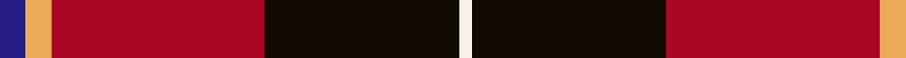

In pattern [BYRKW](/patterns/byrkw/).

This was sourced from register-of-tartans.  It is a [5 stripes tartan](/stripes/stripes5/).

Original link https://www.tartanregister.gov.uk/tartanDetails.aspx?ref=10714

## Attestations

This cloth appears in 2 source records; the oldest owns this page.

- 08/10/2012 — Wormeck (2013) Germany (register-of-tartans, [record](https://www.tartanregister.gov.uk/tartanDetails.aspx?ref=10714))
- undated — Wormeck (2013) German Name Tartan Tartan Number: 10714. Earliest known date: 11 October 2012 This tartan was created by the designer for his wedding and for all those with the surname Wormeck who wish to wear it. The colours are taken from the national and regional flags of Germany and former Prussia, the province of Schleswig-Holstein, Scotland, the Czech Republic and Sweden, all places significant to the designer and his family. See products available Copyright © Blair Urquhart, Comrie, 2015 (house-of-tartan, [record](http://www.house-of-tartan.scotland.net/house/TartanViewjs.asp?colr=Def&tnam=10714))

## Register references

External register numbers recorded for this tartan.

- Scottish Register of Tartans: [10714](https://www.tartanregister.gov.uk/tartanDetails.aspx?ref=10714)

## Thread count
DB/8 O8 DR66 K60 W/4

## Palette
Each colour and its ΔE from the base-6 reference it is a variant of.

| Colour | Shade | Base | ΔE (OKLab) |
|---|---|---|---|
| DB | <code style="background-color:#271B86;">#271B86</code> `#271B86` | B <code style="background-color:#2A418A;">#2A418A</code> | 0.09 |
| DR | <code style="background-color:#A90725;">#A90725</code> `#A90725` | R <code style="background-color:#CC0000;">#CC0000</code> | 0.08 |
| K | <code style="background-color:#120A01;">#120A01</code> `#120A01` | K <code style="background-color:#000000;">#000000</code> | 0.15 |
| O | <code style="background-color:#EBAA57;">#EBAA57</code> `#EBAA57` | Y <code style="background-color:#F2BF00;">#F2BF00</code> | 0.08 |
| W | <code style="background-color:#F7F1E8;">#F7F1E8</code> `#F7F1E8` | W <code style="background-color:#F7F7F7;">#F7F7F7</code> | 0.02 |

# Sample pattern

## Nearest tartans

The nearest existing variants by ΔTartan distance.

1. [Tott (Personal))](/setts/s7/k51r21y4r12g8b4r5~b2c2c80-g006818-k101010-rc80000-yc4bc68~x2/) — ΔT 1.04
1. [Cetoloni (Personal)](/setts/s6/b1r12k6y1k6b1~b2c2c80-k101010-rc80000-ye8c000~x4/) — ΔT 1.07
1. [Drambuie](/setts/s6/w6r36k48y4k5ya6~k101010-r880000-we0e0e0-ya08858-yae8c000/) — ΔT 1.08
1. [Templar Grand Priory USA](/setts/s4/b3k32r27w2~b2c2c80-k101010-rc80000-we0e0e0~x2/) — ΔT 1.18
1. [Totté (from Hofstade de Baerebeeck) (Personal)](/setts/s7/k51r21y4r12g8b4r5~b0000cd-g008b00-k101010-rff0000-yffe600~x2/) — ΔT 1.19
1. [Rei Okamoto (Personal)](/setts/s6/r60k40y3b5ba3g12~b783080-ba944cb8-g005448-k101010-rc80000-yd0b404~x2/) — ΔT 1.22
1. [Ramsay Red Clan Tartan Tartan Number: 1238. Earliest known date: 1842 Ramsay was one of the names adopted by members of the Clan MacGregor when their own was proscribed. It is not surprising then that an early MacGregor sett was used as a basis for the Ramsay tartan. It is possible that the tartan was in existance long before the earliest recorded date given. See products available Copyright © Blair Urquhart, Comrie, 2015](/setts/s6/r5ra2r30k28w2k4~k101010-rc80000-raa00048-we0e0e0~x2/) — ΔT 1.27
1. [Templeton (Name?)](/setts/s8/b4r1k11r20k20r20g4y1~b1474b4-g006818-k101010-rc80000-yfccc00~x2/) — ΔT 1.27
1. [Fraser](/setts/s6/r2b12r2g12r24w1~b000050-g003000-rc00000-we0e0e0~x2/) — ΔT 1.28
1. [MacGleish Formal (Personal)](/setts/s5/r50k25g10ra5y2~g006818-k101010-rc80000-ra888888-ye8c000~x2/) — ΔT 1.32

## Neighbour map

Every grey dot is one of 15726 variants placed by the first two principal components of the ΔTartan feature space (44% of its variance). Red is this tartan; blue dots are its nearest — click one to open its page.

<svg viewBox="0 0 640 380" role="img" style="max-width:100%;height:auto;border:1px solid #e0e0e0;border-radius:4px;display:block" xmlns="http://www.w3.org/2000/svg"><image href="/nn/cloud.v1.png" width="640" height="380"/><a href="/setts/s7/k51r21y4r12g8b4r5~b2c2c80-g006818-k101010-rc80000-yc4bc68~x2/"><circle cx="266.7" cy="158.7" r="4" fill="#3465a4"><title>Tott (Personal))</title></circle></a><a href="/setts/s6/b1r12k6y1k6b1~b2c2c80-k101010-rc80000-ye8c000~x4/"><circle cx="272.4" cy="191.3" r="4" fill="#3465a4"><title>Cetoloni (Personal)</title></circle></a><a href="/setts/s6/w6r36k48y4k5ya6~k101010-r880000-we0e0e0-ya08858-yae8c000/"><circle cx="264.7" cy="169.4" r="4" fill="#3465a4"><title>Drambuie</title></circle></a><a href="/setts/s4/b3k32r27w2~b2c2c80-k101010-rc80000-we0e0e0~x2/"><circle cx="314.6" cy="204.6" r="4" fill="#3465a4"><title>Templar Grand Priory USA</title></circle></a><a href="/setts/s7/k51r21y4r12g8b4r5~b0000cd-g008b00-k101010-rff0000-yffe600~x2/"><circle cx="245.1" cy="146.3" r="4" fill="#3465a4"><title>Totté (from Hofstade de Baerebeeck) (Personal)</title></circle></a><a href="/setts/s6/r60k40y3b5ba3g12~b783080-ba944cb8-g005448-k101010-rc80000-yd0b404~x2/"><circle cx="274.2" cy="128.2" r="4" fill="#3465a4"><title>Rei Okamoto (Personal)</title></circle></a><a href="/setts/s6/r5ra2r30k28w2k4~k101010-rc80000-raa00048-we0e0e0~x2/"><circle cx="325.0" cy="173.8" r="4" fill="#3465a4"><title>Ramsay Red Clan Tartan Tartan Number: 1238. Earliest known date: 1842 Ramsay was one of the names adopted by members of the Clan MacGregor when their own was proscribed. It is not surprising then that an early MacGregor sett was used as a basis for the Ramsay tartan. It is possible that the tartan was in existance long before the earliest recorded date given. See products available Copyright © Blair Urquhart, Comrie, 2015</title></circle></a><a href="/setts/s8/b4r1k11r20k20r20g4y1~b1474b4-g006818-k101010-rc80000-yfccc00~x2/"><circle cx="285.8" cy="152.1" r="4" fill="#3465a4"><title>Templeton (Name?)</title></circle></a><a href="/setts/s6/r2b12r2g12r24w1~b000050-g003000-rc00000-we0e0e0~x2/"><circle cx="321.1" cy="165.0" r="4" fill="#3465a4"><title>Fraser</title></circle></a><a href="/setts/s5/r50k25g10ra5y2~g006818-k101010-rc80000-ra888888-ye8c000~x2/"><circle cx="322.1" cy="150.1" r="4" fill="#3465a4"><title>MacGleish Formal (Personal)</title></circle></a><circle cx="266.7" cy="166.9" r="5" fill="#c00000"/></svg>

ID: /setts/s5/b4y4r33k30w2~b271b86-k120a01-ra90725-wf7f1e8-yebaa57~x2/
