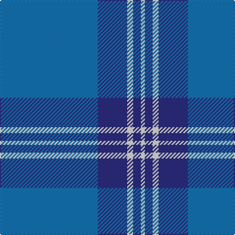

This page is one **sett** — a single exact thread-count. It belongs to the [tartan](/tartans/b50db15w3db4w2/)
(the same proportion at any scale), whose colour order is pattern [BBWBW](/stripes/bbwbw/).

Sourced from tartans-authority.  It is a [5 stripe tartan](/stripes/stripes5/).

Original link http://www.tartansauthority.com/tartan-ferret/display/2099/

## Thread count
B/100 DB30 LN6 DB8 LN/4

## Palette

Palette: <strong>Tartan Register</strong>
<table><thead><tr><th>Colour</th><th>Threads</th><th>Shade</th><th>Base</th><th>OKLCh</th></tr></thead><tbody><tr><td>B/</td><td style="text-align:right;font-variant-numeric:tabular-nums">100</td><td><code style="background-color:#1474B4;">#1474B4</code> <small style="color:#888">#1474B4</small></td><td>B <code style="background-color:#2A418A;">#2A418A</code></td><td><small style="color:#888">oklch(54.0% 0.129 245.1)</small></td></tr><tr><td>DB</td><td style="text-align:right;font-variant-numeric:tabular-nums">30</td><td><code style="background-color:#2C2C80;">#2C2C80</code> <small style="color:#888">#2C2C80</small></td><td>B <code style="background-color:#2A418A;">#2A418A</code></td><td><small style="color:#888">oklch(35.0% 0.138 276.6)</small></td></tr><tr><td>LN</td><td style="text-align:right;font-variant-numeric:tabular-nums">6</td><td><code style="background-color:#E0E0E0;">#E0E0E0</code> <small style="color:#888">#E0E0E0</small></td><td>W <code style="background-color:#F7F7F7;">#F7F7F7</code></td><td><small style="color:#888">oklch(90.7% 0.000 89.9)</small></td></tr><tr><td>DB</td><td style="text-align:right;font-variant-numeric:tabular-nums">8</td><td><code style="background-color:#2C2C80;">#2C2C80</code> <small style="color:#888">#2C2C80</small></td><td>B <code style="background-color:#2A418A;">#2A418A</code></td><td><small style="color:#888">oklch(35.0% 0.138 276.6)</small></td></tr><tr><td>LN/</td><td style="text-align:right;font-variant-numeric:tabular-nums">4</td><td><code style="background-color:#E0E0E0;">#E0E0E0</code> <small style="color:#888">#E0E0E0</small></td><td>W <code style="background-color:#F7F7F7;">#F7F7F7</code></td><td><small style="color:#888">oklch(90.7% 0.000 89.9)</small></td></tr></tbody></table>

# Sample pattern

## Nearest tartans

The nearest existing variants by ΔTartan distance, with this tartan at the top so the swatches line up against it.

ΔTartan

Tartan

Sett

—

<a href="/ttd/edit/#slug=b50db15w3db4w2~x2">Scottish Tourist Board (1990) (Corp)</a> <a class="nn-out" href="/setts/s5/b50db15w3db4w2~x2/" title="open its dictionary page">↗</a>

1.41

<a href="/ttd/edit/#slug=db13b1db3b6ly1b1~x4">Hepburn #2</a> <a class="nn-out" href="/setts/s6/db13b1db3b6ly1b1~x4/" title="open its dictionary page">↗</a>

1.44

<a href="/ttd/edit/#slug=db5t1db15t25db1t5~x4">Dram! (Corporate)</a> <a class="nn-out" href="/setts/s6/db5t1db15t25db1t5~x4/" title="open its dictionary page">↗</a>

1.48

<a href="/ttd/edit/#slug=t52db28w3db2w2db10~x2">St Andrews Earl of Royal family Tartan Tartan Number: 85. Earliest known date: c.1930 Count taken from a 'MacKinlay Strip'. Prince George is reputed to have worn this tartan at a Scottish Society dinner in 1919 and kept everyone guessing the name of the tartan. However, MacKinlay's record shows the design dating to 1930. No further details can be found. The sett has much in common with the Clan Donald. Royal titles of territorial origin provide a precedent for considering tartans of the name, District tartans. See products available Copyright © Blair Urquhart, Comrie, 2015</a> <a class="nn-out" href="/setts/s6/t52db28w3db2w2db10~x2/" title="open its dictionary page">↗</a>

1.50

<a href="/ttd/edit/#slug=t20p3db7ly1~x4">Peacock</a> <a class="nn-out" href="/setts/s4/t20p3db7ly1~x4/" title="open its dictionary page">↗</a>

1.50

<a href="/ttd/edit/#slug=b136db45w7db4r4db16">S.C.O.T.S</a> <a class="nn-out" href="/setts/s6/b136db45w7db4r4db16/" title="open its dictionary page">↗</a>

1.54

<a href="/ttd/edit/#slug=ly4b3ly1b17db40b2db3~x2">Danzas</a> <a class="nn-out" href="/setts/s7/ly4b3ly1b17db40b2db3~x2/" title="open its dictionary page">↗</a>

1.59

<a href="/ttd/edit/#slug=t60db19w3db2r2db7~x2">Federal Bureaux of Investigation</a> <a class="nn-out" href="/setts/s6/t60db19w3db2r2db7~x2/" title="open its dictionary page">↗</a>

1.67

<a href="/ttd/edit/#slug=dp11t90dy3t11dp7dy11dp13t11">Royal Conservatoire of Scotland</a> <a class="nn-out" href="/setts/s8/dp11t90dy3t11dp7dy11dp13t11/" title="open its dictionary page">↗</a>

1.79

<a href="/ttd/edit/#slug=t20dp3db7ly1~x4">Peacock (Samantha)</a> <a class="nn-out" href="/setts/s4/t20dp3db7ly1~x4/" title="open its dictionary page">↗</a>

1.79

<a href="/ttd/edit/#slug=r2t21r2db6ly1r1~x4">Lauder Primary School (Corporate)</a> <a class="nn-out" href="/setts/s6/r2t21r2db6ly1r1~x4/" title="open its dictionary page">↗</a>

## Neighbour map

Every grey dot is one of 14299 variants placed by the first two principal components of the ΔTartan feature space (44% of its variance). Red is this tartan; blue dots are its nearest — click one to open its page.

<svg viewBox="0 0 640 380" role="img" style="max-width:100%;height:auto;border:1px solid #e0e0e0;border-radius:4px;display:block" xmlns="http://www.w3.org/2000/svg"><image href="/nn/cloud.v1.png" width="640" height="380"/><a href="/setts/s6/db13b1db3b6ly1b1~x4/"><circle cx="424.5" cy="224.5" r="4" fill="#3465a4"><title>Hepburn #2</title></circle></a><a href="/setts/s6/db5t1db15t25db1t5~x4/"><circle cx="467.6" cy="224.8" r="4" fill="#3465a4"><title>Dram! (Corporate)</title></circle></a><a href="/setts/s6/t52db28w3db2w2db10~x2/"><circle cx="401.7" cy="191.4" r="4" fill="#3465a4"><title>St Andrews Earl of Royal family Tartan Tartan Number: 85. Earliest known date: c.1930 Count taken from a 'MacKinlay Strip'. Prince George is reputed to have worn this tartan at a Scottish Society dinner in 1919 and kept everyone guessing the name of the tartan. However, MacKinlay's record shows the design dating to 1930. No further details can be found. The sett has much in common with the Clan Donald. Royal titles of territorial origin provide a precedent for considering tartans of the name, District tartans. See products available Copyright © Blair Urquhart, Comrie, 2015</title></circle></a><a href="/setts/s4/t20p3db7ly1~x4/"><circle cx="430.0" cy="221.3" r="4" fill="#3465a4"><title>Peacock</title></circle></a><a href="/setts/s6/b136db45w7db4r4db16/"><circle cx="452.4" cy="156.9" r="4" fill="#3465a4"><title>S.C.O.T.S</title></circle></a><a href="/setts/s7/ly4b3ly1b17db40b2db3~x2/"><circle cx="469.9" cy="166.8" r="4" fill="#3465a4"><title>Danzas</title></circle></a><a href="/setts/s6/t60db19w3db2r2db7~x2/"><circle cx="500.1" cy="181.4" r="4" fill="#3465a4"><title>Federal Bureaux of Investigation</title></circle></a><a href="/setts/s8/dp11t90dy3t11dp7dy11dp13t11/"><circle cx="514.4" cy="164.1" r="4" fill="#3465a4"><title>Royal Conservatoire of Scotland</title></circle></a><a href="/setts/s4/t20dp3db7ly1~x4/"><circle cx="421.7" cy="212.6" r="4" fill="#3465a4"><title>Peacock (Samantha)</title></circle></a><a href="/setts/s6/r2t21r2db6ly1r1~x4/"><circle cx="414.3" cy="165.0" r="4" fill="#3465a4"><title>Lauder Primary School (Corporate)</title></circle></a><circle cx="496.2" cy="207.6" r="5" fill="#c00000"/></svg>

ID: /setts/s5/b50db15w3db4w2~x2/
