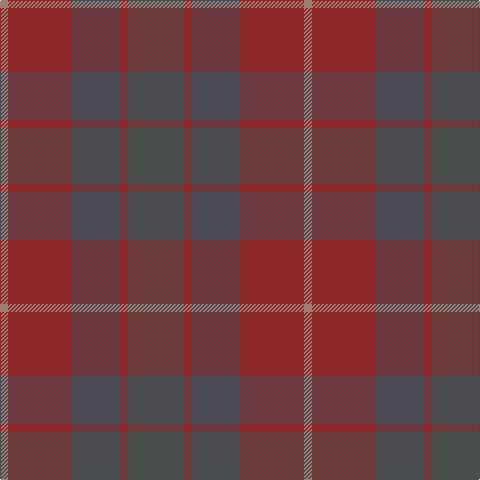

In pattern [BRBRR](/patterns/brbrr/).

This was sourced from register-of-tartans.  It is a [5 stripes tartan](/stripes/stripes5/).

Original link https://www.tartanregister.gov.uk/tartanDetails.aspx?ref=10322

## Thread count
LT/8 DR64 N48 DR8 Na/56

## Palette
Each colour and its ΔE from the base-6 reference it is a variant of.

| Colour | Shade | Base | ΔE (OKLab) |
|---|---|---|---|
| DR | <code style="background-color:#8C2828;">#8C2828</code> `#8C2828` | R <code style="background-color:#C80000;">#C80000</code> | 0.12 |
| LT | <code style="background-color:#A07D73;">#A07D73</code> `#A07D73` | R <code style="background-color:#C80000;">#C80000</code> | 0.19 |
| N | <code style="background-color:#4B4B58;">#4B4B58</code> `#4B4B58` | B <code style="background-color:#2C4084;">#2C4084</code> | 0.10 |
| Na | <code style="background-color:#4B4F4B;">#4B4F4B</code> `#4B4F4B` | B <code style="background-color:#2C4084;">#2C4084</code> | 0.12 |

# Sample pattern

ID: /setts/s5/b56r8ba48r64ra8-b4b4f4b-ba4b4b58-r8c2828-raa07d73/
