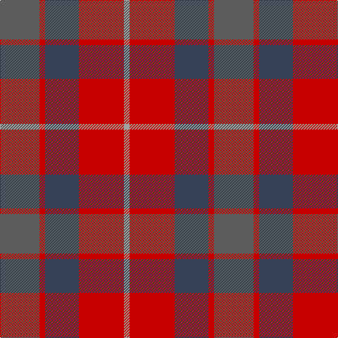

In pattern [BRBRY](/patterns/brbry/).

This was sourced from tartans-authority.  It is a [5 stripes tartan](/stripes/stripes5/).

Original link http://www.tartansauthority.com/tartan-ferret/display/10322/

## Thread count
N/56 R8 Nb48 R64 Na/8

## Palette
Each colour and its ΔE from the base-6 reference it is a variant of.

| Colour | Shade | Base | ΔE (OKLab) |
|---|---|---|---|
| N | <code style="background-color:#5C5C5C;">#5C5C5C</code> `#5C5C5C` | B <code style="background-color:#2C4084;">#2C4084</code> | 0.14 |
| Na | <code style="background-color:#A0A0A0;">#A0A0A0</code> `#A0A0A0` | Y <code style="background-color:#E8C000;">#E8C000</code> | 0.20 |
| Nb | <code style="background-color:#344054;">#344054</code> `#344054` | B <code style="background-color:#2C4084;">#2C4084</code> | 0.08 |
| R | <code style="background-color:#C80000;">#C80000</code> `#C80000` | R <code style="background-color:#C80000;">#C80000</code> | 0.00 |

# Sample pattern

## Nearest tartans

The nearest existing variants by ΔTartan distance.

1. [Pople (Name)](/setts/s5/k2r18b16g16w2-b5c5c5c-g808080-k101010-r880000-we0e0e0/) — ΔT 1.24
1. [Bristol Gramar School Check (School)](/setts/s6/r4b3ba12bb8b2r4-b447084-ba5c5c5c-bb1c1c50-rc80000/) — ΔT 1.34
1. [Harmony 8](/setts/s5/b8g40r60b40g8-b401000-g808080-r906030/) — ΔT 1.38
1. [Moray of Abercairney](/setts/s5/r16ra2g8ra2b8-b304080-g008000-rc00000-rad03030/) — ΔT 1.47
1. [Unamed, Riding cloak 1745](/setts/s5/b2ba16r4ra16r2-b5480b0-ba304080-rc00000-ra806050/) — ΔT 1.54
1. [Unamed Riding cloak 1745](/setts/s5/b2ba16r4g16r2-b3c82af-ba2c4084-g503c14-rdc0000/) — ΔT 1.55
1. [Roscommon](/setts/s10/r10ra6r38b12ra10b12ba24ba10ba24ba6-b401000-ba606080-rd00000-ra906030/) — ΔT 1.55
1. [Harmony, 6](/setts/s5/b8g40r60b40g8-b800070-g008000-r806050/) — ΔT 1.56
1. [Lady Boys of Bangkok (Corporate)](/setts/s6/y23r22ra52r8w6ya18-rc80000-raa45098-we0e0e0-ya08858-yabc8c00/) — ΔT 1.56
1. [MacNab #2](/setts/s6/g4r4g28r16ra28r4-g006818-ra00048-rac80000/) — ΔT 1.57

## Neighbour map

Every grey dot is one of 15726 variants placed by the first two principal components of the ΔTartan feature space (44% of its variance). Red is this tartan; blue dots are its nearest — click one to open its page.

<svg viewBox="0 0 640 380" role="img" style="max-width:100%;height:auto;border:1px solid #e0e0e0;border-radius:4px;display:block" xmlns="http://www.w3.org/2000/svg"><image href="/nn/cloud.v1.png" width="640" height="380"/><a href="/setts/s5/k2r18b16g16w2-b5c5c5c-g808080-k101010-r880000-we0e0e0/"><circle cx="199.1" cy="232.4" r="4" fill="#3465a4"><title>Pople (Name)</title></circle></a><a href="/setts/s6/r4b3ba12bb8b2r4-b447084-ba5c5c5c-bb1c1c50-rc80000/"><circle cx="195.7" cy="260.9" r="4" fill="#3465a4"><title>Bristol Gramar School Check (School)</title></circle></a><a href="/setts/s5/b8g40r60b40g8-b401000-g808080-r906030/"><circle cx="256.7" cy="273.3" r="4" fill="#3465a4"><title>Harmony 8</title></circle></a><a href="/setts/s5/r16ra2g8ra2b8-b304080-g008000-rc00000-rad03030/"><circle cx="242.3" cy="233.9" r="4" fill="#3465a4"><title>Moray of Abercairney</title></circle></a><a href="/setts/s5/b2ba16r4ra16r2-b5480b0-ba304080-rc00000-ra806050/"><circle cx="297.5" cy="256.6" r="4" fill="#3465a4"><title>Unamed, Riding cloak 1745</title></circle></a><a href="/setts/s5/b2ba16r4g16r2-b3c82af-ba2c4084-g503c14-rdc0000/"><circle cx="271.9" cy="247.8" r="4" fill="#3465a4"><title>Unamed Riding cloak 1745</title></circle></a><a href="/setts/s10/r10ra6r38b12ra10b12ba24ba10ba24ba6-b401000-ba606080-rd00000-ra906030/"><circle cx="231.4" cy="232.2" r="4" fill="#3465a4"><title>Roscommon</title></circle></a><a href="/setts/s5/b8g40r60b40g8-b800070-g008000-r806050/"><circle cx="253.0" cy="273.9" r="4" fill="#3465a4"><title>Harmony, 6</title></circle></a><a href="/setts/s6/y23r22ra52r8w6ya18-rc80000-raa45098-we0e0e0-ya08858-yabc8c00/"><circle cx="228.0" cy="215.7" r="4" fill="#3465a4"><title>Lady Boys of Bangkok (Corporate)</title></circle></a><a href="/setts/s6/g4r4g28r16ra28r4-g006818-ra00048-rac80000/"><circle cx="261.7" cy="249.2" r="4" fill="#3465a4"><title>MacNab #2</title></circle></a><circle cx="258.0" cy="258.4" r="5" fill="#c00000"/></svg>

ID: /setts/s5/b56r8ba48r64y8-b5c5c5c-ba344054-rc80000-ya0a0a0/
