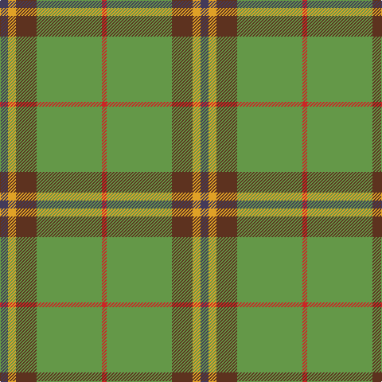

In pattern [BYGGR](/patterns/byggr/).

This was sourced from register-of-tartans.  It is a [5 stripes tartan](/stripes/stripes5/).

Original link https://www.tartanregister.gov.uk/tartanDetails.aspx?ref=10311

## Register references

External register numbers recorded for this tartan.

- Scottish Register of Tartans: [10311](https://www.tartanregister.gov.uk/tartanDetails.aspx?ref=10311)

## Thread count
N/10 Y10 T26 LG82 R/6

## Palette
Each colour and its ΔE from the base-6 reference it is a variant of.

| Colour | Shade | Base | ΔE (OKLab) |
|---|---|---|---|
| LG | <code style="background-color:#649848;">#649848</code> `#649848` | G <code style="background-color:#006100;">#006100</code> | 0.20 |
| N | <code style="background-color:#433A5A;">#433A5A</code> `#433A5A` | B <code style="background-color:#2A418A;">#2A418A</code> | 0.09 |
| R | <code style="background-color:#CA2625;">#CA2625</code> `#CA2625` | R <code style="background-color:#CC0000;">#CC0000</code> | 0.02 |
| T | <code style="background-color:#5D321F;">#5D321F</code> `#5D321F` | G <code style="background-color:#006100;">#006100</code> | 0.18 |
| Y | <code style="background-color:#E0A126;">#E0A126</code> `#E0A126` | Y <code style="background-color:#F2BF00;">#F2BF00</code> | 0.08 |

# Sample pattern

## Nearest tartans

The nearest existing variants by ΔTartan distance.

1. [Clare, Richard (Personal)](/setts/s5/b5y5g13ga41r3~b003c64-g604000-ga289c18-rc8002c-ybc8c00~x2/) — ΔT 1.13
1. [Crieff, and Strathearn](/setts/s7/g55b7r24g12ba4y3ba4~b800080-ba304080-g008000-rc00000-yf0c000~x2/) — ΔT 1.24
1. [McGuigan, Julia (Personal)](/setts/s4/w9g52ga15y4~g5c6428-ga604000-wc0c0c0-yfccc00~x2/) — ΔT 1.34
1. [St Johns County Sheriff Office (Cor)](/setts/s5/r17b7y8g58k6~b1c0070-g006818-k101010-rc80000-ybc8c00~x2/) — ΔT 1.35
1. [Crieff and Strathearn District Tartan Tartan Number: 664. Earliest known date: 1988 A branch of the Stewart clan from Galloway and the South West of Scotland. See products available Copyright © Blair Urquhart, Comrie, 2015](/setts/s7/g55b7r24g12ba4y3ba4~b780078-ba2c2c80-g006818-rc80000-ye8c000~x2/) — ΔT 1.40
1. [Tulloch Homes](/setts/s7/g6ga14r9b7r9ga54y6~b14283c-g289c18-ga006818-rc80000-ye8c000/) — ΔT 1.41
1. [Crieff & Strathearn #1](/setts/s7/g55b7r24g12ba4y3ba4~b2c2c80-ba003c64-g006818-r880000-ye8c000~x2/) — ΔT 1.43
1. [Jahore District Tartan Tartan Number: 1309. Earliest known date: c.1890 [50% actual count] Reputed to have been presented to the Sultan of Jahore by Queen Victoria during his visit to Balmoral around 1890. See products available Copyright © Blair Urquhart, Comrie, 2015](/setts/s5/r57w5g20r5y10~g006818-r888888-we0e0e0-ye8c000/) — ΔT 1.44
1. [Jahore](/setts/s5/g57w5ga20g5y10~g808080-ga008000-we0e0e0-yf0c000/) — ΔT 1.45
1. [Sinclair](/setts/s7/g10r3g30ga10w2b15r4~b304080-g008000-ga808080-rc00000-we0e0e0~x2/) — ΔT 1.56

## Neighbour map

Every grey dot is one of 15726 variants placed by the first two principal components of the ΔTartan feature space (44% of its variance). Red is this tartan; blue dots are its nearest — click one to open its page.

<svg viewBox="0 0 640 380" role="img" style="max-width:100%;height:auto;border:1px solid #e0e0e0;border-radius:4px;display:block" xmlns="http://www.w3.org/2000/svg"><image href="/nn/cloud.v1.png" width="640" height="380"/><a href="/setts/s5/b5y5g13ga41r3~b003c64-g604000-ga289c18-rc8002c-ybc8c00~x2/"><circle cx="358.5" cy="193.4" r="4" fill="#3465a4"><title>Clare, Richard (Personal)</title></circle></a><a href="/setts/s7/g55b7r24g12ba4y3ba4~b800080-ba304080-g008000-rc00000-yf0c000~x2/"><circle cx="357.2" cy="154.3" r="4" fill="#3465a4"><title>Crieff, and Strathearn</title></circle></a><a href="/setts/s4/w9g52ga15y4~g5c6428-ga604000-wc0c0c0-yfccc00~x2/"><circle cx="421.8" cy="233.1" r="4" fill="#3465a4"><title>McGuigan, Julia (Personal)</title></circle></a><a href="/setts/s5/r17b7y8g58k6~b1c0070-g006818-k101010-rc80000-ybc8c00~x2/"><circle cx="323.9" cy="199.6" r="4" fill="#3465a4"><title>St Johns County Sheriff Office (Cor)</title></circle></a><a href="/setts/s7/g55b7r24g12ba4y3ba4~b780078-ba2c2c80-g006818-rc80000-ye8c000~x2/"><circle cx="364.5" cy="157.2" r="4" fill="#3465a4"><title>Crieff and Strathearn District Tartan Tartan Number: 664. Earliest known date: 1988 A branch of the Stewart clan from Galloway and the South West of Scotland. See products available Copyright © Blair Urquhart, Comrie, 2015</title></circle></a><a href="/setts/s7/g6ga14r9b7r9ga54y6~b14283c-g289c18-ga006818-rc80000-ye8c000/"><circle cx="355.5" cy="190.7" r="4" fill="#3465a4"><title>Tulloch Homes</title></circle></a><a href="/setts/s7/g55b7r24g12ba4y3ba4~b2c2c80-ba003c64-g006818-r880000-ye8c000~x2/"><circle cx="385.1" cy="171.1" r="4" fill="#3465a4"><title>Crieff &amp; Strathearn #1</title></circle></a><a href="/setts/s5/r57w5g20r5y10~g006818-r888888-we0e0e0-ye8c000/"><circle cx="401.9" cy="216.4" r="4" fill="#3465a4"><title>Jahore District Tartan Tartan Number: 1309. Earliest known date: c.1890 [50% actual count] Reputed to have been presented to the Sultan of Jahore by Queen Victoria during his visit to Balmoral around 1890. See products available Copyright © Blair Urquhart, Comrie, 2015</title></circle></a><a href="/setts/s5/g57w5ga20g5y10~g808080-ga008000-we0e0e0-yf0c000/"><circle cx="409.3" cy="220.0" r="4" fill="#3465a4"><title>Jahore</title></circle></a><a href="/setts/s7/g10r3g30ga10w2b15r4~b304080-g008000-ga808080-rc00000-we0e0e0~x2/"><circle cx="287.1" cy="185.3" r="4" fill="#3465a4"><title>Sinclair</title></circle></a><circle cx="364.3" cy="188.4" r="5" fill="#c00000"/></svg>

ID: /setts/s5/b5y5g13ga41r3~b433a5a-g5d321f-ga649848-rca2625-ye0a126~x2/
