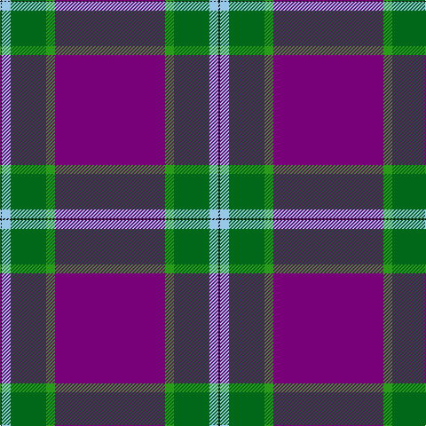

In pattern [BGGWK](/patterns/bggwk/).

This was sourced from tartans-authority.  It is a [5 stripes tartan](/stripes/stripes5/).

Original link http://www.tartansauthority.com/tartan-ferret/display/10379/

## Thread count
K/2 LB10 G40 Ga10 P/124

## Palette
Each colour and its ΔE from the base-6 reference it is a variant of.

| Colour | Shade | Base | ΔE (OKLab) |
|---|---|---|---|
| G | <code style="background-color:#006818;">#006818</code> `#006818` | G <code style="background-color:#006100;">#006100</code> | 0.02 |
| Ga | <code style="background-color:#289C18;">#289C18</code> `#289C18` | G <code style="background-color:#006100;">#006100</code> | 0.19 |
| K | <code style="background-color:#101010;">#101010</code> `#101010` | K <code style="background-color:#000000;">#000000</code> | 0.17 |
| LB | <code style="background-color:#98C8E8;">#98C8E8</code> `#98C8E8` | W <code style="background-color:#F7F7F7;">#F7F7F7</code> | 0.18 |
| P | <code style="background-color:#780078;">#780078</code> `#780078` | B <code style="background-color:#2A418A;">#2A418A</code> | 0.17 |

# Sample pattern

## Nearest tartans

The nearest existing variants by ΔTartan distance.

1. [Salvation Army Dress Corporate Tartan Tartan Number: 546. Earliest known date: 1983 The colours chosen are the same as those for the flag. Red for the Blood of Christ, blue for the Heavenly Father, yellow for Fire of the Holy Spirit when tongues of fire symbolized his presence at Penticost. See products available Copyright © Blair Urquhart, Comrie, 2015](/setts/s7/b80r21k2y4k2r16b10~b2c2c80-k101010-rc80000-ye8c000~x2/) — ΔT 1.27
1. [Salvation Army, dress](/setts/s7/b80r21k2y4k2r16b10~b304080-k000000-rc00000-yf0c000~x2/) — ΔT 1.29
1. [Michie Dress, Andrew](/setts/s5/b62g5ga20y5k1~b751857-g509721-ga124b24-k120a01-y82adba~x2/) — ΔT 1.37
1. [Clan Gregor Tartan Tartan Number: 3089. Earliest known date: See products available Copyright © Blair Urquhart, Comrie, 2015](/setts/s6/b25r8b3r4k1w3~b38356a-k080808-rc80000-we0e0e0~x2/) — ΔT 1.49
1. [Salvation Army Dress (Corporate)](/setts/s8/b74k2r15k2y4k2r16b10~b2c2c80-k101010-rc80000-ye8c000~x2/) — ΔT 1.56
1. [SiMBA](/setts/s6/b2g3w21b42wa1g2~b780078-g006818-wc49cd8-wafcfcfc~x2/) — ΔT 1.61
1. [Auchtermuchty Tartan Army](/setts/s6/b80r8w1r8y20b15~b2c2c80-rc80000-wffffff-ye8c000~x2/) — ΔT 1.65
1. [SiMBA](/setts/s6/b2g3w21b42wa1g2~b780078-g408060-wc49cd8-waffffff~x2/) — ΔT 1.69
1. [McBrayer Blue (Personal)](/setts/s8/b57k1r12b1g12r14b1r2~b2c2c80-g006818-k101010-rc80000~x2/) — ΔT 1.69
1. [Auchtermuchty Tartan Army (Corp)](/setts/s6/b80r7w1r7y20b15~b2c2c80-rc80000-we0e0e0-ye8c000~x2/) — ΔT 1.75

## Neighbour map

Every grey dot is one of 15726 variants placed by the first two principal components of the ΔTartan feature space (44% of its variance). Red is this tartan; blue dots are its nearest — click one to open its page.

<svg viewBox="0 0 640 380" role="img" style="max-width:100%;height:auto;border:1px solid #e0e0e0;border-radius:4px;display:block" xmlns="http://www.w3.org/2000/svg"><image href="/nn/cloud.v1.png" width="640" height="380"/><a href="/setts/s7/b80r21k2y4k2r16b10~b2c2c80-k101010-rc80000-ye8c000~x2/"><circle cx="471.4" cy="132.5" r="4" fill="#3465a4"><title>Salvation Army Dress Corporate Tartan Tartan Number: 546. Earliest known date: 1983 The colours chosen are the same as those for the flag. Red for the Blood of Christ, blue for the Heavenly Father, yellow for Fire of the Holy Spirit when tongues of fire symbolized his presence at Penticost. See products available Copyright © Blair Urquhart, Comrie, 2015</title></circle></a><a href="/setts/s7/b80r21k2y4k2r16b10~b304080-k000000-rc00000-yf0c000~x2/"><circle cx="474.6" cy="134.1" r="4" fill="#3465a4"><title>Salvation Army, dress</title></circle></a><a href="/setts/s5/b62g5ga20y5k1~b751857-g509721-ga124b24-k120a01-y82adba~x2/"><circle cx="487.3" cy="138.9" r="4" fill="#3465a4"><title>Michie Dress, Andrew</title></circle></a><a href="/setts/s6/b25r8b3r4k1w3~b38356a-k080808-rc80000-we0e0e0~x2/"><circle cx="415.5" cy="160.9" r="4" fill="#3465a4"><title>Clan Gregor Tartan Tartan Number: 3089. Earliest known date: See products available Copyright © Blair Urquhart, Comrie, 2015</title></circle></a><a href="/setts/s8/b74k2r15k2y4k2r16b10~b2c2c80-k101010-rc80000-ye8c000~x2/"><circle cx="470.8" cy="124.2" r="4" fill="#3465a4"><title>Salvation Army Dress (Corporate)</title></circle></a><a href="/setts/s6/b2g3w21b42wa1g2~b780078-g006818-wc49cd8-wafcfcfc~x2/"><circle cx="437.1" cy="124.3" r="4" fill="#3465a4"><title>SiMBA</title></circle></a><a href="/setts/s6/b80r8w1r8y20b15~b2c2c80-rc80000-wffffff-ye8c000~x2/"><circle cx="474.8" cy="130.7" r="4" fill="#3465a4"><title>Auchtermuchty Tartan Army</title></circle></a><a href="/setts/s6/b2g3w21b42wa1g2~b780078-g408060-wc49cd8-waffffff~x2/"><circle cx="441.2" cy="125.4" r="4" fill="#3465a4"><title>SiMBA</title></circle></a><a href="/setts/s8/b57k1r12b1g12r14b1r2~b2c2c80-g006818-k101010-rc80000~x2/"><circle cx="431.7" cy="114.9" r="4" fill="#3465a4"><title>McBrayer Blue (Personal)</title></circle></a><a href="/setts/s6/b80r7w1r7y20b15~b2c2c80-rc80000-we0e0e0-ye8c000~x2/"><circle cx="485.2" cy="130.5" r="4" fill="#3465a4"><title>Auchtermuchty Tartan Army (Corp)</title></circle></a><circle cx="451.9" cy="124.1" r="5" fill="#c00000"/></svg>

ID: /setts/s5/b62g5ga20w5k1~b780078-g289c18-ga006818-k101010-w98c8e8~x2/
