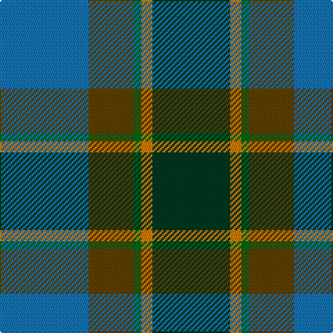

In pattern [BGGYG](/patterns/bggyg/).

This was sourced from tartans-authority.  It is a [5 stripes tartan](/stripes/stripes5/).

Original link http://www.tartansauthority.com/tartan-ferret/display/10824/

## Thread count
B/64 T32 G6 O8 DG/56

## Palette
Each colour and its ΔE from the base-6 reference it is a variant of.

| Colour | Shade | Base | ΔE (OKLab) |
|---|---|---|---|
| B | <code style="background-color:#1474B4;">#1474B4</code> `#1474B4` | B <code style="background-color:#2A418A;">#2A418A</code> | 0.15 |
| DG | <code style="background-color:#003820;">#003820</code> `#003820` | G <code style="background-color:#006100;">#006100</code> | 0.15 |
| G | <code style="background-color:#006818;">#006818</code> `#006818` | G <code style="background-color:#006100;">#006100</code> | 0.02 |
| O | <code style="background-color:#D87C00;">#D87C00</code> `#D87C00` | Y <code style="background-color:#F2BF00;">#F2BF00</code> | 0.17 |
| T | <code style="background-color:#604000;">#604000</code> `#604000` | G <code style="background-color:#006100;">#006100</code> | 0.14 |

# Sample pattern

## Nearest tartans

The nearest existing variants by ΔTartan distance.

1. [Wellington (Lochcarron)](/setts/s5/k18y12b44g56ya4-b0c585c-g408060-k101010-y9ca8b0-yae8c000/) — ΔT 0.86
1. [Montrose (1983)](/setts/s6/g12y6g52k20b60w6-b5c5c5c-g004c2c-k101010-wc0c0c0-ybca010/) — ΔT 1.04
1. [Lyle and Scott](/setts/s6/g10b4g18ba38r18y4-b1474b4-ba003c64-g003820-ra00000-yfccc00/) — ΔT 1.05
1. [Corey in Balachuirn](/setts/s5/b64ba32g6r8k56-b0163ac-ba453128-g004710-k001a00-re9713c/) — ΔT 1.07
1. [Turnbull Hunting](/setts/s5/r14y6g56b56w6-b2c4084-g005020-r960000-we0e0e0-ye8c000/) — ΔT 1.11
1. [Newmill](/setts/s7/r8ra40b24ba88b24ra40y8-b14283c-ba003c64-r880000-ra888888-yd09800/) — ΔT 1.13
1. [Alvis of Lee (Personal)](/setts/s5/b18w8g72ba72r8-b1c0070-ba5c8ca8-g00643c-rc80000-we0e0e0/) — ΔT 1.16
1. [Balfour Hunting](/setts/s6/b60y6g22y6ga66r12-b1870a4-g604000-ga006818-rc80000-ye8c000/) — ΔT 1.17
1. [Dallard Personal Tartan Tartan Number: 7424. Earliest known date: 2007 The material was going towards a kilt for my wedding in June 2008. See products available Copyright © Blair Urquhart, Comrie, 2015](/setts/s5/b74g74r16k6ba10-b003c64-ba780078-g285800-k101010-r888888/) — ΔT 1.17
1. [Gamba Tuscany Fife](/setts/s5/g10r6ga60b60w6-b105088-g004830-ga006840-re01c18-we8e8e8/) — ΔT 1.22

## Neighbour map

Every grey dot is one of 15726 variants placed by the first two principal components of the ΔTartan feature space (44% of its variance). Red is this tartan; blue dots are its nearest — click one to open its page.

<svg viewBox="0 0 640 380" role="img" style="max-width:100%;height:auto;border:1px solid #e0e0e0;border-radius:4px;display:block" xmlns="http://www.w3.org/2000/svg"><image href="/nn/cloud.v1.png" width="640" height="380"/><a href="/setts/s5/k18y12b44g56ya4-b0c585c-g408060-k101010-y9ca8b0-yae8c000/"><circle cx="226.8" cy="215.9" r="4" fill="#3465a4"><title>Wellington (Lochcarron)</title></circle></a><a href="/setts/s6/g12y6g52k20b60w6-b5c5c5c-g004c2c-k101010-wc0c0c0-ybca010/"><circle cx="250.6" cy="221.6" r="4" fill="#3465a4"><title>Montrose (1983)</title></circle></a><a href="/setts/s6/g10b4g18ba38r18y4-b1474b4-ba003c64-g003820-ra00000-yfccc00/"><circle cx="216.8" cy="220.4" r="4" fill="#3465a4"><title>Lyle and Scott</title></circle></a><a href="/setts/s5/b64ba32g6r8k56-b0163ac-ba453128-g004710-k001a00-re9713c/"><circle cx="195.3" cy="224.9" r="4" fill="#3465a4"><title>Corey in Balachuirn</title></circle></a><a href="/setts/s5/r14y6g56b56w6-b2c4084-g005020-r960000-we0e0e0-ye8c000/"><circle cx="221.3" cy="214.7" r="4" fill="#3465a4"><title>Turnbull Hunting</title></circle></a><a href="/setts/s7/r8ra40b24ba88b24ra40y8-b14283c-ba003c64-r880000-ra888888-yd09800/"><circle cx="201.9" cy="203.6" r="4" fill="#3465a4"><title>Newmill</title></circle></a><a href="/setts/s5/b18w8g72ba72r8-b1c0070-ba5c8ca8-g00643c-rc80000-we0e0e0/"><circle cx="217.8" cy="216.2" r="4" fill="#3465a4"><title>Alvis of Lee (Personal)</title></circle></a><a href="/setts/s6/b60y6g22y6ga66r12-b1870a4-g604000-ga006818-rc80000-ye8c000/"><circle cx="213.0" cy="203.8" r="4" fill="#3465a4"><title>Balfour Hunting</title></circle></a><a href="/setts/s5/b74g74r16k6ba10-b003c64-ba780078-g285800-k101010-r888888/"><circle cx="283.5" cy="228.9" r="4" fill="#3465a4"><title>Dallard Personal Tartan Tartan Number: 7424. Earliest known date: 2007 The material was going towards a kilt for my wedding in June 2008. See products available Copyright © Blair Urquhart, Comrie, 2015</title></circle></a><a href="/setts/s5/g10r6ga60b60w6-b105088-g004830-ga006840-re01c18-we8e8e8/"><circle cx="274.6" cy="228.4" r="4" fill="#3465a4"><title>Gamba Tuscany Fife</title></circle></a><circle cx="214.1" cy="232.0" r="5" fill="#c00000"/></svg>

ID: /setts/s5/b64g32ga6y8gb56-b1474b4-g604000-ga006818-gb003820-yd87c00/
