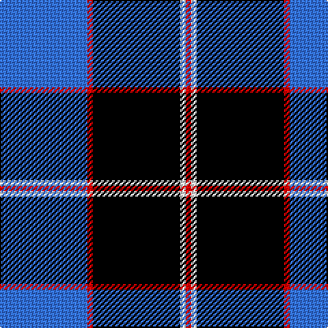

In pattern [BRKWR](/patterns/brkwr/).

This was sourced from register-of-tartans.  It is a [5 stripes tartan](/stripes/stripes5/).

Original link https://www.tartanregister.gov.uk/tartanDetails.aspx?ref=11640

## Thread count
B/64 R4 K64 W4 R/4

## Palette
Each colour and its ΔE from the base-6 reference it is a variant of.

| Colour | Shade | Base | ΔE (OKLab) |
|---|---|---|---|
| B | <code style="background-color:#3474FC;">#3474FC</code> `#3474FC` | B <code style="background-color:#2A418A;">#2A418A</code> | 0.22 |
| K | <code style="background-color:#000000;">#000000</code> `#000000` | K <code style="background-color:#000000;">#000000</code> | 0.00 |
| R | <code style="background-color:#FF0000;">#FF0000</code> `#FF0000` | R <code style="background-color:#CC0000;">#CC0000</code> | 0.11 |
| W | <code style="background-color:#FFFFFF;">#FFFFFF</code> `#FFFFFF` | W <code style="background-color:#F7F7F7;">#F7F7F7</code> | 0.02 |

# Sample pattern

## Nearest tartans

The nearest existing variants by ΔTartan distance.

1. [DeCloud-McMasters (Personal)](/setts/s8/r6b4w4b52k44w6b6w6-b00008c-k101010-rc80000-wffffff/) — ΔT 1.24
1. [Hydro-Electric](/setts/s6/k6b60k16w16k4r6-b304080-k000000-rc00000-we0e0e0/) — ΔT 1.27
1. [DeCloud-McMasters (Personal)](/setts/s8/r6b4w4b52k44w6b6w6-b2c2c80-k101010-rc80000-wfcfcfc/) — ΔT 1.50
1. [Sorbie (Name)](/setts/s6/r4b4k68b68k4w4-b1474b4-k101010-rc80000-wfcfcfc/) — ΔT 1.50
1. [Hakkarain (Personal)](/setts/s6/k74w36ka74r4ka4r4-k000040-ka101010-rc80000-we0e0e0/) — ΔT 1.53
1. [Eildon (1980)](/setts/s8/b84w4wa4w4b10ba24wa64b8-b000050-ba003478-w94acfc-wac8c8c8/) — ΔT 1.55
1. [Hannah (Personal)](/setts/s6/w4b70k18w6k18y4-b30308c-k101010-we0e0e0-ye8c000/) — ΔT 1.56
1. [Bro-Spirit of Northmen (Corporate)](/setts/s5/r6k2b54k54w6-b1474b4-k101010-r880000-we0e0e0/) — ΔT 1.61
1. [Int. Police Association (Official)](/setts/s7/b14r6b52ba4b4ba52y8-b1c0070-ba5c8ca8-rc80000-ye8c000/) — ΔT 1.63
1. [Historic Scotland](/setts/s9/b8w2b2w6b48g18k2g18k6-b000050-g808080-k000000-we0e0e0/) — ΔT 1.65

## Neighbour map

Every grey dot is one of 15726 variants placed by the first two principal components of the ΔTartan feature space (44% of its variance). Red is this tartan; blue dots are its nearest — click one to open its page.

<svg viewBox="0 0 640 380" role="img" style="max-width:100%;height:auto;border:1px solid #e0e0e0;border-radius:4px;display:block" xmlns="http://www.w3.org/2000/svg"><image href="/nn/cloud.v1.png" width="640" height="380"/><a href="/setts/s8/r6b4w4b52k44w6b6w6-b00008c-k101010-rc80000-wffffff/"><circle cx="252.0" cy="160.1" r="4" fill="#3465a4"><title>DeCloud-McMasters (Personal)</title></circle></a><a href="/setts/s6/k6b60k16w16k4r6-b304080-k000000-rc00000-we0e0e0/"><circle cx="288.7" cy="168.1" r="4" fill="#3465a4"><title>Hydro-Electric</title></circle></a><a href="/setts/s8/r6b4w4b52k44w6b6w6-b2c2c80-k101010-rc80000-wfcfcfc/"><circle cx="259.7" cy="158.0" r="4" fill="#3465a4"><title>DeCloud-McMasters (Personal)</title></circle></a><a href="/setts/s6/r4b4k68b68k4w4-b1474b4-k101010-rc80000-wfcfcfc/"><circle cx="312.0" cy="170.7" r="4" fill="#3465a4"><title>Sorbie (Name)</title></circle></a><a href="/setts/s6/k74w36ka74r4ka4r4-k000040-ka101010-rc80000-we0e0e0/"><circle cx="219.3" cy="171.5" r="4" fill="#3465a4"><title>Hakkarain (Personal)</title></circle></a><a href="/setts/s8/b84w4wa4w4b10ba24wa64b8-b000050-ba003478-w94acfc-wac8c8c8/"><circle cx="270.7" cy="136.8" r="4" fill="#3465a4"><title>Eildon (1980)</title></circle></a><a href="/setts/s6/w4b70k18w6k18y4-b30308c-k101010-we0e0e0-ye8c000/"><circle cx="346.4" cy="169.9" r="4" fill="#3465a4"><title>Hannah (Personal)</title></circle></a><a href="/setts/s5/r6k2b54k54w6-b1474b4-k101010-r880000-we0e0e0/"><circle cx="300.1" cy="172.3" r="4" fill="#3465a4"><title>Bro-Spirit of Northmen (Corporate)</title></circle></a><a href="/setts/s7/b14r6b52ba4b4ba52y8-b1c0070-ba5c8ca8-rc80000-ye8c000/"><circle cx="285.0" cy="178.3" r="4" fill="#3465a4"><title>Int. Police Association (Official)</title></circle></a><a href="/setts/s9/b8w2b2w6b48g18k2g18k6-b000050-g808080-k000000-we0e0e0/"><circle cx="297.1" cy="136.3" r="4" fill="#3465a4"><title>Historic Scotland</title></circle></a><circle cx="263.4" cy="177.6" r="5" fill="#c00000"/></svg>

ID: /setts/s5/b64r4k64w4r4-b3474fc-k000000-rff0000-wffffff/
