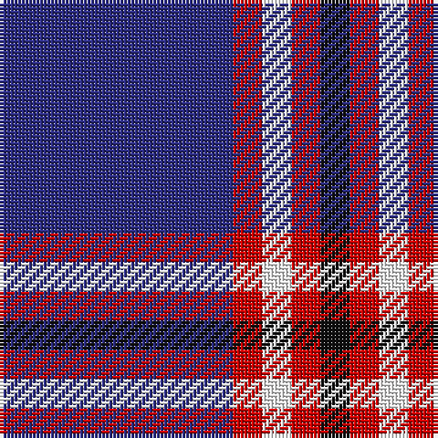

In pattern [BRWRK](/patterns/brwrk/).

This was sourced from tartans-authority.  It is a [5 stripes tartan](/stripes/stripes5/).

Original link http://www.tartansauthority.com/tartan-ferret/display/2544/

## Thread count
DB/64 R8 W8 R8 K/8

## Palette
Each colour and its ΔE from the base-6 reference it is a variant of.

| Colour | Shade | Base | ΔE (OKLab) |
|---|---|---|---|
| DB | <code style="background-color:#2C2C80;">#2C2C80</code> `#2C2C80` | B <code style="background-color:#2A418A;">#2A418A</code> | 0.06 |
| K | <code style="background-color:#101010;">#101010</code> `#101010` | K <code style="background-color:#000000;">#000000</code> | 0.17 |
| R | <code style="background-color:#C80000;">#C80000</code> `#C80000` | R <code style="background-color:#CC0000;">#CC0000</code> | 0.01 |
| W | <code style="background-color:#FCFCFC;">#FCFCFC</code> `#FCFCFC` | W <code style="background-color:#F7F7F7;">#F7F7F7</code> | 0.01 |

# Sample pattern

## Nearest tartans

The nearest existing variants by ΔTartan distance.

1. [Laing of Archiestown](/setts/s5/b76r8w8r8k8-b304080-k000000-rc00000-we0e0e0/) — ΔT 0.76
1. [International Festival of Authors](/setts/s6/b60r10b10ba8b8g24-b59178a-ba009ec7-g00b052-re026a3/) — ΔT 1.02
1. [Lytley Hunting (Personal)](/setts/s5/b50r5y5ba15y10-b2c2c80-ba202060-rc80000-yfccc00/) — ΔT 1.23
1. [Glen Moy](/setts/s5/b78w18b6r18w6-b1c0070-rc80000-wc0c0c0/) — ΔT 1.26
1. [Glen Moy Trade Tartan Tartan Number: 635. Earliest known date: pre 1992 Its mainly Sheep farming in Glen Moy. Off the beaten track, its a very quiet area of the Angus glens close to Cortachy castle and great for walking if you like it to yourself! Its also close to Glen Clova which is the busiest glen around here with some fantastic mountains for walking and taking photos. See products available Copyright © Blair Urquhart, Comrie, 2015](/setts/s5/b74w18b6r18w6-b202060-rc80000-we0e0e0/) — ΔT 1.29
1. [South Australian Pipes & Drums (Corp](/setts/s6/b120y12b22r50b22y12-b2c2c80-rc80000-ye8c000/) — ΔT 1.31
1. [Glen Moy](/setts/s5/b74w18b6r18w6-b000050-rc00000-we0e0e0/) — ΔT 1.48
1. [Lothian Buses (Corporate?)](/setts/s6/w16b120r24g24r24b8-b2c2c80-g006818-rc80000-we0e0e0/) — ΔT 1.50
1. [International Festival of Authors (C](/setts/s6/b60r10b10ba8b8g24-b780078-ba586cd0-g289c18-rc850d8/) — ΔT 1.54
1. [BC Corps of Commissionaires, The](/setts/s7/b48w4r12w4r12w4b24-b202060-ra00000-wc0c0c0/) — ΔT 1.55

## Neighbour map

Every grey dot is one of 15726 variants placed by the first two principal components of the ΔTartan feature space (44% of its variance). Red is this tartan; blue dots are its nearest — click one to open its page.

<svg viewBox="0 0 640 380" role="img" style="max-width:100%;height:auto;border:1px solid #e0e0e0;border-radius:4px;display:block" xmlns="http://www.w3.org/2000/svg"><image href="/nn/cloud.v1.png" width="640" height="380"/><a href="/setts/s5/b76r8w8r8k8-b304080-k000000-rc00000-we0e0e0/"><circle cx="413.5" cy="193.2" r="4" fill="#3465a4"><title>Laing of Archiestown</title></circle></a><a href="/setts/s6/b60r10b10ba8b8g24-b59178a-ba009ec7-g00b052-re026a3/"><circle cx="348.1" cy="210.1" r="4" fill="#3465a4"><title>International Festival of Authors</title></circle></a><a href="/setts/s5/b50r5y5ba15y10-b2c2c80-ba202060-rc80000-yfccc00/"><circle cx="306.1" cy="199.5" r="4" fill="#3465a4"><title>Lytley Hunting (Personal)</title></circle></a><a href="/setts/s5/b78w18b6r18w6-b1c0070-rc80000-wc0c0c0/"><circle cx="394.2" cy="201.5" r="4" fill="#3465a4"><title>Glen Moy</title></circle></a><a href="/setts/s5/b74w18b6r18w6-b202060-rc80000-we0e0e0/"><circle cx="377.3" cy="200.1" r="4" fill="#3465a4"><title>Glen Moy Trade Tartan Tartan Number: 635. Earliest known date: pre 1992 Its mainly Sheep farming in Glen Moy. Off the beaten track, its a very quiet area of the Angus glens close to Cortachy castle and great for walking if you like it to yourself! Its also close to Glen Clova which is the busiest glen around here with some fantastic mountains for walking and taking photos. See products available Copyright © Blair Urquhart, Comrie, 2015</title></circle></a><a href="/setts/s6/b120y12b22r50b22y12-b2c2c80-rc80000-ye8c000/"><circle cx="410.3" cy="215.1" r="4" fill="#3465a4"><title>South Australian Pipes &amp; Drums (Corp</title></circle></a><a href="/setts/s5/b74w18b6r18w6-b000050-rc00000-we0e0e0/"><circle cx="367.6" cy="202.8" r="4" fill="#3465a4"><title>Glen Moy</title></circle></a><a href="/setts/s6/w16b120r24g24r24b8-b2c2c80-g006818-rc80000-we0e0e0/"><circle cx="339.9" cy="175.9" r="4" fill="#3465a4"><title>Lothian Buses (Corporate?)</title></circle></a><a href="/setts/s6/b60r10b10ba8b8g24-b780078-ba586cd0-g289c18-rc850d8/"><circle cx="364.8" cy="209.5" r="4" fill="#3465a4"><title>International Festival of Authors (C</title></circle></a><a href="/setts/s7/b48w4r12w4r12w4b24-b202060-ra00000-wc0c0c0/"><circle cx="405.7" cy="207.4" r="4" fill="#3465a4"><title>BC Corps of Commissionaires, The</title></circle></a><circle cx="368.8" cy="199.0" r="5" fill="#c00000"/></svg>

ID: /setts/s5/b64r8w8r8k8-b2c2c80-k101010-rc80000-wfcfcfc/
