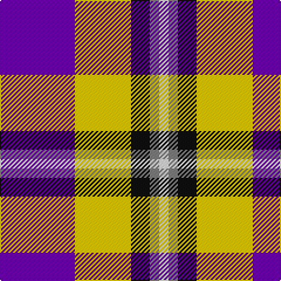

In pattern [BYKGW](/patterns/bykgw/).

This was sourced from register-of-tartans.  It is a [5 stripes tartan](/stripes/stripes5/).

Original link https://www.tartanregister.gov.uk/tartanDetails.aspx?ref=11064

## Thread count
P/64 Y48 K16 N8 W/8

## Palette
Each colour and its ΔE from the base-6 reference it is a variant of.

| Colour | Shade | Base | ΔE (OKLab) |
|---|---|---|---|
| K | <code style="background-color:#101010;">#101010</code> `#101010` | K <code style="background-color:#000000;">#000000</code> | 0.17 |
| N | <code style="background-color:#808080;">#808080</code> `#808080` | G <code style="background-color:#006400;">#006400</code> | 0.22 |
| P | <code style="background-color:#5A008C;">#5A008C</code> `#5A008C` | B <code style="background-color:#2C4084;">#2C4084</code> | 0.12 |
| W | <code style="background-color:#F9F5EF;">#F9F5EF</code> `#F9F5EF` | W <code style="background-color:#F4F4F0;">#F4F4F0</code> | 0.01 |
| Y | <code style="background-color:#E8C000;">#E8C000</code> `#E8C000` | Y <code style="background-color:#E8C000;">#E8C000</code> | 0.00 |

# Sample pattern

## Nearest tartans

The nearest existing variants by ΔTartan distance.

1. [Ballater Victoria Week](/setts/s5/b64y48k16r8w8-b780078-k101010-r888888-wfcfcfc-ye8c000/) — ΔT 0.68
1. [Pengelly, The Cornish (Name)](/setts/s7/w10k52y8w48b16k6r8-b780078-k101010-rc80000-wcccccc-ye8c000/) — ΔT 1.05
1. [Wilson's, No 111](/setts/s5/b38w4g24ba6k8-b800080-ba5480b0-g008000-k000000-we0e0e0/) — ΔT 1.07
1. [Siddle, New (Corporate)](/setts/s5/r30b20w15wa3y3-b202060-rc80000-we0e0e0-wa98c8e8-yfccc00/) — ΔT 1.13
1. [Thomson Dress (Grey) (Fashion)](/setts/s6/r8ra50k12w24k22y6-k101010-rc80000-ra888888-we0e0e0-ye8c000/) — ΔT 1.15
1. [Meg Merrilees Fancy Tartan Tartan Number: 1602. Earliest known date: 1831 Miss McDougall, Inverness library, says in her notes:The first mention I had of this tartan was in an advertisment by D MacDougall, Draper, 27 High St., Inverness in 1831 . . . Meg Merrilees and other winter shawls. From Dalgety Archives. STS notes that it was sold by Forsyth's in Glasgow in 1840. Meg Merrilees was a character in one of Scotts novels, Guy Mannering. BU See products available Copyright © Blair Urquhart, Comrie, 2015](/setts/s6/w46b12w12r10k70r20-b2c2c80-k101010-rc80000-we0e0e0/) — ΔT 1.18
1. [Common Ground (Dress)](/setts/s5/w6r54w32b54y6-b001f5c-r930601-wffffff-yf0e200/) — ΔT 1.19
1. [Merrilees](/setts/s6/w46b12w12r10k70r20-b5c8ca8-k101010-rc80000-wf8f8f8/) — ΔT 1.22
1. [Common Ground Dress (Fashion)](/setts/s5/w6r54w32b54y6-b2c2c80-r880000-we0e0e0-ybc8c00/) — ΔT 1.24
1. [MacTavish Dress Family Tartan Tartan Number: 1383. Earliest known date: 1958 Designed for Lord Thomson of Fleet in 1958 based on a sample in the Moy Hall collection dating from the mid 19th century. Designed by John Bain & Alfred Bottomley of MacArthurs of Hamilton (now at Biggar 2002). Alfred was owner of MacArthurs and John was a director and one of the leading designers in Scotland. The design work on this and the Thomson Htg was for Lord Thomson of Fleet - via Kinloch Anderson of Edinburgh. The tartan is also suitable for MacTavishs and Thomsons, who claim descent from the Clan MacIntosh, regardless of spelling. John Bain 10 Oct 2002, remembers Lord Thomson visiting the mill to discuss the designs. See products available Copyright © Blair Urquhart, Comrie, 2015](/setts/s6/r8b56k12w24k24y6-b5c8ca8-k101010-rc80000-we0e0e0-ye8c000/) — ΔT 1.25

## Neighbour map

Every grey dot is one of 15726 variants placed by the first two principal components of the ΔTartan feature space (44% of its variance). Red is this tartan; blue dots are its nearest — click one to open its page.

<svg viewBox="0 0 640 380" role="img" style="max-width:100%;height:auto;border:1px solid #e0e0e0;border-radius:4px;display:block" xmlns="http://www.w3.org/2000/svg"><image href="/nn/cloud.v1.png" width="640" height="380"/><a href="/setts/s5/b64y48k16r8w8-b780078-k101010-r888888-wfcfcfc-ye8c000/"><circle cx="177.2" cy="183.7" r="4" fill="#3465a4"><title>Ballater Victoria Week</title></circle></a><a href="/setts/s7/w10k52y8w48b16k6r8-b780078-k101010-rc80000-wcccccc-ye8c000/"><circle cx="150.1" cy="164.4" r="4" fill="#3465a4"><title>Pengelly, The Cornish (Name)</title></circle></a><a href="/setts/s5/b38w4g24ba6k8-b800080-ba5480b0-g008000-k000000-we0e0e0/"><circle cx="206.8" cy="191.8" r="4" fill="#3465a4"><title>Wilson's, No 111</title></circle></a><a href="/setts/s5/r30b20w15wa3y3-b202060-rc80000-we0e0e0-wa98c8e8-yfccc00/"><circle cx="171.2" cy="181.4" r="4" fill="#3465a4"><title>Siddle, New (Corporate)</title></circle></a><a href="/setts/s6/r8ra50k12w24k22y6-k101010-rc80000-ra888888-we0e0e0-ye8c000/"><circle cx="139.3" cy="186.6" r="4" fill="#3465a4"><title>Thomson Dress (Grey) (Fashion)</title></circle></a><a href="/setts/s6/w46b12w12r10k70r20-b2c2c80-k101010-rc80000-we0e0e0/"><circle cx="161.4" cy="200.3" r="4" fill="#3465a4"><title>Meg Merrilees Fancy Tartan Tartan Number: 1602. Earliest known date: 1831 Miss McDougall, Inverness library, says in her notes:The first mention I had of this tartan was in an advertisment by D MacDougall, Draper, 27 High St., Inverness in 1831 . . . Meg Merrilees and other winter shawls. From Dalgety Archives. STS notes that it was sold by Forsyth's in Glasgow in 1840. Meg Merrilees was a character in one of Scotts novels, Guy Mannering. BU See products available Copyright © Blair Urquhart, Comrie, 2015</title></circle></a><a href="/setts/s5/w6r54w32b54y6-b001f5c-r930601-wffffff-yf0e200/"><circle cx="148.3" cy="204.7" r="4" fill="#3465a4"><title>Common Ground (Dress)</title></circle></a><a href="/setts/s6/w46b12w12r10k70r20-b5c8ca8-k101010-rc80000-wf8f8f8/"><circle cx="156.1" cy="196.8" r="4" fill="#3465a4"><title>Merrilees</title></circle></a><a href="/setts/s5/w6r54w32b54y6-b2c2c80-r880000-we0e0e0-ybc8c00/"><circle cx="164.0" cy="210.1" r="4" fill="#3465a4"><title>Common Ground Dress (Fashion)</title></circle></a><a href="/setts/s6/r8b56k12w24k24y6-b5c8ca8-k101010-rc80000-we0e0e0-ye8c000/"><circle cx="155.4" cy="181.3" r="4" fill="#3465a4"><title>MacTavish Dress Family Tartan Tartan Number: 1383. Earliest known date: 1958 Designed for Lord Thomson of Fleet in 1958 based on a sample in the Moy Hall collection dating from the mid 19th century. Designed by John Bain &amp; Alfred Bottomley of MacArthurs of Hamilton (now at Biggar 2002). Alfred was owner of MacArthurs and John was a director and one of the leading designers in Scotland. The design work on this and the Thomson Htg was for Lord Thomson of Fleet - via Kinloch Anderson of Edinburgh. The tartan is also suitable for MacTavishs and Thomsons, who claim descent from the Clan MacIntosh, regardless of spelling. John Bain 10 Oct 2002, remembers Lord Thomson visiting the mill to discuss the designs. See products available Copyright © Blair Urquhart, Comrie, 2015</title></circle></a><circle cx="171.4" cy="186.4" r="5" fill="#c00000"/></svg>

ID: /setts/s5/b64y48k16g8w8-b5a008c-g808080-k101010-wf9f5ef-ye8c000/
