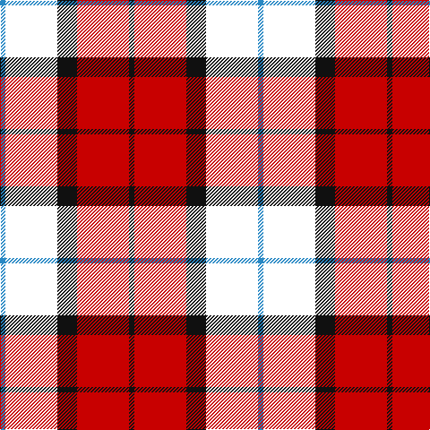

In pattern [BKKRK](/patterns/bkkrk/).

This was sourced from house-of-tartan.  It is a [5 stripes tartan](/stripes/stripes5/).

Original link http://www.house-of-tartan.scotland.net/house/TartanViewjs.asp?colr=Def&tnam=8186

## Thread count
B/6 W58 K22 R58 K/6

## Palette
Each colour and its ΔE from the base-6 reference it is a variant of.

| Colour | Shade | Base | ΔE (OKLab) |
|---|---|---|---|
| B | <code style="background-color:#2888C4;">#2888C4</code> `#2888C4` | B <code style="background-color:#2C4084;">#2C4084</code> | 0.21 |
| K | <code style="background-color:#101010;">#101010</code> `#101010` | K <code style="background-color:#000000;">#000000</code> | 0.17 |
| LN | <code style="background-color:#E0E0E0;">#E0E0E0</code> `#E0E0E0` | W <code style="background-color:#F4F4F0;">#F4F4F0</code> | 0.06 |
| R | <code style="background-color:#C80000;">#C80000</code> `#C80000` | R <code style="background-color:#C80000;">#C80000</code> | 0.00 |

# Sample pattern

## Nearest tartans

The nearest existing variants by ΔTartan distance.

1. [Dutch (District)](/setts/s6/k8r38k38r4b44w8-b440044-k000000-rb84c00-wfcfcfc/) — ΔT 0.99
1. [Graham of Menteith, (Red)](/setts/s6/r52b6r8k32ba32k8-b5480b0-ba304080-k000000-rc00000/) — ΔT 1.00
1. [Dutch](/setts/s6/k8r38k38r4b44w8-b440044-k000000-rc47000-wfcfcfc/) — ΔT 1.13
1. [Unidentified #65](/setts/s6/g6k40ka40r40k6r6-g005020-k000028-ka101010-rdc0000/) — ΔT 1.16
1. [Connel](/setts/s4/w2r16k16y2-k000000-rc00000-we0e0e0-yf0c000/) — ΔT 1.24
1. [Wcwm 759-2](/setts/s6/w10r68k44r8ra48r8-k000000-r8c0000-ra8c8c8c-wc8c8c8/) — ΔT 1.31
1. [MacTavish](/setts/s6/b8r60k12b26k26b6-b304080-k000000-rc00000/) — ΔT 1.31
1. [LP Cover (Dance)](/setts/s7/y12k36b4k4r24k8y12-b3474fc-k000000-r8c0000-yc89800/) — ΔT 1.34
1. [Aitken](/setts/s8/y10b4k4b24k32r40k4r8-b00008c-k000000-r8c0000-yc88c00/) — ΔT 1.38
1. [MacTavish](/setts/s6/b4r24ba4b12k12b2-b4367ae-ba000052-k000000-raa0000/) — ΔT 1.45

## Neighbour map

Every grey dot is one of 15726 variants placed by the first two principal components of the ΔTartan feature space (44% of its variance). Red is this tartan; blue dots are its nearest — click one to open its page.

<svg viewBox="0 0 640 380" role="img" style="max-width:100%;height:auto;border:1px solid #e0e0e0;border-radius:4px;display:block" xmlns="http://www.w3.org/2000/svg"><image href="/nn/cloud.v1.png" width="640" height="380"/><a href="/setts/s6/k8r38k38r4b44w8-b440044-k000000-rb84c00-wfcfcfc/"><circle cx="157.5" cy="200.7" r="4" fill="#3465a4"><title>Dutch (District)</title></circle></a><a href="/setts/s6/r52b6r8k32ba32k8-b5480b0-ba304080-k000000-rc00000/"><circle cx="204.9" cy="208.8" r="4" fill="#3465a4"><title>Graham of Menteith, (Red)</title></circle></a><a href="/setts/s6/k8r38k38r4b44w8-b440044-k000000-rc47000-wfcfcfc/"><circle cx="150.6" cy="198.7" r="4" fill="#3465a4"><title>Dutch</title></circle></a><a href="/setts/s6/g6k40ka40r40k6r6-g005020-k000028-ka101010-rdc0000/"><circle cx="163.1" cy="226.4" r="4" fill="#3465a4"><title>Unidentified #65</title></circle></a><a href="/setts/s4/w2r16k16y2-k000000-rc00000-we0e0e0-yf0c000/"><circle cx="231.6" cy="221.3" r="4" fill="#3465a4"><title>Connel</title></circle></a><a href="/setts/s6/w10r68k44r8ra48r8-k000000-r8c0000-ra8c8c8c-wc8c8c8/"><circle cx="205.7" cy="204.5" r="4" fill="#3465a4"><title>Wcwm 759-2</title></circle></a><a href="/setts/s6/b8r60k12b26k26b6-b304080-k000000-rc00000/"><circle cx="242.6" cy="215.8" r="4" fill="#3465a4"><title>MacTavish</title></circle></a><a href="/setts/s7/y12k36b4k4r24k8y12-b3474fc-k000000-r8c0000-yc89800/"><circle cx="209.0" cy="200.4" r="4" fill="#3465a4"><title>LP Cover (Dance)</title></circle></a><a href="/setts/s8/y10b4k4b24k32r40k4r8-b00008c-k000000-r8c0000-yc88c00/"><circle cx="185.4" cy="189.0" r="4" fill="#3465a4"><title>Aitken</title></circle></a><a href="/setts/s6/b4r24ba4b12k12b2-b4367ae-ba000052-k000000-raa0000/"><circle cx="208.6" cy="196.0" r="4" fill="#3465a4"><title>MacTavish</title></circle></a><circle cx="203.2" cy="212.3" r="5" fill="#c00000"/></svg>

ID: /setts/s5/b6k58ka22r58ka6-b2888c4-k000000-ka101010-rc80000/
