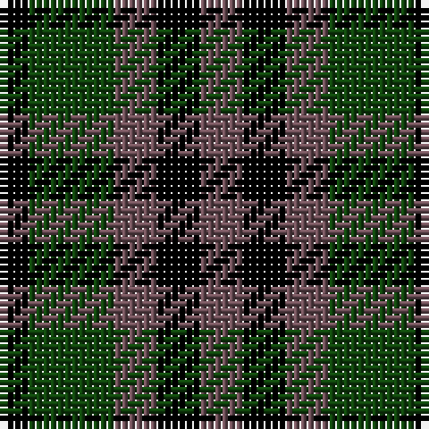

In pattern [BKBGK](/patterns/bkbgk/).

This was sourced from weddslist.  It is a [5 stripes tartan](/stripes/stripes5/).

Original link http://www.weddslist.com/cgi-bin/tartans/pg.pl?source=tinsel

## Thread count
K/4 DG12 N6 K6 N/6

## Palette
Each colour and its ΔE from the base-6 reference it is a variant of.

| Colour | Shade | Base | ΔE (OKLab) |
|---|---|---|---|
| DG | <code style="background-color:#11450D;">#11450D</code> `#11450D` | G <code style="background-color:#006400;">#006400</code> | 0.10 |
| K | <code style="background-color:#000000;">#000000</code> `#000000` | K <code style="background-color:#000000;">#000000</code> | 0.00 |
| N | <code style="background-color:#6E5058;">#6E5058</code> `#6E5058` | B <code style="background-color:#2C4084;">#2C4084</code> | 0.14 |

# Sample pattern

## Nearest tartans

The nearest existing variants by ΔTartan distance.

1. [Austin WI](/setts/s5/b3k3b3g6k2-b6e5058-g11450d-k000000/) — ΔT 0.00
1. [Durham District Tartan Tartan Number: 1089. Earliest known date: 1819 It was Wilson's practice to give the names of towns to many of his new designs. Maybe because the order came from there or because it was the name of the purchaser. There was a family of Durhams associated with the Royal Court in Edinburgh prior to the Union of the Crowns. Wilson was also a collector of tartans, receiving samples from his agents in the Highlands and from purchase orders from around the world. See 'Denholme' and 'Urquhart'. See products available Copyright © Blair Urquhart, Comrie, 2015](/setts/s5/k4g12k12b12r4-b2c2c80-g006818-k101010-rc80000/) — ΔT 1.33
1. [Sutherland, 42nd](/setts/s6/b4k4b12k12g12k4-b304080-g008000-k000000/) — ΔT 1.43
1. [Graham of Montrose Clan Tartan Tartan Number: 1044. Earliest known date: 1810-15 This sett was woven by Wilson's of Bannockburn around 1819. Wilson called it the No. 64 or 'Abercrombie' pattern, and produced it in various colours. In yellow it becomes the Breadalbane and in red, the MacCallum. The white striped Graham tartan is also known as MacLaggan. It is worn unofficially by 205 (sc) General Hospital RAMCV. There is a sample dating from 1815, labelled 'Graham', in the Cockburn Collection. It was first published in the Smith's book of 1850. See also Montrose, Menteith. See products available Copyright © Blair Urquhart, Comrie, 2015](/setts/s7/k16g16w4g16k16b16k4-b2c2c80-g006818-k101010-we0e0e0/) — ΔT 1.49
1. [Norwich No.064](/setts/s8/b24k32g28k10g28k32b24g8-b2c2c80-g006818-k000000/) — ΔT 1.51
1. [Denholm (Fashion)](/setts/s5/k10g40k36b40r10-b2c2c80-g006818-k000000-rc80000/) — ΔT 1.51
1. [Unnamed 1](/setts/s5/k10g28k32b24g8-b000050-g008000-k000000/) — ΔT 1.54
1. [Campbell of Breadalbane Clan Tartan Tartan Number: 1046. Earliest known date: 1810-15 The earliest reference to this pattern is called simply, Breadalbane. W. and A. Smith (1850) were the first to illustrate the sett in its present form. Wilson's of Bannockburn produced this pattern, the No. 64 or 'Abercrombie' in a variety of colours. (See Graham, MacCallum, Rollo.) See products available Copyright © Blair Urquhart, Comrie, 2015](/setts/s7/k18g18y4g18k18b18k6-b2c2c80-g006818-k101010-ye8c000/) — ΔT 1.55
1. [Austin, or Keith](/setts/s5/b8k8b8g18k4-b304080-g008000-k000000/) — ΔT 1.56
1. [Denholme](/setts/s5/k4g16k14b16r4-b304080-g008000-k000000-rc00000/) — ΔT 1.57

## Neighbour map

Every grey dot is one of 15726 variants placed by the first two principal components of the ΔTartan feature space (44% of its variance). Red is this tartan; blue dots are its nearest — click one to open its page.

<svg viewBox="0 0 640 380" role="img" style="max-width:100%;height:auto;border:1px solid #e0e0e0;border-radius:4px;display:block" xmlns="http://www.w3.org/2000/svg"><image href="/nn/cloud.v1.png" width="640" height="380"/><a href="/setts/s5/b3k3b3g6k2-b6e5058-g11450d-k000000/"><circle cx="140.0" cy="332.9" r="4" fill="#3465a4"><title>Austin WI</title></circle></a><a href="/setts/s5/k4g12k12b12r4-b2c2c80-g006818-k101010-rc80000/"><circle cx="128.6" cy="314.3" r="4" fill="#3465a4"><title>Durham District Tartan Tartan Number: 1089. Earliest known date: 1819 It was Wilson's practice to give the names of towns to many of his new designs. Maybe because the order came from there or because it was the name of the purchaser. There was a family of Durhams associated with the Royal Court in Edinburgh prior to the Union of the Crowns. Wilson was also a collector of tartans, receiving samples from his agents in the Highlands and from purchase orders from around the world. See 'Denholme' and 'Urquhart'. See products available Copyright © Blair Urquhart, Comrie, 2015</title></circle></a><a href="/setts/s6/b4k4b12k12g12k4-b304080-g008000-k000000/"><circle cx="147.1" cy="306.0" r="4" fill="#3465a4"><title>Sutherland, 42nd</title></circle></a><a href="/setts/s7/k16g16w4g16k16b16k4-b2c2c80-g006818-k101010-we0e0e0/"><circle cx="142.2" cy="289.2" r="4" fill="#3465a4"><title>Graham of Montrose Clan Tartan Tartan Number: 1044. Earliest known date: 1810-15 This sett was woven by Wilson's of Bannockburn around 1819. Wilson called it the No. 64 or 'Abercrombie' pattern, and produced it in various colours. In yellow it becomes the Breadalbane and in red, the MacCallum. The white striped Graham tartan is also known as MacLaggan. It is worn unofficially by 205 (sc) General Hospital RAMCV. There is a sample dating from 1815, labelled 'Graham', in the Cockburn Collection. It was first published in the Smith's book of 1850. See also Montrose, Menteith. See products available Copyright © Blair Urquhart, Comrie, 2015</title></circle></a><a href="/setts/s8/b24k32g28k10g28k32b24g8-b2c2c80-g006818-k000000/"><circle cx="136.1" cy="305.2" r="4" fill="#3465a4"><title>Norwich No.064</title></circle></a><a href="/setts/s5/k10g40k36b40r10-b2c2c80-g006818-k000000-rc80000/"><circle cx="108.1" cy="283.4" r="4" fill="#3465a4"><title>Denholm (Fashion)</title></circle></a><a href="/setts/s5/k10g28k32b24g8-b000050-g008000-k000000/"><circle cx="155.2" cy="309.8" r="4" fill="#3465a4"><title>Unnamed 1</title></circle></a><a href="/setts/s7/k18g18y4g18k18b18k6-b2c2c80-g006818-k101010-ye8c000/"><circle cx="156.9" cy="291.0" r="4" fill="#3465a4"><title>Campbell of Breadalbane Clan Tartan Tartan Number: 1046. Earliest known date: 1810-15 The earliest reference to this pattern is called simply, Breadalbane. W. and A. Smith (1850) were the first to illustrate the sett in its present form. Wilson's of Bannockburn produced this pattern, the No. 64 or 'Abercrombie' in a variety of colours. (See Graham, MacCallum, Rollo.) See products available Copyright © Blair Urquhart, Comrie, 2015</title></circle></a><a href="/setts/s5/b8k8b8g18k4-b304080-g008000-k000000/"><circle cx="154.3" cy="297.0" r="4" fill="#3465a4"><title>Austin, or Keith</title></circle></a><a href="/setts/s5/k4g16k14b16r4-b304080-g008000-k000000-rc00000/"><circle cx="96.4" cy="279.2" r="4" fill="#3465a4"><title>Denholme</title></circle></a><circle cx="140.0" cy="332.9" r="5" fill="#c00000"/></svg>

ID: /setts/s5/b6k6b6g12k4-b6e5058-g11450d-k000000/
