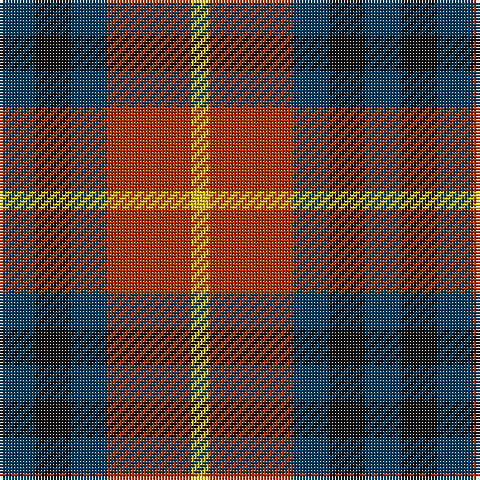

In pattern [BKBRY](/patterns/bkbry/).

This was sourced from register-of-tartans.  It is a [5 stripes tartan](/stripes/stripes5/).

Original link https://www.tartanregister.gov.uk/tartanDetails.aspx?ref=5110

## Thread count
DB/12 K12 DB12 R28 Y/6

## Palette
Each colour and its ΔE from the base-6 reference it is a variant of.

| Colour | Shade | Base | ΔE (OKLab) |
|---|---|---|---|
| DB | <code style="background-color:#003C64;">#003C64</code> `#003C64` | B <code style="background-color:#2A418A;">#2A418A</code> | 0.08 |
| K | <code style="background-color:#101010;">#101010</code> `#101010` | K <code style="background-color:#000000;">#000000</code> | 0.17 |
| R | <code style="background-color:#B03000;">#B03000</code> `#B03000` | R <code style="background-color:#CC0000;">#CC0000</code> | 0.06 |
| Y | <code style="background-color:#E8C000;">#E8C000</code> `#E8C000` | Y <code style="background-color:#F2BF00;">#F2BF00</code> | 0.02 |

# Sample pattern

## Nearest tartans

The nearest existing variants by ΔTartan distance.

1. [Chivas Regal (Corporate)](/setts/s5/b2k2b2r5y1~b003c64-k101010-rb03000-ye8c000~x12/) — ΔT 0.26
1. [Battle of Prestonpans (1745) Herit](/setts/s5/b9r12g9b5w2~b2c2c80-g285800-rc80000-wfcfcfc~x4/) — ΔT 0.78
1. [Unidentified No 28](/setts/s4/r6g5k5b1~b3c82af-g005020-k101010-rdc0000~x2/) — ΔT 0.97
1. [Stewart (Artefact)](/setts/s7/r2g4b8r9g9k2r2~b2c2c80-g006818-k101010-rc80000~x4/) — ΔT 1.03
1. [MacTavish #2](/setts/s6/b1r6ba1b3k3b1~b5c8ca8-ba1c0070-k101010-r880000~x8/) — ΔT 1.14
1. [Creek Indian Nation](/setts/s5/b2g4y1b1r2~b2c2c80-g006818-rc80000-ye8c000~x12/) — ΔT 1.14
1. [Wilson's No.196](/setts/s4/r9g9k10b2~b2888c4-g006818-k101010-rc80000~x2/) — ΔT 1.15
1. [Stewart, Plaid](/setts/s7/r2g4b8r9g9k2r2~b304080-g008000-k000000-rc00000~x2/) — ΔT 1.19
1. [Tulsa, City of](/setts/s6/g14b8g14r14k3r14~b2c2c80-g003820-k101010-rc80000~x2/) — ΔT 1.21
1. [Chaudhri (Name)](/setts/s8/b13r8w5g24w5r10w5r10~b440044-g285800-r800028-we8ccb8~x2/) — ΔT 1.25

## Neighbour map

Every grey dot is one of 15726 variants placed by the first two principal components of the ΔTartan feature space (44% of its variance). Red is this tartan; blue dots are its nearest — click one to open its page.

<svg viewBox="0 0 640 380" role="img" style="max-width:100%;height:auto;border:1px solid #e0e0e0;border-radius:4px;display:block" xmlns="http://www.w3.org/2000/svg"><image href="/nn/cloud.v1.png" width="640" height="380"/><a href="/setts/s5/b2k2b2r5y1~b003c64-k101010-rb03000-ye8c000~x12/"><circle cx="174.4" cy="262.5" r="4" fill="#3465a4"><title>Chivas Regal (Corporate)</title></circle></a><a href="/setts/s5/b9r12g9b5w2~b2c2c80-g285800-rc80000-wfcfcfc~x4/"><circle cx="148.8" cy="264.0" r="4" fill="#3465a4"><title>Battle of Prestonpans (1745) Herit</title></circle></a><a href="/setts/s4/r6g5k5b1~b3c82af-g005020-k101010-rdc0000~x2/"><circle cx="142.8" cy="278.6" r="4" fill="#3465a4"><title>Unidentified No 28</title></circle></a><a href="/setts/s7/r2g4b8r9g9k2r2~b2c2c80-g006818-k101010-rc80000~x4/"><circle cx="158.3" cy="251.4" r="4" fill="#3465a4"><title>Stewart (Artefact)</title></circle></a><a href="/setts/s6/b1r6ba1b3k3b1~b5c8ca8-ba1c0070-k101010-r880000~x8/"><circle cx="190.7" cy="234.6" r="4" fill="#3465a4"><title>MacTavish #2</title></circle></a><a href="/setts/s5/b2g4y1b1r2~b2c2c80-g006818-rc80000-ye8c000~x12/"><circle cx="142.1" cy="273.4" r="4" fill="#3465a4"><title>Creek Indian Nation</title></circle></a><a href="/setts/s4/r9g9k10b2~b2888c4-g006818-k101010-rc80000~x2/"><circle cx="122.4" cy="291.3" r="4" fill="#3465a4"><title>Wilson's No.196</title></circle></a><a href="/setts/s7/r2g4b8r9g9k2r2~b304080-g008000-k000000-rc00000~x2/"><circle cx="144.0" cy="246.6" r="4" fill="#3465a4"><title>Stewart, Plaid</title></circle></a><a href="/setts/s6/g14b8g14r14k3r14~b2c2c80-g003820-k101010-rc80000~x2/"><circle cx="181.3" cy="289.9" r="4" fill="#3465a4"><title>Tulsa, City of</title></circle></a><a href="/setts/s8/b13r8w5g24w5r10w5r10~b440044-g285800-r800028-we8ccb8~x2/"><circle cx="118.4" cy="231.8" r="4" fill="#3465a4"><title>Chaudhri (Name)</title></circle></a><circle cx="159.1" cy="269.3" r="5" fill="#c00000"/></svg>

ID: /setts/s5/b6k6b6r14y3~b003c64-k101010-rb03000-ye8c000~x2/
