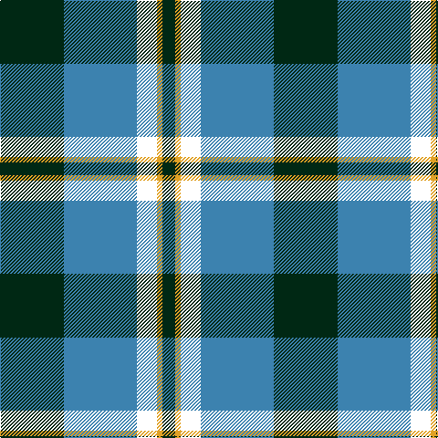

In pattern [BBWYB](/patterns/bbwyb/).

This was sourced from register-of-tartans.  It is a [5 stripes tartan](/stripes/stripes5/).

Original link https://www.tartanregister.gov.uk/tartanDetails.aspx?ref=11402

## Thread count
DG/70 B80 W22 Y6 DG/14

## Palette
Each colour and its ΔE from the base-6 reference it is a variant of.

| Colour | Shade | Base | ΔE (OKLab) |
|---|---|---|---|
| B | <code style="background-color:#3C82AF;">#3C82AF</code> `#3C82AF` | B <code style="background-color:#2C4084;">#2C4084</code> | 0.20 |
| DG | <code style="background-color:#002814;">#002814</code> `#002814` | B <code style="background-color:#2C4084;">#2C4084</code> | 0.21 |
| W | <code style="background-color:#FFFFFF;">#FFFFFF</code> `#FFFFFF` | W <code style="background-color:#F4F4F0;">#F4F4F0</code> | 0.03 |
| Y | <code style="background-color:#E0A126;">#E0A126</code> `#E0A126` | Y <code style="background-color:#E8C000;">#E8C000</code> | 0.08 |

# Sample pattern

## Nearest tartans

The nearest existing variants by ΔTartan distance.

1. [Burberry Hunting](/setts/s5/k18w18k18g60r6-g406054-k101010-rc80000-wfcfcfc/) — ΔT 1.17
1. [Centennial-King George Lodge No.171](/setts/s5/r4w14b60g72y4-b1870a4-g004028-rff0000-wffffff-yffe600/) — ΔT 1.22
1. [Rothesay & Caithness Fencibles (Mil)](/setts/s5/b64k20g30k4y8-b1474b4-g006818-k101010-ye8c000/) — ΔT 1.24
1. [U.S. Border Patrol (Corporate)](/setts/s5/g80k30b20k20y6-b1474b4-g408060-k101010-ye8c000/) — ΔT 1.24
1. [Centennial-King George Lodge No.171](/setts/s5/r4w14b60g72y4-b202060-g006818-rc80000-wfcfcfc-ye8c000/) — ΔT 1.28
1. [Crombie House Check](/setts/s6/k6w20b4g12b36g4-b2c2c80-g006818-k101010-wc0c0c0/) — ΔT 1.31
1. [MacTavish / Thom(p)son, hunting](/setts/s6/b6r52g8b26k26b4-b5480b0-g008000-k000000-r806050/) — ΔT 1.33
1. [Keela (Corporate)](/setts/s7/b14w6b4w12b32ba52r8-b003c64-ba5c8ca8-r880000-wfcfcfc/) — ΔT 1.34
1. [Turnbull, hunting](/setts/s5/k14y6g56b56w6-b304080-g008000-k000000-we0e0e0-yf0c000/) — ΔT 1.35
1. [Thomson Dress (Blue)](/setts/s6/r6b60k12w24k24y6-b1870a4-k101010-rc80000-we0e0e0-ye8c000/) — ΔT 1.35

## Neighbour map

Every grey dot is one of 15726 variants placed by the first two principal components of the ΔTartan feature space (44% of its variance). Red is this tartan; blue dots are its nearest — click one to open its page.

<svg viewBox="0 0 640 380" role="img" style="max-width:100%;height:auto;border:1px solid #e0e0e0;border-radius:4px;display:block" xmlns="http://www.w3.org/2000/svg"><image href="/nn/cloud.v1.png" width="640" height="380"/><a href="/setts/s5/k18w18k18g60r6-g406054-k101010-rc80000-wfcfcfc/"><circle cx="230.5" cy="211.4" r="4" fill="#3465a4"><title>Burberry Hunting</title></circle></a><a href="/setts/s5/r4w14b60g72y4-b1870a4-g004028-rff0000-wffffff-yffe600/"><circle cx="252.0" cy="171.8" r="4" fill="#3465a4"><title>Centennial-King George Lodge No.171</title></circle></a><a href="/setts/s5/b64k20g30k4y8-b1474b4-g006818-k101010-ye8c000/"><circle cx="273.6" cy="205.7" r="4" fill="#3465a4"><title>Rothesay &amp; Caithness Fencibles (Mil)</title></circle></a><a href="/setts/s5/g80k30b20k20y6-b1474b4-g408060-k101010-ye8c000/"><circle cx="277.5" cy="214.3" r="4" fill="#3465a4"><title>U.S. Border Patrol (Corporate)</title></circle></a><a href="/setts/s5/r4w14b60g72y4-b202060-g006818-rc80000-wfcfcfc-ye8c000/"><circle cx="248.9" cy="170.3" r="4" fill="#3465a4"><title>Centennial-King George Lodge No.171</title></circle></a><a href="/setts/s6/k6w20b4g12b36g4-b2c2c80-g006818-k101010-wc0c0c0/"><circle cx="224.3" cy="207.5" r="4" fill="#3465a4"><title>Crombie House Check</title></circle></a><a href="/setts/s6/b6r52g8b26k26b4-b5480b0-g008000-k000000-r806050/"><circle cx="212.3" cy="194.7" r="4" fill="#3465a4"><title>MacTavish / Thom(p)son, hunting</title></circle></a><a href="/setts/s7/b14w6b4w12b32ba52r8-b003c64-ba5c8ca8-r880000-wfcfcfc/"><circle cx="209.9" cy="180.9" r="4" fill="#3465a4"><title>Keela (Corporate)</title></circle></a><a href="/setts/s5/k14y6g56b56w6-b304080-g008000-k000000-we0e0e0-yf0c000/"><circle cx="182.1" cy="201.3" r="4" fill="#3465a4"><title>Turnbull, hunting</title></circle></a><a href="/setts/s6/r6b60k12w24k24y6-b1870a4-k101010-rc80000-we0e0e0-ye8c000/"><circle cx="176.6" cy="178.5" r="4" fill="#3465a4"><title>Thomson Dress (Blue)</title></circle></a><circle cx="222.6" cy="203.2" r="5" fill="#c00000"/></svg>

ID: /setts/s5/b70ba80w22y6b14-b002814-ba3c82af-wffffff-ye0a126/
