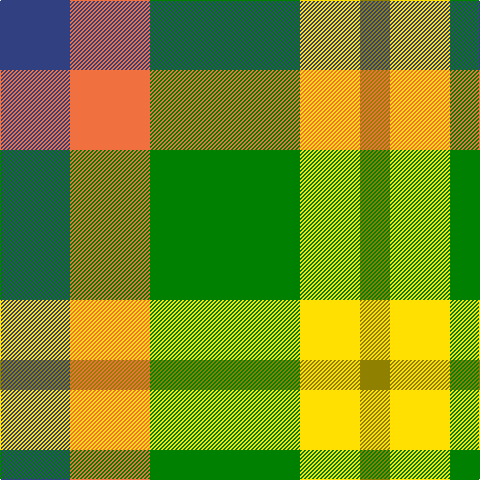

In pattern [BRGYG](/patterns/brgyg/).

This was sourced from weddslist.  It is a [5 stripes tartan](/stripes/stripes5/).

Original link http://www.weddslist.com/cgi-bin/tartans/pg.pl?source=sts

## Thread count
B/70 O80 G150 Y60 LG/30

## Palette
Each colour and its ΔE from the base-6 reference it is a variant of.

| Colour | Shade | Base | ΔE (OKLab) |
|---|---|---|---|
| B | <code style="background-color:#304080;">#304080</code> `#304080` | B <code style="background-color:#2C4084;">#2C4084</code> | 0.01 |
| G | <code style="background-color:#008000;">#008000</code> `#008000` | G <code style="background-color:#006400;">#006400</code> | 0.09 |
| LG | <code style="background-color:#908000;">#908000</code> `#908000` | G <code style="background-color:#006400;">#006400</code> | 0.19 |
| O | <code style="background-color:#F07040;">#F07040</code> `#F07040` | R <code style="background-color:#C80000;">#C80000</code> | 0.18 |
| Y | <code style="background-color:#FFE000;">#FFE000</code> `#FFE000` | Y <code style="background-color:#E8C000;">#E8C000</code> | 0.09 |

# Sample pattern

## Nearest tartans

The nearest existing variants by ΔTartan distance.

1. [Unidentified Silk Plaid](/setts/s5/b70r80g150y60ya30-b2c4084-g005020-rec7440-yfadc00-yac89600/) — ΔT 0.81
1. [Wild Mustard Dreams](/setts/s5/y34ya34r34g52b10-b0000ff-g408060-rb84c00-yd87c00-yaffe600/) — ΔT 1.21
1. [Wild Mustard Dreams](/setts/s5/y34ya34y34g52b10-b2c2c80-g006818-ydc943c-yafccc00/) — ΔT 1.42
1. [Devon Original District Tartan Tartan Number: 1284. Earliest known date: 1984 The Devon Original and Devon Companion owe their origin to the success of the Cornish St Piran sett, which was woven by Coldharbour Mill in the early 1980's. The accreditation certificate was presented to the Mayor of Barnstaple in 1991. In a poem describing the tartan, Miss M. Miles says, "So, in the mind, Devon's beauty is retrieved By contemplating Devon's tartan's weave." See products available Copyright © Blair Urquhart, Comrie, 2015](/setts/s7/y20g16w4g16r16ga16ya4-g6c8820-ga003820-ra8441c-we0e0e0-ya8a8a8-yae8c000/) — ΔT 1.48
1. [Wilson's, No 203](/setts/s4/b8r16g20y4-b5480b0-g008000-rc00000-yf0c000/) — ΔT 1.52
1. [MacKinnon, dress](/setts/s4/g36r28w28ra4-g008000-r703000-rac00000-we0e0e0/) — ΔT 1.52
1. [Inspiration](/setts/s5/r10b24y22ba42ya10-b202060-ba5c5c5c-rc80000-yfccc00-yae8c000/) — ΔT 1.61
1. [Dunoon Burgh Hall Trust](/setts/s5/b4r6g6ra12y4-b1c1c50-g008b00-rb458ac-ra888888-yffff00/) — ΔT 1.61
1. [Wilson's No.203](/setts/s4/b8r16g20y4-b2888c4-g006818-rc80000-ye8c000/) — ΔT 1.63
1. [Devon, Original](/setts/s7/g20ga16w4ga16r16gb16y4-g808080-ga008000-gb003000-r703000-we0e0e0-yf0c000/) — ΔT 1.65

## Neighbour map

Every grey dot is one of 15726 variants placed by the first two principal components of the ΔTartan feature space (44% of its variance). Red is this tartan; blue dots are its nearest — click one to open its page.

<svg viewBox="0 0 640 380" role="img" style="max-width:100%;height:auto;border:1px solid #e0e0e0;border-radius:4px;display:block" xmlns="http://www.w3.org/2000/svg"><image href="/nn/cloud.v1.png" width="640" height="380"/><a href="/setts/s5/b70r80g150y60ya30-b2c4084-g005020-rec7440-yfadc00-yac89600/"><circle cx="91.0" cy="243.1" r="4" fill="#3465a4"><title>Unidentified Silk Plaid</title></circle></a><a href="/setts/s5/y34ya34r34g52b10-b0000ff-g408060-rb84c00-yd87c00-yaffe600/"><circle cx="66.4" cy="254.0" r="4" fill="#3465a4"><title>Wild Mustard Dreams</title></circle></a><a href="/setts/s5/y34ya34y34g52b10-b2c2c80-g006818-ydc943c-yafccc00/"><circle cx="146.9" cy="274.1" r="4" fill="#3465a4"><title>Wild Mustard Dreams</title></circle></a><a href="/setts/s7/y20g16w4g16r16ga16ya4-g6c8820-ga003820-ra8441c-we0e0e0-ya8a8a8-yae8c000/"><circle cx="69.3" cy="232.7" r="4" fill="#3465a4"><title>Devon Original District Tartan Tartan Number: 1284. Earliest known date: 1984 The Devon Original and Devon Companion owe their origin to the success of the Cornish St Piran sett, which was woven by Coldharbour Mill in the early 1980's. The accreditation certificate was presented to the Mayor of Barnstaple in 1991. In a poem describing the tartan, Miss M. Miles says, &quot;So, in the mind, Devon's beauty is retrieved By contemplating Devon's tartan's weave.&quot; See products available Copyright © Blair Urquhart, Comrie, 2015</title></circle></a><a href="/setts/s4/b8r16g20y4-b5480b0-g008000-rc00000-yf0c000/"><circle cx="181.4" cy="278.1" r="4" fill="#3465a4"><title>Wilson's, No 203</title></circle></a><a href="/setts/s4/g36r28w28ra4-g008000-r703000-rac00000-we0e0e0/"><circle cx="149.2" cy="248.2" r="4" fill="#3465a4"><title>MacKinnon, dress</title></circle></a><a href="/setts/s5/r10b24y22ba42ya10-b202060-ba5c5c5c-rc80000-yfccc00-yae8c000/"><circle cx="94.4" cy="241.4" r="4" fill="#3465a4"><title>Inspiration</title></circle></a><a href="/setts/s5/b4r6g6ra12y4-b1c1c50-g008b00-rb458ac-ra888888-yffff00/"><circle cx="62.8" cy="267.3" r="4" fill="#3465a4"><title>Dunoon Burgh Hall Trust</title></circle></a><a href="/setts/s4/b8r16g20y4-b2888c4-g006818-rc80000-ye8c000/"><circle cx="177.8" cy="277.0" r="4" fill="#3465a4"><title>Wilson's No.203</title></circle></a><a href="/setts/s7/g20ga16w4ga16r16gb16y4-g808080-ga008000-gb003000-r703000-we0e0e0-yf0c000/"><circle cx="66.6" cy="240.0" r="4" fill="#3465a4"><title>Devon, Original</title></circle></a><circle cx="97.1" cy="246.2" r="5" fill="#c00000"/></svg>

ID: /setts/s5/b70r80g150y60ga30-b304080-g008000-ga908000-rf07040-yffe000/
