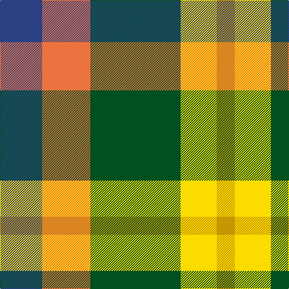

In pattern [BRGYY](/patterns/brgyy/).

This was sourced from register-of-tartans.  It is a [5 stripes tartan](/stripes/stripes5/).

Original link https://www.tartanregister.gov.uk/tartanDetails.aspx?ref=4383

## Thread count
B/70 O80 G150 Y60 DY/30

## Palette
Each colour and its ΔE from the base-6 reference it is a variant of.

| Colour | Shade | Base | ΔE (OKLab) |
|---|---|---|---|
| B | <code style="background-color:#2C4084;">#2C4084</code> `#2C4084` | B <code style="background-color:#2C4084;">#2C4084</code> | 0.00 |
| DY | <code style="background-color:#C89600;">#C89600</code> `#C89600` | Y <code style="background-color:#E8C000;">#E8C000</code> | 0.12 |
| G | <code style="background-color:#005020;">#005020</code> `#005020` | G <code style="background-color:#006400;">#006400</code> | 0.08 |
| O | <code style="background-color:#EC7440;">#EC7440</code> `#EC7440` | R <code style="background-color:#C80000;">#C80000</code> | 0.18 |
| Y | <code style="background-color:#FADC00;">#FADC00</code> `#FADC00` | Y <code style="background-color:#E8C000;">#E8C000</code> | 0.08 |

# Sample pattern

## Nearest tartans

The nearest existing variants by ΔTartan distance.

1. [Unidentified, Silk Plaid](/setts/s5/b70r80g150y60ga30-b304080-g008000-ga908000-rf07040-yffe000/) — ΔT 0.81
1. [Inspiration](/setts/s5/r10b24y22ba42ya10-b202060-ba5c5c5c-rc80000-yfccc00-yae8c000/) — ΔT 0.93
1. [Inspiration](/setts/s5/r10b24y22ba42ya10-b5f749c-ba14283c-rc8002c-yc4bc68-yae0a126/) — ΔT 1.25
1. [Gallowater Old District Tartan Tartan Number: 1025. Earliest known date: 1819 Both 'Old' and 'New' appear in Wilson's 1819 pattern book. See products available Copyright © Blair Urquhart, Comrie, 2015](/setts/s5/k19b10ba19g40y10-b5c8ca8-ba780078-g006818-k101010-ye8c000/) — ΔT 1.27
1. [Dunoon Burgh Hall Trust](/setts/s5/b4r6g6ra12y4-b1c1c50-g008b00-rb458ac-ra888888-yffff00/) — ΔT 1.29
1. [Wilson's, No 214](/setts/s5/g16r12b4k4b12-b5480b0-g008000-k000000-rc00000/) — ΔT 1.31
1. [Gallowater, Old](/setts/s5/k19b10ba19g40y10-b5480b0-ba800080-g008000-k000000-yf0c000/) — ΔT 1.35
1. [Wild Mustard Dreams](/setts/s5/y34ya34r34g52b10-b0000ff-g408060-rb84c00-yd87c00-yaffe600/) — ΔT 1.38
1. [Entre Rios Province (Provisional](/setts/s6/g72w8g16k58r48wa14-g44a054-k101010-rc80000-wa8ace8-wae0e0e0/) — ΔT 1.41
1. [Blackie](/setts/s8/g18y4g18w10r18b4r18b4-b5c8ca8-g006818-rc80000-wffffff-ye8c000/) — ΔT 1.45

## Neighbour map

Every grey dot is one of 15726 variants placed by the first two principal components of the ΔTartan feature space (44% of its variance). Red is this tartan; blue dots are its nearest — click one to open its page.

<svg viewBox="0 0 640 380" role="img" style="max-width:100%;height:auto;border:1px solid #e0e0e0;border-radius:4px;display:block" xmlns="http://www.w3.org/2000/svg"><image href="/nn/cloud.v1.png" width="640" height="380"/><a href="/setts/s5/b70r80g150y60ga30-b304080-g008000-ga908000-rf07040-yffe000/"><circle cx="97.1" cy="246.2" r="4" fill="#3465a4"><title>Unidentified, Silk Plaid</title></circle></a><a href="/setts/s5/r10b24y22ba42ya10-b202060-ba5c5c5c-rc80000-yfccc00-yae8c000/"><circle cx="94.4" cy="241.4" r="4" fill="#3465a4"><title>Inspiration</title></circle></a><a href="/setts/s5/r10b24y22ba42ya10-b5f749c-ba14283c-rc8002c-yc4bc68-yae0a126/"><circle cx="96.7" cy="246.9" r="4" fill="#3465a4"><title>Inspiration</title></circle></a><a href="/setts/s5/k19b10ba19g40y10-b5c8ca8-ba780078-g006818-k101010-ye8c000/"><circle cx="107.0" cy="255.2" r="4" fill="#3465a4"><title>Gallowater Old District Tartan Tartan Number: 1025. Earliest known date: 1819 Both 'Old' and 'New' appear in Wilson's 1819 pattern book. See products available Copyright © Blair Urquhart, Comrie, 2015</title></circle></a><a href="/setts/s5/b4r6g6ra12y4-b1c1c50-g008b00-rb458ac-ra888888-yffff00/"><circle cx="62.8" cy="267.3" r="4" fill="#3465a4"><title>Dunoon Burgh Hall Trust</title></circle></a><a href="/setts/s5/g16r12b4k4b12-b5480b0-g008000-k000000-rc00000/"><circle cx="107.9" cy="276.0" r="4" fill="#3465a4"><title>Wilson's, No 214</title></circle></a><a href="/setts/s5/k19b10ba19g40y10-b5480b0-ba800080-g008000-k000000-yf0c000/"><circle cx="85.1" cy="246.6" r="4" fill="#3465a4"><title>Gallowater, Old</title></circle></a><a href="/setts/s5/y34ya34r34g52b10-b0000ff-g408060-rb84c00-yd87c00-yaffe600/"><circle cx="66.4" cy="254.0" r="4" fill="#3465a4"><title>Wild Mustard Dreams</title></circle></a><a href="/setts/s6/g72w8g16k58r48wa14-g44a054-k101010-rc80000-wa8ace8-wae0e0e0/"><circle cx="142.7" cy="194.7" r="4" fill="#3465a4"><title>Entre Rios Province (Provisional</title></circle></a><a href="/setts/s8/g18y4g18w10r18b4r18b4-b5c8ca8-g006818-rc80000-wffffff-ye8c000/"><circle cx="114.4" cy="219.8" r="4" fill="#3465a4"><title>Blackie</title></circle></a><circle cx="91.0" cy="243.1" r="5" fill="#c00000"/></svg>

ID: /setts/s5/b70r80g150y60ya30-b2c4084-g005020-rec7440-yfadc00-yac89600/
