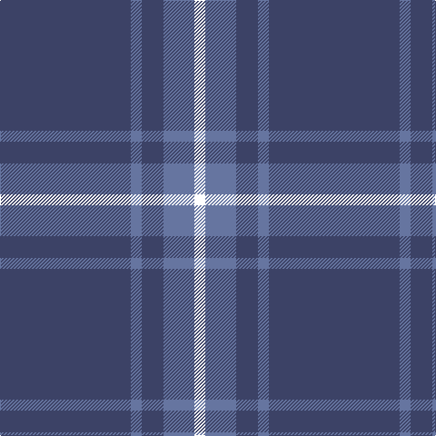

In pattern [BBBBW](/patterns/bbbbw/).

This was sourced from register-of-tartans.  It is a [5 stripes tartan](/stripes/stripes5/).

Original link https://www.tartanregister.gov.uk/tartanDetails.aspx?ref=10325

## Register references

External register numbers recorded for this tartan.

- Scottish Register of Tartans: [10325](https://www.tartanregister.gov.uk/tartanDetails.aspx?ref=10325)

## Thread count
N/144 B12 N24 B34 W/12

## Palette
Each colour and its ΔE from the base-6 reference it is a variant of.

| Colour | Shade | Base | ΔE (OKLab) |
|---|---|---|---|
| B | <code style="background-color:#6675A0;">#6675A0</code> `#6675A0` | B <code style="background-color:#2A418A;">#2A418A</code> | 0.18 |
| N | <code style="background-color:#3C4266;">#3C4266</code> `#3C4266` | B <code style="background-color:#2A418A;">#2A418A</code> | 0.07 |
| W | <code style="background-color:#FFFFFF;">#FFFFFF</code> `#FFFFFF` | W <code style="background-color:#F7F7F7;">#F7F7F7</code> | 0.02 |

# Sample pattern

## Nearest tartans

The nearest existing variants by ΔTartan distance.

1. [Hepburn](/setts/s6/b13ba1b3ba6y1ba1~b304080-ba8080d0-yf0c000~x4/) — ΔT 1.50
1. [Gulfmark (Corporate)](/setts/s5/b72ba6b12ba17w6~b2c2c80-ba2888c4-we0e0e0~x2/) — ΔT 1.50
1. [Lynch Family Tartan Tartan Number: 2163. Earliest known date: 1994 Information from Dr. Phil Smith, Narvon, USA. See products available Copyright © Blair Urquhart, Comrie, 2015](/setts/s6/r19b6r14b101g7b7~b2c2c80-g006818-rc80000/) — ΔT 1.50
1. [Lynch](/setts/s6/r19b6r7b101g6b7~b304080-g006030-rc00000~x2/) — ΔT 1.54
1. [Dollar Academy](/setts/s6/b9k9b9k9b42w5~b2c2c80-k101010-wc0c0c0~x2/) — ΔT 1.61
1. [Wheadon (Name)](/setts/s6/b40g7y3g7b15r5~b34349c-g008c20-rc80000-ye8c000~x2/) — ΔT 1.68
1. [Dominion (Fashion)](/setts/s7/y6r1y17b3y3b8y1~b2c2c80-rc80000-y6c9cb4~x2/) — ΔT 1.70
1. [JetBlue (Corporate)](/setts/s7/b4w3ba6b40ba8b12g3~b2c2c80-ba1474b4-g289c18-wfcfcfc~x2/) — ΔT 1.74
1. [Dollar Academy (1930s) (Corporate)](/setts/s6/b9k9b9k9b42w5~b2c2c80-k101010-we0e0e0~x2/) — ΔT 1.75
1. [Gyle](/setts/s4/r2g1b8g1~b2888c4-g003820-r880000~x20/) — ΔT 1.76

## Neighbour map

Every grey dot is one of 15726 variants placed by the first two principal components of the ΔTartan feature space (44% of its variance). Red is this tartan; blue dots are its nearest — click one to open its page.

<svg viewBox="0 0 640 380" role="img" style="max-width:100%;height:auto;border:1px solid #e0e0e0;border-radius:4px;display:block" xmlns="http://www.w3.org/2000/svg"><image href="/nn/cloud.v1.png" width="640" height="380"/><a href="/setts/s6/b13ba1b3ba6y1ba1~b304080-ba8080d0-yf0c000~x4/"><circle cx="442.4" cy="226.3" r="4" fill="#3465a4"><title>Hepburn</title></circle></a><a href="/setts/s5/b72ba6b12ba17w6~b2c2c80-ba2888c4-we0e0e0~x2/"><circle cx="494.3" cy="234.1" r="4" fill="#3465a4"><title>Gulfmark (Corporate)</title></circle></a><a href="/setts/s6/r19b6r14b101g7b7~b2c2c80-g006818-rc80000/"><circle cx="529.7" cy="200.0" r="4" fill="#3465a4"><title>Lynch Family Tartan Tartan Number: 2163. Earliest known date: 1994 Information from Dr. Phil Smith, Narvon, USA. See products available Copyright © Blair Urquhart, Comrie, 2015</title></circle></a><a href="/setts/s6/r19b6r7b101g6b7~b304080-g006030-rc00000~x2/"><circle cx="593.8" cy="210.1" r="4" fill="#3465a4"><title>Lynch</title></circle></a><a href="/setts/s6/b9k9b9k9b42w5~b2c2c80-k101010-wc0c0c0~x2/"><circle cx="461.9" cy="257.5" r="4" fill="#3465a4"><title>Dollar Academy</title></circle></a><a href="/setts/s6/b40g7y3g7b15r5~b34349c-g008c20-rc80000-ye8c000~x2/"><circle cx="425.8" cy="203.7" r="4" fill="#3465a4"><title>Wheadon (Name)</title></circle></a><a href="/setts/s7/y6r1y17b3y3b8y1~b2c2c80-rc80000-y6c9cb4~x2/"><circle cx="451.9" cy="208.7" r="4" fill="#3465a4"><title>Dominion (Fashion)</title></circle></a><a href="/setts/s7/b4w3ba6b40ba8b12g3~b2c2c80-ba1474b4-g289c18-wfcfcfc~x2/"><circle cx="469.0" cy="200.0" r="4" fill="#3465a4"><title>JetBlue (Corporate)</title></circle></a><a href="/setts/s6/b9k9b9k9b42w5~b2c2c80-k101010-we0e0e0~x2/"><circle cx="446.1" cy="251.1" r="4" fill="#3465a4"><title>Dollar Academy (1930s) (Corporate)</title></circle></a><a href="/setts/s4/r2g1b8g1~b2888c4-g003820-r880000~x20/"><circle cx="403.8" cy="256.3" r="4" fill="#3465a4"><title>Gyle</title></circle></a><circle cx="510.7" cy="236.9" r="5" fill="#c00000"/></svg>

ID: /setts/s5/b72ba6b12ba17w6~b3c4266-ba6675a0-wffffff~x2/
