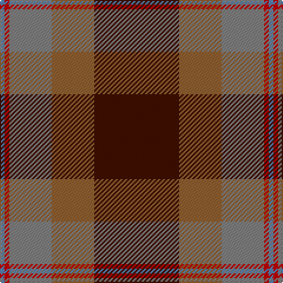

In pattern [BRGRB](/patterns/brgrb/).

This was sourced from weddslist.  It is a [5 stripes tartan](/stripes/stripes5/).

Original link http://www.weddslist.com/cgi-bin/tartans/pg.pl?source=sts

## Thread count
B/4 R4 N36 LT36 DR/72

## Palette
Each colour and its ΔE from the base-6 reference it is a variant of.

| Colour | Shade | Base | ΔE (OKLab) |
|---|---|---|---|
| B | <code style="background-color:#5480B0;">#5480B0</code> `#5480B0` | B <code style="background-color:#2C4084;">#2C4084</code> | 0.20 |
| DR | <code style="background-color:#401000;">#401000</code> `#401000` | B <code style="background-color:#2C4084;">#2C4084</code> | 0.23 |
| LT | <code style="background-color:#906030;">#906030</code> `#906030` | R <code style="background-color:#C80000;">#C80000</code> | 0.15 |
| N | <code style="background-color:#808080;">#808080</code> `#808080` | G <code style="background-color:#006400;">#006400</code> | 0.22 |
| R | <code style="background-color:#C00000;">#C00000</code> `#C00000` | R <code style="background-color:#C80000;">#C80000</code> | 0.02 |

# Sample pattern

## Nearest tartans

The nearest existing variants by ΔTartan distance.

1. [Douglas Ancient Red](/setts/s5/k16y4b60r60w6-b5c5c5c-k101010-r880000-wc0c0c0-yd09800/) — ΔT 0.85
1. [Buncle (Duns)](/setts/s5/b18ba4g24r62y18-b486373-ba351e14-g203b27-ra32d18-ye0a126/) — ΔT 0.88
1. [Miller, Reverend Ian (Personal](/setts/s6/b4g36b30r48k2y4-b780078-g006818-k101010-r880000-yc4bc68/) — ΔT 1.07
1. [Buncle (Name)](/setts/s5/b18g4ga24r62y18-b5c8ca8-g604000-ga006818-ra00000-ybc8c00/) — ΔT 1.08
1. [Christmas](/setts/s5/y4g34ga8r30g2-g0e3923-ga207449-rbb001a-ye3b235/) — ΔT 1.09
1. [MacGleish Formal (Personal)](/setts/s5/r100k50g20ra10y4-g285800-k101010-ra03400-ra888888-yc4a868/) — ΔT 1.15
1. [Fraser Green](/setts/s6/w8b48g24b4ba24b4-b4c0000-ba5c5c5c-g447438-wc0c0c0/) — ΔT 1.20
1. [Leckie (Personal)](/setts/s7/r12b4r48ra12g48w4g8-b00008c-g004c00-rb00000-ra640000-wc8c8c8/) — ΔT 1.24
1. [Plummer Family Personal Tartan Tartan Number: 2778. Earliest known date: 2001 From a D C Dalgliesh swatch in 2001 via Phil Smith June 2004. See products available Copyright © Blair Urquhart, Comrie, 2015](/setts/s6/r60k16g60b8r6b4-b1860a8-g005028-k101010-rc80000/) — ΔT 1.24
1. [Wellmont Foundation (Corporate)](/setts/s7/b24w4b26g6ga4r48ga6-b14283c-g003820-ga006818-ra40000-wfcfcfc/) — ΔT 1.27

## Neighbour map

Every grey dot is one of 15726 variants placed by the first two principal components of the ΔTartan feature space (44% of its variance). Red is this tartan; blue dots are its nearest — click one to open its page.

<svg viewBox="0 0 640 380" role="img" style="max-width:100%;height:auto;border:1px solid #e0e0e0;border-radius:4px;display:block" xmlns="http://www.w3.org/2000/svg"><image href="/nn/cloud.v1.png" width="640" height="380"/><a href="/setts/s5/k16y4b60r60w6-b5c5c5c-k101010-r880000-wc0c0c0-yd09800/"><circle cx="282.0" cy="196.6" r="4" fill="#3465a4"><title>Douglas Ancient Red</title></circle></a><a href="/setts/s5/b18ba4g24r62y18-b486373-ba351e14-g203b27-ra32d18-ye0a126/"><circle cx="281.5" cy="195.4" r="4" fill="#3465a4"><title>Buncle (Duns)</title></circle></a><a href="/setts/s6/b4g36b30r48k2y4-b780078-g006818-k101010-r880000-yc4bc68/"><circle cx="262.1" cy="165.4" r="4" fill="#3465a4"><title>Miller, Reverend Ian (Personal</title></circle></a><a href="/setts/s5/b18g4ga24r62y18-b5c8ca8-g604000-ga006818-ra00000-ybc8c00/"><circle cx="283.0" cy="195.6" r="4" fill="#3465a4"><title>Buncle (Name)</title></circle></a><a href="/setts/s5/y4g34ga8r30g2-g0e3923-ga207449-rbb001a-ye3b235/"><circle cx="300.9" cy="198.7" r="4" fill="#3465a4"><title>Christmas</title></circle></a><a href="/setts/s5/r100k50g20ra10y4-g285800-k101010-ra03400-ra888888-yc4a868/"><circle cx="340.5" cy="163.2" r="4" fill="#3465a4"><title>MacGleish Formal (Personal)</title></circle></a><a href="/setts/s6/w8b48g24b4ba24b4-b4c0000-ba5c5c5c-g447438-wc0c0c0/"><circle cx="287.0" cy="209.8" r="4" fill="#3465a4"><title>Fraser Green</title></circle></a><a href="/setts/s7/r12b4r48ra12g48w4g8-b00008c-g004c00-rb00000-ra640000-wc8c8c8/"><circle cx="273.2" cy="178.7" r="4" fill="#3465a4"><title>Leckie (Personal)</title></circle></a><a href="/setts/s6/r60k16g60b8r6b4-b1860a8-g005028-k101010-rc80000/"><circle cx="278.9" cy="186.1" r="4" fill="#3465a4"><title>Plummer Family Personal Tartan Tartan Number: 2778. Earliest known date: 2001 From a D C Dalgliesh swatch in 2001 via Phil Smith June 2004. See products available Copyright © Blair Urquhart, Comrie, 2015</title></circle></a><a href="/setts/s7/b24w4b26g6ga4r48ga6-b14283c-g003820-ga006818-ra40000-wfcfcfc/"><circle cx="246.0" cy="177.7" r="4" fill="#3465a4"><title>Wellmont Foundation (Corporate)</title></circle></a><circle cx="285.3" cy="189.2" r="5" fill="#c00000"/></svg>

ID: /setts/s5/b72r36g36ra4ba4-b401000-ba5480b0-g808080-r906030-rac00000/
