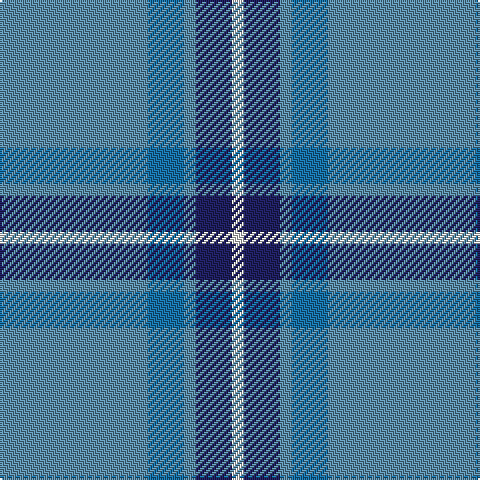

In pattern [BBBBW](/patterns/bbbbw/).

This was sourced from house-of-tartan.  It is a [5 stripes tartan](/stripes/stripes5/).

Original link http://www.house-of-tartan.scotland.net/house/TartanViewjs.asp?colr=Def&tnam=628

## Thread count
Ba/74 B18 Ba6 DB18 LN/6

## Palette
Each colour and its ΔE from the base-6 reference it is a variant of.

| Colour | Shade | Base | ΔE (OKLab) |
|---|---|---|---|
| B | <code style="background-color:#1870A4;">#1870A4</code> `#1870A4` | B <code style="background-color:#2C4084;">#2C4084</code> | 0.14 |
| Ba | <code style="background-color:#5C8CA8;">#5C8CA8</code> `#5C8CA8` | B <code style="background-color:#2C4084;">#2C4084</code> | 0.23 |
| DB | <code style="background-color:#202060;">#202060</code> `#202060` | B <code style="background-color:#2C4084;">#2C4084</code> | 0.11 |
| LN | <code style="background-color:#E0E0E0;">#E0E0E0</code> `#E0E0E0` | W <code style="background-color:#F4F4F0;">#F4F4F0</code> | 0.06 |

# Sample pattern

## Nearest tartans

The nearest existing variants by ΔTartan distance.

1. [Peacock](/setts/s4/b80ba12bb28y4-b3090c0-ba800080-bb304080-yf0c000/) — ΔT 1.05
1. [Peacock (Samantha)](/setts/s4/b80ba12bb28y4-b5c8ca8-ba780078-bb2c2c80-ye8c000/) — ΔT 1.24
1. [Port Authority of NY & NJ](/setts/s6/b18ba4b78bb66y4bb10-b5c8ca8-ba1c0070-bb003c64-ybc8c00/) — ΔT 1.45
1. [Bermuda, Plaid](/setts/s7/b66r16ba24g24b16ba4b16-b5480b0-ba304080-g008000-rc00000/) — ΔT 1.57
1. [North Sea Commission](/setts/s5/b36ba12b4ba48y4-b5c8ca8-ba344054-ye8c000/) — ΔT 1.59
1. [Lauder Primary School (Corporate)](/setts/s6/r8b84r8ba24y4r4-b2888c4-ba2c2c80-rc80000-ye8c000/) — ΔT 1.61
1. [Thorburn (Lochcarron)](/setts/s6/b6ba28b6r32b68ra6-b003c64-ba5c8ca8-r888888-rac80000/) — ΔT 1.63
1. [Hector James](/setts/s5/r4g22b54g10ra4-b304080-g008000-r806050-rac00000/) — ΔT 1.64
1. [Cleland Corporate Tartan Tartan Number: 2181. Earliest known date: 1989 The Tartan is based on the Douglas as the Clelands were hereditary foresters to the Douglases. There was a deal of inter-marriage between the Douglases, the Hamiltons and the Clelands. In 1989 John Clelland Hocknull of Casuavina in Australia's Northern Territories made it known that he was the Founder of the Northern Territories Clan Clelland Association Inc. who wanted to have a Clelland tartan designed. the task fell to Harry Lindley of Kinloch Anderson. D.C. Dalgliesh of Selkirk wove the first piece. Lord Lyon may have recorded the sett in the Lyon Court Books, but this is unconfirmed. See products available Copyright © Blair Urquhart, Comrie, 2015](/setts/s5/k4b56g14w6r4-b5c8ca8-g006818-k101010-rc80000-we0e0e0/) — ΔT 1.68
1. [Hepburn](/setts/s6/b52ba4b12ba24y4ba4-b304080-ba8080d0-yf0c000/) — ΔT 1.68

## Neighbour map

Every grey dot is one of 15726 variants placed by the first two principal components of the ΔTartan feature space (44% of its variance). Red is this tartan; blue dots are its nearest — click one to open its page.

<svg viewBox="0 0 640 380" role="img" style="max-width:100%;height:auto;border:1px solid #e0e0e0;border-radius:4px;display:block" xmlns="http://www.w3.org/2000/svg"><image href="/nn/cloud.v1.png" width="640" height="380"/><a href="/setts/s4/b80ba12bb28y4-b3090c0-ba800080-bb304080-yf0c000/"><circle cx="427.6" cy="216.1" r="4" fill="#3465a4"><title>Peacock</title></circle></a><a href="/setts/s4/b80ba12bb28y4-b5c8ca8-ba780078-bb2c2c80-ye8c000/"><circle cx="419.9" cy="208.9" r="4" fill="#3465a4"><title>Peacock (Samantha)</title></circle></a><a href="/setts/s6/b18ba4b78bb66y4bb10-b5c8ca8-ba1c0070-bb003c64-ybc8c00/"><circle cx="378.1" cy="197.2" r="4" fill="#3465a4"><title>Port Authority of NY &amp; NJ</title></circle></a><a href="/setts/s7/b66r16ba24g24b16ba4b16-b5480b0-ba304080-g008000-rc00000/"><circle cx="361.9" cy="214.7" r="4" fill="#3465a4"><title>Bermuda, Plaid</title></circle></a><a href="/setts/s5/b36ba12b4ba48y4-b5c8ca8-ba344054-ye8c000/"><circle cx="396.6" cy="247.5" r="4" fill="#3465a4"><title>North Sea Commission</title></circle></a><a href="/setts/s6/r8b84r8ba24y4r4-b2888c4-ba2c2c80-rc80000-ye8c000/"><circle cx="411.3" cy="161.8" r="4" fill="#3465a4"><title>Lauder Primary School (Corporate)</title></circle></a><a href="/setts/s6/b6ba28b6r32b68ra6-b003c64-ba5c8ca8-r888888-rac80000/"><circle cx="329.9" cy="220.1" r="4" fill="#3465a4"><title>Thorburn (Lochcarron)</title></circle></a><a href="/setts/s5/r4g22b54g10ra4-b304080-g008000-r806050-rac00000/"><circle cx="376.5" cy="218.9" r="4" fill="#3465a4"><title>Hector James</title></circle></a><a href="/setts/s5/k4b56g14w6r4-b5c8ca8-g006818-k101010-rc80000-we0e0e0/"><circle cx="393.6" cy="176.3" r="4" fill="#3465a4"><title>Cleland Corporate Tartan Tartan Number: 2181. Earliest known date: 1989 The Tartan is based on the Douglas as the Clelands were hereditary foresters to the Douglases. There was a deal of inter-marriage between the Douglases, the Hamiltons and the Clelands. In 1989 John Clelland Hocknull of Casuavina in Australia's Northern Territories made it known that he was the Founder of the Northern Territories Clan Clelland Association Inc. who wanted to have a Clelland tartan designed. the task fell to Harry Lindley of Kinloch Anderson. D.C. Dalgliesh of Selkirk wove the first piece. Lord Lyon may have recorded the sett in the Lyon Court Books, but this is unconfirmed. See products available Copyright © Blair Urquhart, Comrie, 2015</title></circle></a><a href="/setts/s6/b52ba4b12ba24y4ba4-b304080-ba8080d0-yf0c000/"><circle cx="442.5" cy="223.7" r="4" fill="#3465a4"><title>Hepburn</title></circle></a><circle cx="415.5" cy="218.7" r="5" fill="#c00000"/></svg>

ID: /setts/s5/b74ba18b6bb18w6-b5c8ca8-ba1870a4-bb202060-we0e0e0/
