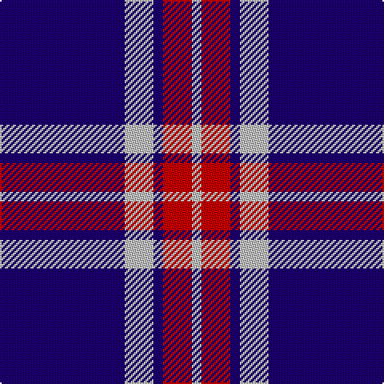

In pattern [BWBRW](/patterns/bwbrw/).

This was sourced from register-of-tartans.  It is a [5 stripes tartan](/stripes/stripes5/).

Original link https://www.tartanregister.gov.uk/tartanDetails.aspx?ref=1387

## Attestations

This cloth appears in 2 source records; the oldest owns this page.

- 01/01/1986 — Glen Moy (register-of-tartans, [record](https://www.tartanregister.gov.uk/tartanDetails.aspx?ref=1387))
- pre 1986 — Glen Moy 1986 (Fashion) (tartans-authority, [record](http://www.tartansauthority.com/tartan-ferret/display/635/))

## Thread count
DB/78 N18 DB6 R18 N/6

## Palette
Each colour and its ΔE from the base-6 reference it is a variant of.

| Colour | Shade | Base | ΔE (OKLab) |
|---|---|---|---|
| DB | <code style="background-color:#1C0070;">#1C0070</code> `#1C0070` | B <code style="background-color:#2C4084;">#2C4084</code> | 0.14 |
| N | <code style="background-color:#C0C0C0;">#C0C0C0</code> `#C0C0C0` | W <code style="background-color:#F4F4F0;">#F4F4F0</code> | 0.16 |
| R | <code style="background-color:#C80000;">#C80000</code> `#C80000` | R <code style="background-color:#C80000;">#C80000</code> | 0.00 |

# Sample pattern

## Nearest tartans

The nearest existing variants by ΔTartan distance.

1. [Glen Moy](/setts/s5/b74w18b6r18w6-b000050-rc00000-we0e0e0/) — ΔT 0.83
1. [Glen Moy Trade Tartan Tartan Number: 635. Earliest known date: pre 1992 Its mainly Sheep farming in Glen Moy. Off the beaten track, its a very quiet area of the Angus glens close to Cortachy castle and great for walking if you like it to yourself! Its also close to Glen Clova which is the busiest glen around here with some fantastic mountains for walking and taking photos. See products available Copyright © Blair Urquhart, Comrie, 2015](/setts/s5/b74w18b6r18w6-b202060-rc80000-we0e0e0/) — ΔT 0.86
1. [Debbie Munro Memorial (Corporate)](/setts/s5/b104w44b12w16k8-b003c9c-k101010-wfc9cd4/) — ΔT 1.20
1. [South Australian Pipes & Drums (Corp](/setts/s6/b120y12b22r50b22y12-b2c2c80-rc80000-ye8c000/) — ΔT 1.23
1. [Laing of Archiestown](/setts/s5/b64r8w8r8k8-b2c2c80-k101010-rc80000-wfcfcfc/) — ΔT 1.26
1. [BC Corps of Commissionaires, The](/setts/s7/b48w4r12w4r12w4b24-b202060-ra00000-wc0c0c0/) — ΔT 1.38
1. [BC Corps of Commissionaires](/setts/s7/b48w4r12w4r12w4b24-b141e46-r800028-we0e0e0/) — ΔT 1.43
1. [Laing of Archiestown](/setts/s5/b76r8w8r8k8-b304080-k000000-rc00000-we0e0e0/) — ΔT 1.44
1. [Nike ACG Lunarstorm (Fashion)](/setts/s7/b16r4b36r2b4w20b8-b2c2c80-rc80000-wf8f8f8/) — ΔT 1.52
1. [Americana - 1978 (Fashion)](/setts/s8/b66w14b10r4b10w4r26b6-b1c1c50-rc80000-we0e0e0/) — ΔT 1.54

## Neighbour map

Every grey dot is one of 15726 variants placed by the first two principal components of the ΔTartan feature space (44% of its variance). Red is this tartan; blue dots are its nearest — click one to open its page.

<svg viewBox="0 0 640 380" role="img" style="max-width:100%;height:auto;border:1px solid #e0e0e0;border-radius:4px;display:block" xmlns="http://www.w3.org/2000/svg"><image href="/nn/cloud.v1.png" width="640" height="380"/><a href="/setts/s5/b74w18b6r18w6-b000050-rc00000-we0e0e0/"><circle cx="367.6" cy="202.8" r="4" fill="#3465a4"><title>Glen Moy</title></circle></a><a href="/setts/s5/b74w18b6r18w6-b202060-rc80000-we0e0e0/"><circle cx="377.3" cy="200.1" r="4" fill="#3465a4"><title>Glen Moy Trade Tartan Tartan Number: 635. Earliest known date: pre 1992 Its mainly Sheep farming in Glen Moy. Off the beaten track, its a very quiet area of the Angus glens close to Cortachy castle and great for walking if you like it to yourself! Its also close to Glen Clova which is the busiest glen around here with some fantastic mountains for walking and taking photos. See products available Copyright © Blair Urquhart, Comrie, 2015</title></circle></a><a href="/setts/s5/b104w44b12w16k8-b003c9c-k101010-wfc9cd4/"><circle cx="377.0" cy="206.5" r="4" fill="#3465a4"><title>Debbie Munro Memorial (Corporate)</title></circle></a><a href="/setts/s6/b120y12b22r50b22y12-b2c2c80-rc80000-ye8c000/"><circle cx="410.3" cy="215.1" r="4" fill="#3465a4"><title>South Australian Pipes &amp; Drums (Corp</title></circle></a><a href="/setts/s5/b64r8w8r8k8-b2c2c80-k101010-rc80000-wfcfcfc/"><circle cx="368.8" cy="199.0" r="4" fill="#3465a4"><title>Laing of Archiestown</title></circle></a><a href="/setts/s7/b48w4r12w4r12w4b24-b202060-ra00000-wc0c0c0/"><circle cx="405.7" cy="207.4" r="4" fill="#3465a4"><title>BC Corps of Commissionaires, The</title></circle></a><a href="/setts/s7/b48w4r12w4r12w4b24-b141e46-r800028-we0e0e0/"><circle cx="394.7" cy="205.8" r="4" fill="#3465a4"><title>BC Corps of Commissionaires</title></circle></a><a href="/setts/s5/b76r8w8r8k8-b304080-k000000-rc00000-we0e0e0/"><circle cx="413.5" cy="193.2" r="4" fill="#3465a4"><title>Laing of Archiestown</title></circle></a><a href="/setts/s7/b16r4b36r2b4w20b8-b2c2c80-rc80000-wf8f8f8/"><circle cx="408.5" cy="185.0" r="4" fill="#3465a4"><title>Nike ACG Lunarstorm (Fashion)</title></circle></a><a href="/setts/s8/b66w14b10r4b10w4r26b6-b1c1c50-rc80000-we0e0e0/"><circle cx="393.7" cy="168.1" r="4" fill="#3465a4"><title>Americana - 1978 (Fashion)</title></circle></a><circle cx="394.2" cy="201.5" r="5" fill="#c00000"/></svg>

ID: /setts/s5/b78w18b6r18w6-b1c0070-rc80000-wc0c0c0/
