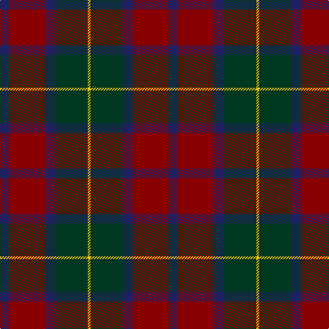

In pattern [BRBGY](/patterns/brbgy/).

This was sourced from register-of-tartans.  It is a [5 stripes tartan](/stripes/stripes5/).

Original link https://www.tartanregister.gov.uk/tartanDetails.aspx?ref=2874

## Attestations

This cloth appears in 2 source records; the oldest owns this page.

- 01/01/2000 — McCarthy, Old (register-of-tartans, [record](https://www.tartanregister.gov.uk/tartanDetails.aspx?ref=2874))
- pre 2000 — McCarthy, Old (Clan?) (tartans-authority, [record](http://www.tartansauthority.com/tartan-ferret/display/4049/))

## Thread count
DB/14 DR52 DB14 DG48 Y/4

## Palette
Each colour and its ΔE from the base-6 reference it is a variant of.

| Colour | Shade | Base | ΔE (OKLab) |
|---|---|---|---|
| DB | <code style="background-color:#202060;">#202060</code> `#202060` | B <code style="background-color:#2A418A;">#2A418A</code> | 0.11 |
| DG | <code style="background-color:#003820;">#003820</code> `#003820` | G <code style="background-color:#006100;">#006100</code> | 0.15 |
| DR | <code style="background-color:#880000;">#880000</code> `#880000` | R <code style="background-color:#CC0000;">#CC0000</code> | 0.15 |
| Y | <code style="background-color:#E8C000;">#E8C000</code> `#E8C000` | Y <code style="background-color:#F2BF00;">#F2BF00</code> | 0.02 |

# Sample pattern

## Nearest tartans

The nearest existing variants by ΔTartan distance.

1. [Ferguson Britt (Corporate)](/setts/s6/b2g12b12r1k12g2~b441800-g644824-k00002c-r9c2828~x6/) — ΔT 0.95
1. [Strathspey (Fashion)](/setts/s6/g3r22b5g10k10g2~b48748c-g006818-k101010-r880000~x2/) — ΔT 1.05
1. [Canadian Autumn](/setts/s6/g4r28b6g10k10g3~b1c0070-g006818-k101010-r880000~x2/) — ΔT 1.16
1. [Edinburgh International Conference Centre, The](/setts/s6/g4b20g3k20r24b3~b14283c-g603800-k101010-r98481c~x2/) — ΔT 1.17
1. [Andover (Fashion)](/setts/s6/r1b12k6y1ba10r1~b5c5c5c-ba4c3428-k101010-rc80000-yfccc00~x4/) — ΔT 1.21
1. [Unamed Riding cloak 1745](/setts/s5/b1ba8r2g8r1~b3c82af-ba2c4084-g503c14-rdc0000~x2/) — ΔT 1.22
1. [Vass (Personal)](/setts/s5/b6w1g6ga12r2~b141e46-g503c14-ga2a2303-rdc0000-we0e0e0~x4/) — ΔT 1.23
1. [(2) Cook](/setts/s7/g12b6g6r15k1r1k2~b006090-g004c00-k000000-r800000~x2/) — ΔT 1.26
1. [Loch Long One Design](/setts/s6/y4k28r2b22ba8b3~b3d3134-ba5f749c-k1c1714-rca2625-ye0a126~x2/) — ΔT 1.26
1. [Eachaidh (Personal)](/setts/s6/k6b1r18ba6g18k2~b2888c4-ba2c2c80-g005c30-k101010-r880000~x2/) — ΔT 1.27

## Neighbour map

Every grey dot is one of 15726 variants placed by the first two principal components of the ΔTartan feature space (44% of its variance). Red is this tartan; blue dots are its nearest — click one to open its page.

<svg viewBox="0 0 640 380" role="img" style="max-width:100%;height:auto;border:1px solid #e0e0e0;border-radius:4px;display:block" xmlns="http://www.w3.org/2000/svg"><image href="/nn/cloud.v1.png" width="640" height="380"/><a href="/setts/s6/b2g12b12r1k12g2~b441800-g644824-k00002c-r9c2828~x6/"><circle cx="258.9" cy="238.7" r="4" fill="#3465a4"><title>Ferguson Britt (Corporate)</title></circle></a><a href="/setts/s6/g3r22b5g10k10g2~b48748c-g006818-k101010-r880000~x2/"><circle cx="250.4" cy="222.5" r="4" fill="#3465a4"><title>Strathspey (Fashion)</title></circle></a><a href="/setts/s6/g4r28b6g10k10g3~b1c0070-g006818-k101010-r880000~x2/"><circle cx="266.4" cy="223.9" r="4" fill="#3465a4"><title>Canadian Autumn</title></circle></a><a href="/setts/s6/g4b20g3k20r24b3~b14283c-g603800-k101010-r98481c~x2/"><circle cx="215.8" cy="248.2" r="4" fill="#3465a4"><title>Edinburgh International Conference Centre, The</title></circle></a><a href="/setts/s6/r1b12k6y1ba10r1~b5c5c5c-ba4c3428-k101010-rc80000-yfccc00~x4/"><circle cx="239.9" cy="201.2" r="4" fill="#3465a4"><title>Andover (Fashion)</title></circle></a><a href="/setts/s5/b1ba8r2g8r1~b3c82af-ba2c4084-g503c14-rdc0000~x2/"><circle cx="272.4" cy="247.1" r="4" fill="#3465a4"><title>Unamed Riding cloak 1745</title></circle></a><a href="/setts/s5/b6w1g6ga12r2~b141e46-g503c14-ga2a2303-rdc0000-we0e0e0~x4/"><circle cx="251.2" cy="228.0" r="4" fill="#3465a4"><title>Vass (Personal)</title></circle></a><a href="/setts/s7/g12b6g6r15k1r1k2~b006090-g004c00-k000000-r800000~x2/"><circle cx="273.2" cy="206.2" r="4" fill="#3465a4"><title>(2) Cook</title></circle></a><a href="/setts/s6/y4k28r2b22ba8b3~b3d3134-ba5f749c-k1c1714-rca2625-ye0a126~x2/"><circle cx="263.3" cy="195.8" r="4" fill="#3465a4"><title>Loch Long One Design</title></circle></a><a href="/setts/s6/k6b1r18ba6g18k2~b2888c4-ba2c2c80-g005c30-k101010-r880000~x2/"><circle cx="235.5" cy="191.3" r="4" fill="#3465a4"><title>Eachaidh (Personal)</title></circle></a><circle cx="272.7" cy="235.7" r="5" fill="#c00000"/></svg>

ID: /setts/s5/b7r26b7g24y2~b202060-g003820-r880000-ye8c000~x2/
