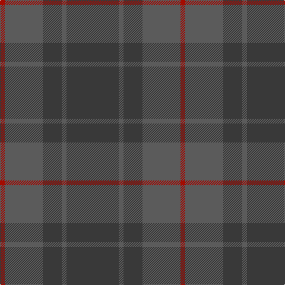

In pattern [BBBBR](/patterns/bbbbr/).

This was sourced from register-of-tartans.  It is a [5 stripes tartan](/stripes/stripes5/).

Original link https://www.tartanregister.gov.uk/tartanDetails.aspx?ref=10143

## Thread count
DR/8 Na64 N32 Na8 N/88

## Palette
Each colour and its ΔE from the base-6 reference it is a variant of.

| Colour | Shade | Base | ΔE (OKLab) |
|---|---|---|---|
| DR | <code style="background-color:#A40B00;">#A40B00</code> `#A40B00` | R <code style="background-color:#C80000;">#C80000</code> | 0.08 |
| N | <code style="background-color:#393939;">#393939</code> `#393939` | B <code style="background-color:#2C4084;">#2C4084</code> | 0.13 |
| Na | <code style="background-color:#5B5B5B;">#5B5B5B</code> `#5B5B5B` | B <code style="background-color:#2C4084;">#2C4084</code> | 0.14 |

# Sample pattern

ID: /setts/s5/b88ba8b32ba64r8-b393939-ba5b5b5b-ra40b00/
