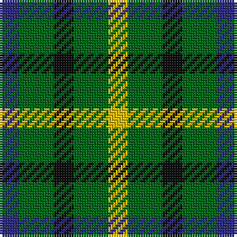

In pattern [BGKGY](/patterns/bgkgy/).

This was sourced from register-of-tartans.  It is a [5 stripes tartan](/stripes/stripes5/).

Original link https://www.tartanregister.gov.uk/tartanDetails.aspx?ref=870

## Thread count
DB/8 G14 K8 G14 Y/8

## Palette
Each colour and its ΔE from the base-6 reference it is a variant of.

| Colour | Shade | Base | ΔE (OKLab) |
|---|---|---|---|
| DB | <code style="background-color:#2C2C80;">#2C2C80</code> `#2C2C80` | B <code style="background-color:#2A418A;">#2A418A</code> | 0.06 |
| G | <code style="background-color:#006818;">#006818</code> `#006818` | G <code style="background-color:#006100;">#006100</code> | 0.02 |
| K | <code style="background-color:#101010;">#101010</code> `#101010` | K <code style="background-color:#000000;">#000000</code> | 0.17 |
| R | <code style="background-color:#C80000;">#C80000</code> `#C80000` | R <code style="background-color:#CC0000;">#CC0000</code> | 0.01 |
| Y | <code style="background-color:#E8C000;">#E8C000</code> `#E8C000` | Y <code style="background-color:#F2BF00;">#F2BF00</code> | 0.02 |

# Sample pattern

## Nearest tartans

The nearest existing variants by ΔTartan distance.

1. [DAKS House (C.6700.040)](/setts/s5/b8g14k8g14y8-b304080-g008000-k000000-yf0c000/) — ΔT 0.81
1. [Wilson's No.094](/setts/s4/g8k10g8r4-g408060-k101010-rc80000/) — ΔT 1.63
1. [Wilson's, No 52](/setts/s3/g14k8b8-b5480b0-g008000-k000000/) — ΔT 1.71
1. [Angle Dress (Fashion)](/setts/s5/k20g32y20g12y20-g408060-k101010-ybc8c00/) — ΔT 1.79
1. [Wilson's No.052](/setts/s3/g14k8b8-b2888c4-g006818-k101010/) — ΔT 1.80
1. [Glen Lyon #1](/setts/s4/k12g10r4g10-g006818-k101010-rc80000/) — ΔT 1.84
1. [Hage-West (Personal)](/setts/s6/g16k16g16y12k6y12-g003820-k101010-ye8c000/) — ΔT 1.85
1. [Wilson's No.209](/setts/s4/g8b10g8ba4-b440044-ba2888c4-g006818/) — ΔT 1.85
1. [Wilson's No.207](/setts/s4/g8r8g8b4-b2888c4-g006818-rc80000/) — ΔT 1.94
1. [Mull](/setts/s3/k10g8b4-b5c8ca8-g006818-k101010/) — ΔT 1.98

## Neighbour map

Every grey dot is one of 15726 variants placed by the first two principal components of the ΔTartan feature space (44% of its variance). Red is this tartan; blue dots are its nearest — click one to open its page.

<svg viewBox="0 0 640 380" role="img" style="max-width:100%;height:auto;border:1px solid #e0e0e0;border-radius:4px;display:block" xmlns="http://www.w3.org/2000/svg"><image href="/nn/cloud.v1.png" width="640" height="380"/><a href="/setts/s5/b8g14k8g14y8-b304080-g008000-k000000-yf0c000/"><circle cx="112.9" cy="338.6" r="4" fill="#3465a4"><title>DAKS House (C.6700.040)</title></circle></a><a href="/setts/s4/g8k10g8r4-g408060-k101010-rc80000/"><circle cx="202.2" cy="359.6" r="4" fill="#3465a4"><title>Wilson's No.094</title></circle></a><a href="/setts/s3/g14k8b8-b5480b0-g008000-k000000/"><circle cx="119.0" cy="366.0" r="4" fill="#3465a4"><title>Wilson's, No 52</title></circle></a><a href="/setts/s5/k20g32y20g12y20-g408060-k101010-ybc8c00/"><circle cx="151.0" cy="341.3" r="4" fill="#3465a4"><title>Angle Dress (Fashion)</title></circle></a><a href="/setts/s3/g14k8b8-b2888c4-g006818-k101010/"><circle cx="154.4" cy="366.0" r="4" fill="#3465a4"><title>Wilson's No.052</title></circle></a><a href="/setts/s4/k12g10r4g10-g006818-k101010-rc80000/"><circle cx="244.9" cy="359.0" r="4" fill="#3465a4"><title>Glen Lyon #1</title></circle></a><a href="/setts/s6/g16k16g16y12k6y12-g003820-k101010-ye8c000/"><circle cx="97.3" cy="328.2" r="4" fill="#3465a4"><title>Hage-West (Personal)</title></circle></a><a href="/setts/s4/g8b10g8ba4-b440044-ba2888c4-g006818/"><circle cx="218.8" cy="366.0" r="4" fill="#3465a4"><title>Wilson's No.209</title></circle></a><a href="/setts/s4/g8r8g8b4-b2888c4-g006818-rc80000/"><circle cx="230.1" cy="366.0" r="4" fill="#3465a4"><title>Wilson's No.207</title></circle></a><a href="/setts/s3/k10g8b4-b5c8ca8-g006818-k101010/"><circle cx="178.8" cy="366.0" r="4" fill="#3465a4"><title>Mull</title></circle></a><circle cx="133.3" cy="346.6" r="5" fill="#c00000"/></svg>

ID: /setts/s5/b8g14k8g14y8-b2c2c80-g006818-k101010-ye8c000/
