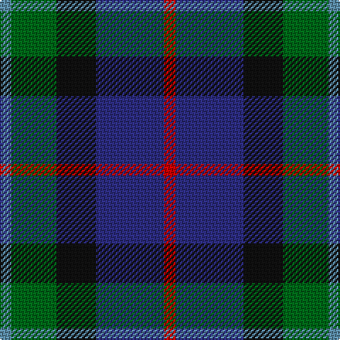

In pattern [BGKBR](/patterns/bgkbr/).

This was sourced from register-of-tartans.  It is a [5 stripes tartan](/stripes/stripes5/).

Original link https://www.tartanregister.gov.uk/tartanDetails.aspx?ref=1226

## Attestations

This cloth appears in 2 source records; the oldest owns this page.

- 01/11/1995 — Forbo Nairn (register-of-tartans, [record](https://www.tartanregister.gov.uk/tartanDetails.aspx?ref=1226))
- pre 2002 — Forbo Nairn (Corporate) (tartans-authority, [record](http://www.tartansauthority.com/tartan-ferret/display/2298/))

## Thread count
B/8 G32 K28 DB48 R/8

## Palette
Each colour and its ΔE from the base-6 reference it is a variant of.

| Colour | Shade | Base | ΔE (OKLab) |
|---|---|---|---|
| B | <code style="background-color:#5C8CA8;">#5C8CA8</code> `#5C8CA8` | B <code style="background-color:#2C4084;">#2C4084</code> | 0.23 |
| DB | <code style="background-color:#2C2C80;">#2C2C80</code> `#2C2C80` | B <code style="background-color:#2C4084;">#2C4084</code> | 0.05 |
| G | <code style="background-color:#006818;">#006818</code> `#006818` | G <code style="background-color:#006400;">#006400</code> | 0.02 |
| K | <code style="background-color:#101010;">#101010</code> `#101010` | K <code style="background-color:#000000;">#000000</code> | 0.17 |
| R | <code style="background-color:#C80000;">#C80000</code> `#C80000` | R <code style="background-color:#C80000;">#C80000</code> | 0.00 |

# Sample pattern

ID: /setts/s5/b8g32k28ba48r8-b5c8ca8-ba2c2c80-g006818-k101010-rc80000/
