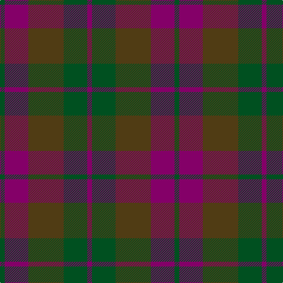

In pattern [BGGBG](/patterns/bggbg/).

This was sourced from register-of-tartans.  It is a [5 stripes tartan](/stripes/stripes5/).

Original link https://www.tartanregister.gov.uk/tartanDetails.aspx?ref=1611

## Thread count
G/8 P40 T60 G40 P/8

## Palette
Each colour and its ΔE from the base-6 reference it is a variant of.

| Colour | Shade | Base | ΔE (OKLab) |
|---|---|---|---|
| G | <code style="background-color:#005020;">#005020</code> `#005020` | G <code style="background-color:#006400;">#006400</code> | 0.08 |
| P | <code style="background-color:#840068;">#840068</code> `#840068` | B <code style="background-color:#2C4084;">#2C4084</code> | 0.18 |
| T | <code style="background-color:#503C14;">#503C14</code> `#503C14` | G <code style="background-color:#006400;">#006400</code> | 0.15 |

# Sample pattern

## Nearest tartans

The nearest existing variants by ΔTartan distance.

1. [Bright of Garth (Personal)](/setts/s5/g42ga36b42ga6b12-b14283c-g006818-ga604000/) — ΔT 1.47
1. [MacNab WI 2](/setts/s4/g30r6b22ba4-b6e5058-ba4367ae-g11450d-raa0000/) — ΔT 1.57
1. [MacNab WI2](/setts/s4/g15r3b11ba2-b6e5058-ba4367ae-g11450d-raa0000/) — ΔT 1.57
1. [Dewar (WCWM)](/setts/s6/b4g4b28g20ga28y4-b084848-g604000-ga8c7038-yb8b8b8/) — ΔT 1.58
1. [Madder](/setts/s7/g56r8b54r54g56r10b4-b280034-g044028-r780014/) — ΔT 1.59
1. [Unamed, Riding cloak 1745](/setts/s5/b2ba16r4ra16r2-b5480b0-ba304080-rc00000-ra806050/) — ΔT 1.64
1. [Fraser Hunting #2](/setts/s6/g2b6g2ga6g8r2-b2c4084-g503c14-ga005020-rdc0000/) — ΔT 1.65
1. [Chindecella Gorse (Kemete Heil)](/setts/s8/r18b8r8b8r48ba38b38ba8-b241b1e-ba4f4232-r8c6627/) — ΔT 1.65
1. [Chindecella Ruadh (Personal)](/setts/s8/r20b8r8b8r46ba38b38ba8-b1c1c50-ba5c5c5c-r880000/) — ΔT 1.69
1. [Bright of Garth (Personal)](/setts/s5/g42ga36b42ga6b12-b245078-g006818-ga845800/) — ΔT 1.72

## Neighbour map

Every grey dot is one of 15726 variants placed by the first two principal components of the ΔTartan feature space (44% of its variance). Red is this tartan; blue dots are its nearest — click one to open its page.

<svg viewBox="0 0 640 380" role="img" style="max-width:100%;height:auto;border:1px solid #e0e0e0;border-radius:4px;display:block" xmlns="http://www.w3.org/2000/svg"><image href="/nn/cloud.v1.png" width="640" height="380"/><a href="/setts/s5/g42ga36b42ga6b12-b14283c-g006818-ga604000/"><circle cx="290.4" cy="322.5" r="4" fill="#3465a4"><title>Bright of Garth (Personal)</title></circle></a><a href="/setts/s4/g30r6b22ba4-b6e5058-ba4367ae-g11450d-raa0000/"><circle cx="334.3" cy="291.7" r="4" fill="#3465a4"><title>MacNab WI 2</title></circle></a><a href="/setts/s4/g15r3b11ba2-b6e5058-ba4367ae-g11450d-raa0000/"><circle cx="334.3" cy="291.7" r="4" fill="#3465a4"><title>MacNab WI2</title></circle></a><a href="/setts/s6/b4g4b28g20ga28y4-b084848-g604000-ga8c7038-yb8b8b8/"><circle cx="253.7" cy="264.6" r="4" fill="#3465a4"><title>Dewar (WCWM)</title></circle></a><a href="/setts/s7/g56r8b54r54g56r10b4-b280034-g044028-r780014/"><circle cx="351.4" cy="262.6" r="4" fill="#3465a4"><title>Madder</title></circle></a><a href="/setts/s5/b2ba16r4ra16r2-b5480b0-ba304080-rc00000-ra806050/"><circle cx="297.5" cy="256.6" r="4" fill="#3465a4"><title>Unamed, Riding cloak 1745</title></circle></a><a href="/setts/s6/g2b6g2ga6g8r2-b2c4084-g503c14-ga005020-rdc0000/"><circle cx="269.5" cy="314.6" r="4" fill="#3465a4"><title>Fraser Hunting #2</title></circle></a><a href="/setts/s8/r18b8r8b8r48ba38b38ba8-b241b1e-ba4f4232-r8c6627/"><circle cx="280.0" cy="268.0" r="4" fill="#3465a4"><title>Chindecella Gorse (Kemete Heil)</title></circle></a><a href="/setts/s8/r20b8r8b8r46ba38b38ba8-b1c1c50-ba5c5c5c-r880000/"><circle cx="289.5" cy="271.6" r="4" fill="#3465a4"><title>Chindecella Ruadh (Personal)</title></circle></a><a href="/setts/s5/g42ga36b42ga6b12-b245078-g006818-ga845800/"><circle cx="300.1" cy="324.6" r="4" fill="#3465a4"><title>Bright of Garth (Personal)</title></circle></a><circle cx="303.4" cy="301.0" r="5" fill="#c00000"/></svg>

ID: /setts/s5/b8g40ga60b40g8-b840068-g005020-ga503c14/
