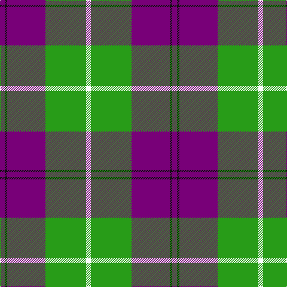

In pattern [BKBGW](/patterns/bkbgw/).

This was sourced from register-of-tartans.  It is a [5 stripes tartan](/stripes/stripes5/).

Original link https://www.tartanregister.gov.uk/tartanDetails.aspx?ref=1928

## Attestations

This cloth appears in 2 source records; the oldest owns this page.

- 01/08/1999 — Kansai Highland Games (register-of-tartans, [record](https://www.tartanregister.gov.uk/tartanDetails.aspx?ref=1928))
- 1999 — Kansai Highland Games (Corporate) (tartans-authority, [record](http://www.tartansauthority.com/tartan-ferret/display/3988/))

## Thread count
Pa/8 K4 Pa64 G68 W/8

## Palette
Each colour and its ΔE from the base-6 reference it is a variant of.

| Colour | Shade | Base | ΔE (OKLab) |
|---|---|---|---|
| G | <code style="background-color:#289C18;">#289C18</code> `#289C18` | G <code style="background-color:#006100;">#006100</code> | 0.19 |
| K | <code style="background-color:#101010;">#101010</code> `#101010` | K <code style="background-color:#000000;">#000000</code> | 0.17 |
| P | <code style="background-color:#B468AC;">#B468AC</code> `#B468AC` | R <code style="background-color:#CC0000;">#CC0000</code> | 0.21 |
| Pa | <code style="background-color:#780078;">#780078</code> `#780078` | B <code style="background-color:#2A418A;">#2A418A</code> | 0.17 |
| W | <code style="background-color:#FCFCFC;">#FCFCFC</code> `#FCFCFC` | W <code style="background-color:#F7F7F7;">#F7F7F7</code> | 0.01 |

# Sample pattern

## Nearest tartans

The nearest existing variants by ΔTartan distance.

1. [Kansai Highland Games Corporate Tartan Tartan Number: 2708. Earliest known date: 1999 Designed for the first Highland Games in Japan, started by Maud Robertson and heavy weight husband, Masonori Nomiyam. See products available Copyright © Blair Urquhart, Comrie, 2015](/setts/s5/b8k4b64g64w8-b780078-g289c18-k101010-we0e0e0/) — ΔT 0.21
1. [Burberry Grey (Original)](/setts/s5/k20w28k20g80b4-b2c2c80-g7c7c7c-k101010-we0e0e0/) — ΔT 0.79
1. [Tiree Grey](/setts/s6/w12k12w12k12r60ra4-k101010-r888888-ra880000-wc0c0c0/) — ΔT 0.95
1. [Brodie (WCWM)](/setts/s6/r4w60k30y4k30r4-k101010-rc80000-wf0ecd4-ybc8c00/) — ΔT 1.09
1. [Stutterheim](/setts/s6/k4y18b44k3y10k4-b565c76-k101010-yecdc8e/) — ΔT 1.22
1. [Downside (Corporate)](/setts/s6/r8ra82k10w28k36r8-k101010-rc80000-ra888888-we0e0e0/) — ΔT 1.28
1. [Merrick, Camel](/setts/s7/r4w20k32ra72w4k4w4-k101010-rc80000-raa07c58-wc0c0c0/) — ΔT 1.29
1. [Stutterheim (Corporate)](/setts/s6/k4y18b44k3y10k4-b2c2c80-k101010-yfccc00/) — ΔT 1.29
1. [Thomson Camel (Jedburgh Mill)](/setts/s6/r8k4w20k20g56k6-g8c7038-k101010-rc80000-wc0c0c0/) — ΔT 1.30
1. [Burberry Check Corporate Tartan Tartan Number: 1239. Earliest known date: 1984 Nothing See products available Copyright © Blair Urquhart, Comrie, 2015](/setts/s5/k24w24k24y84r8-k101010-rc80000-we0e0e0-ya08858/) — ΔT 1.31

## Neighbour map

Every grey dot is one of 15726 variants placed by the first two principal components of the ΔTartan feature space (44% of its variance). Red is this tartan; blue dots are its nearest — click one to open its page.

<svg viewBox="0 0 640 380" role="img" style="max-width:100%;height:auto;border:1px solid #e0e0e0;border-radius:4px;display:block" xmlns="http://www.w3.org/2000/svg"><image href="/nn/cloud.v1.png" width="640" height="380"/><a href="/setts/s5/b8k4b64g64w8-b780078-g289c18-k101010-we0e0e0/"><circle cx="291.4" cy="181.0" r="4" fill="#3465a4"><title>Kansai Highland Games Corporate Tartan Tartan Number: 2708. Earliest known date: 1999 Designed for the first Highland Games in Japan, started by Maud Robertson and heavy weight husband, Masonori Nomiyam. See products available Copyright © Blair Urquhart, Comrie, 2015</title></circle></a><a href="/setts/s5/k20w28k20g80b4-b2c2c80-g7c7c7c-k101010-we0e0e0/"><circle cx="278.9" cy="176.9" r="4" fill="#3465a4"><title>Burberry Grey (Original)</title></circle></a><a href="/setts/s6/w12k12w12k12r60ra4-k101010-r888888-ra880000-wc0c0c0/"><circle cx="289.6" cy="171.0" r="4" fill="#3465a4"><title>Tiree Grey</title></circle></a><a href="/setts/s6/r4w60k30y4k30r4-k101010-rc80000-wf0ecd4-ybc8c00/"><circle cx="241.4" cy="162.3" r="4" fill="#3465a4"><title>Brodie (WCWM)</title></circle></a><a href="/setts/s6/k4y18b44k3y10k4-b565c76-k101010-yecdc8e/"><circle cx="304.6" cy="179.1" r="4" fill="#3465a4"><title>Stutterheim</title></circle></a><a href="/setts/s6/r8ra82k10w28k36r8-k101010-rc80000-ra888888-we0e0e0/"><circle cx="222.6" cy="183.1" r="4" fill="#3465a4"><title>Downside (Corporate)</title></circle></a><a href="/setts/s7/r4w20k32ra72w4k4w4-k101010-rc80000-raa07c58-wc0c0c0/"><circle cx="293.3" cy="143.5" r="4" fill="#3465a4"><title>Merrick, Camel</title></circle></a><a href="/setts/s6/k4y18b44k3y10k4-b2c2c80-k101010-yfccc00/"><circle cx="296.7" cy="178.5" r="4" fill="#3465a4"><title>Stutterheim (Corporate)</title></circle></a><a href="/setts/s6/r8k4w20k20g56k6-g8c7038-k101010-rc80000-wc0c0c0/"><circle cx="259.7" cy="177.5" r="4" fill="#3465a4"><title>Thomson Camel (Jedburgh Mill)</title></circle></a><a href="/setts/s5/k24w24k24y84r8-k101010-rc80000-we0e0e0-ya08858/"><circle cx="244.3" cy="199.8" r="4" fill="#3465a4"><title>Burberry Check Corporate Tartan Tartan Number: 1239. Earliest known date: 1984 Nothing See products available Copyright © Blair Urquhart, Comrie, 2015</title></circle></a><circle cx="286.6" cy="177.1" r="5" fill="#c00000"/></svg>

ID: /setts/s5/b8k4b64g68w8-b780078-g289c18-k101010-wfcfcfc/
