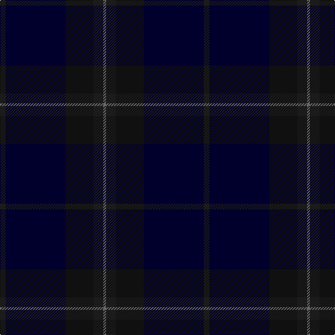

In pattern [BKKBG](/patterns/bkkbg/).

This was sourced from register-of-tartans.  It is a [5 stripes tartan](/stripes/stripes5/).

Original link https://www.tartanregister.gov.uk/tartanDetails.aspx?ref=10287

## Thread count
K/8 DB86 Ka40 K14 N/4

## Palette
Each colour and its ΔE from the base-6 reference it is a variant of.

| Colour | Shade | Base | ΔE (OKLab) |
|---|---|---|---|
| DB | <code style="background-color:#01002C;">#01002C</code> `#01002C` | K <code style="background-color:#000000;">#000000</code> | 0.16 |
| K | <code style="background-color:#1B1B1B;">#1B1B1B</code> `#1B1B1B` | B <code style="background-color:#2A418A;">#2A418A</code> | 0.22 |
| Ka | <code style="background-color:#101010;">#101010</code> `#101010` | K <code style="background-color:#000000;">#000000</code> | 0.17 |
| N | <code style="background-color:#696969;">#696969</code> `#696969` | G <code style="background-color:#006100;">#006100</code> | 0.17 |

# Sample pattern

## Nearest tartans

The nearest existing variants by ΔTartan distance.

1. [Tern House](/setts/s7/g23b3k8b4g4b56ga8-b141e46-g003820-ga604000-k101010/) — ΔT 1.78
1. [Hector, James (Corporate)](/setts/s5/b4g22ba54g16r4-b441800-ba003c64-g003820-r880000/) — ΔT 2.04
1. [Meiklejohn (Personal)](/setts/s8/r4k26b8k26g12k34g46w2-b141e46-g002814-k101010-r781c38-we0e0e0/) — ΔT 2.32
1. [Hector, James](/setts/s8/g16b54g22ba4g22b54g16r4-b003c64-ba441800-g003820-r880000/) — ΔT 2.36
1. [Little Hunting](/setts/s8/b10ba6b8ba6b8k56b16r2-b1c1c50-ba2c2c80-k101010-rc80000/) — ΔT 2.40
1. [Mackaw (Corporate)](/setts/s4/r4b70ba70y2-b2c2c80-ba202060-rc80000-yfccc00/) — ΔT 2.45
1. [Heslop, William D Name Tartan Tartan Number: 10331. Earliest known date: 2011 This tartan was created for the Heslop family descended from William Douglas Heslop, who was born on 1st December 1857. His father, John Heslop was born in Lurdenlaw by Kelso in 1825 and his mother, Jessie Turnbull, was born in Jedburgh in 1826. They married in 1849 and sailed to the USA. The tartan may be worn by anyone with the surname Heslop. The copyright owner is William D Heslop. See products available Copyright © Blair Urquhart, Comrie, 2015](/setts/s4/k88g24b2r12-b003c64-g002414-k181818-r700000/) — ΔT 2.60
1. [St Andrews Old Course Hotel, Golf Course and Spa](/setts/s6/g90b28k6b4ga4b10-b000048-g002814-ga604000-k101010/) — ΔT 2.63
1. [Gravesend Grammar School (Corp)](/setts/s11/b8g5b72ba72r5ba16r5ba72b72g5b8-b2c2c80-ba1c1c50-g006818-r9c68a4/) — ΔT 2.72
1. [Scottish Tourist Board (1990)](/setts/s4/b88ba35w3ba10-b2c2c80-ba003c64-we0e0e0/) — ΔT 2.74

## Neighbour map

Every grey dot is one of 15726 variants placed by the first two principal components of the ΔTartan feature space (44% of its variance). Red is this tartan; blue dots are its nearest — click one to open its page.

<svg viewBox="0 0 640 380" role="img" style="max-width:100%;height:auto;border:1px solid #e0e0e0;border-radius:4px;display:block" xmlns="http://www.w3.org/2000/svg"><image href="/nn/cloud.v1.png" width="640" height="380"/><a href="/setts/s7/g23b3k8b4g4b56ga8-b141e46-g003820-ga604000-k101010/"><circle cx="522.5" cy="248.1" r="4" fill="#3465a4"><title>Tern House</title></circle></a><a href="/setts/s5/b4g22ba54g16r4-b441800-ba003c64-g003820-r880000/"><circle cx="488.1" cy="293.4" r="4" fill="#3465a4"><title>Hector, James (Corporate)</title></circle></a><a href="/setts/s8/r4k26b8k26g12k34g46w2-b141e46-g002814-k101010-r781c38-we0e0e0/"><circle cx="450.0" cy="250.0" r="4" fill="#3465a4"><title>Meiklejohn (Personal)</title></circle></a><a href="/setts/s8/g16b54g22ba4g22b54g16r4-b003c64-ba441800-g003820-r880000/"><circle cx="504.8" cy="297.0" r="4" fill="#3465a4"><title>Hector, James</title></circle></a><a href="/setts/s8/b10ba6b8ba6b8k56b16r2-b1c1c50-ba2c2c80-k101010-rc80000/"><circle cx="469.1" cy="215.0" r="4" fill="#3465a4"><title>Little Hunting</title></circle></a><a href="/setts/s4/r4b70ba70y2-b2c2c80-ba202060-rc80000-yfccc00/"><circle cx="508.6" cy="266.0" r="4" fill="#3465a4"><title>Mackaw (Corporate)</title></circle></a><a href="/setts/s4/k88g24b2r12-b003c64-g002414-k181818-r700000/"><circle cx="626.0" cy="276.8" r="4" fill="#3465a4"><title>Heslop, William D Name Tartan Tartan Number: 10331. Earliest known date: 2011 This tartan was created for the Heslop family descended from William Douglas Heslop, who was born on 1st December 1857. His father, John Heslop was born in Lurdenlaw by Kelso in 1825 and his mother, Jessie Turnbull, was born in Jedburgh in 1826. They married in 1849 and sailed to the USA. The tartan may be worn by anyone with the surname Heslop. The copyright owner is William D Heslop. See products available Copyright © Blair Urquhart, Comrie, 2015</title></circle></a><a href="/setts/s6/g90b28k6b4ga4b10-b000048-g002814-ga604000-k101010/"><circle cx="557.3" cy="238.6" r="4" fill="#3465a4"><title>St Andrews Old Course Hotel, Golf Course and Spa</title></circle></a><a href="/setts/s11/b8g5b72ba72r5ba16r5ba72b72g5b8-b2c2c80-ba1c1c50-g006818-r9c68a4/"><circle cx="457.5" cy="247.0" r="4" fill="#3465a4"><title>Gravesend Grammar School (Corp)</title></circle></a><a href="/setts/s4/b88ba35w3ba10-b2c2c80-ba003c64-we0e0e0/"><circle cx="608.1" cy="289.5" r="4" fill="#3465a4"><title>Scottish Tourist Board (1990)</title></circle></a><circle cx="528.2" cy="283.2" r="5" fill="#c00000"/></svg>

ID: /setts/s5/b8k86ka40b14g4-b1b1b1b-g696969-k01002c-ka101010/
