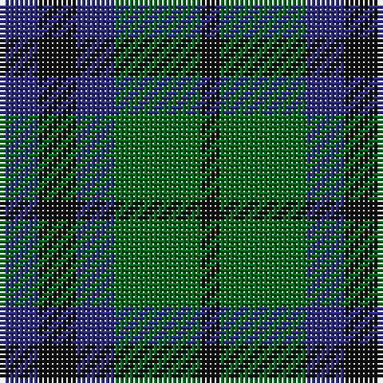

In pattern [BKBGK](/patterns/bkbgk/).

This was sourced from register-of-tartans.  It is a [5 stripes tartan](/stripes/stripes5/).

Original link https://www.tartanregister.gov.uk/tartanDetails.aspx?ref=137

## Attestations

This cloth appears in 4 source records; the oldest owns this page.

- 01/01/1811 — Austin Clan (register-of-tartans, [record](https://www.tartanregister.gov.uk/tartanDetails.aspx?ref=137))
- 1811 — Austin (Clan) (tartans-authority, [record](http://www.tartansauthority.com/tartan-ferret/display/254/))
- undated — Keith and Austin Clan Tartan Tartan Number: 253. Earliest known date: 1893 Also recorded in Wilson's of Bannockburn, 1819 pattern book as No. 75 or Austin. D W Stewart writes in 'Old and Rare..'in 1893, "that it is included in every early collection." The Keiths were a powerful Celtic family, who held the hereditary office of Great Marischal of Scotland. They are associated with Dunottar Castle, near Stonehaven. See products available Copyright © Blair Urquhart, Comrie, 2015 (house-of-tartan, [record](http://www.house-of-tartan.scotland.net/house/TartanViewjs.asp?colr=Def&tnam=253))
- undated — Austin or Keith/Marshall Clan Tartan Tartan Number: 254. Earliest known date: 1893 'Old and Rare Scottish Tartans' (1893), contains a selection of forty five setts, woven in silk, of special interest or antiquity. Many of the illustrated tartans owe their present day popularity to the publication of this work. The author was D. W. Stewart. See products available Copyright © Blair Urquhart, Comrie, 2015 (house-of-tartan, [record](http://www.house-of-tartan.scotland.net/house/TartanViewjs.asp?colr=Def&tnam=254))

## Thread count
DB/8 K8 DB8 G18 K/4

## Palette
Each colour and its ΔE from the base-6 reference it is a variant of.

| Colour | Shade | Base | ΔE (OKLab) |
|---|---|---|---|
| DB | <code style="background-color:#2C2C80;">#2C2C80</code> `#2C2C80` | B <code style="background-color:#2C4084;">#2C4084</code> | 0.05 |
| DN | <code style="background-color:#14283C;">#14283C</code> `#14283C` | B <code style="background-color:#2C4084;">#2C4084</code> | 0.14 |
| G | <code style="background-color:#006818;">#006818</code> `#006818` | G <code style="background-color:#006400;">#006400</code> | 0.02 |
| Ga | <code style="background-color:#005448;">#005448</code> `#005448` | G <code style="background-color:#006400;">#006400</code> | 0.11 |
| K | <code style="background-color:#101010;">#101010</code> `#101010` | K <code style="background-color:#000000;">#000000</code> | 0.17 |

# Sample pattern

ID: /setts/s5/b8k8b8g18k4-b2c2c80-g006818-k101010/
