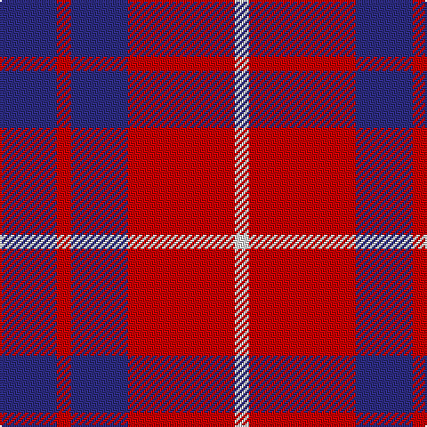

In pattern [BRBRW](/patterns/brbrw/).

This was sourced from tartans-authority.  It is a [5 stripes tartan](/stripes/stripes5/).

Original link http://www.tartansauthority.com/tartan-ferret/display/477/

## Thread count
DB/32 R8 DB32 R60 LN/8

## Palette
Each colour and its ΔE from the base-6 reference it is a variant of.

| Colour | Shade | Base | ΔE (OKLab) |
|---|---|---|---|
| DB | <code style="background-color:#2C2C80;">#2C2C80</code> `#2C2C80` | B <code style="background-color:#2A418A;">#2A418A</code> | 0.06 |
| LN | <code style="background-color:#E0E0E0;">#E0E0E0</code> `#E0E0E0` | W <code style="background-color:#F7F7F7;">#F7F7F7</code> | 0.07 |
| R | <code style="background-color:#C80000;">#C80000</code> `#C80000` | R <code style="background-color:#CC0000;">#CC0000</code> | 0.01 |

# Sample pattern

## Nearest tartans

The nearest existing variants by ΔTartan distance.

1. [Hamilton Red Clan Tartan Tartan Number: 477. Earliest known date: 1842 First recorded in the Vestiarium Scoticum which was supposedly based on an ancient manuscript now known to have been forged. The original illustration shows the four main stripes in a very dark shade of blue. There is no evidence of a Hamilton tartan prior to the publication of this spectacular work. The authors, the Sobieski Stuart brothers, enjoyed a popular following amongst the Scottish gentry of the period and it is probable that the design can be attributed to Charles Edward Stuart (Allan Hay) who prepared the illustrations for the book. See products available Copyright © Blair Urquhart, Comrie, 2015](/setts/s5/b6r1b6r9w1x4~b2c2c80-rc80000-we0e0e0/) — ΔT 0.57
1. [Hamilton, (Red)](/setts/s5/b6r1b6r9w1x2~b304080-rc00000-we0e0e0/) — ΔT 0.82
1. [British European](/setts/s6/r12b2r12b17w2r2x2~b2c2c80-ra00000-wfcfcfc/) — ΔT 0.95
1. [British European (Corporate)](/setts/s6/r12b2r12b17w2r2x4~b2c2c80-ra00000-wfcfcfc/) — ΔT 0.95
1. [Wotherspoon Family Tartan Tartan Number: 741. Earliest known date: c.1941 This sett comes from the MacGregor-Hastie collection which is housed at the Scottish Tartans Society. It was obtained from Andersons in 1947, one of several designs produced between 1930 and 1950 for Septs and Families of Scottish lineage. Wotherspoons are recorded in the Lowlands of Scotland from the beginning of the 14th century. The Rev. John Witherspoon (1722-94), born in Yester, East Lothian, was President of 'Princeton University' in 1768 and took an active part in the American Revolution. See products available Copyright © Blair Urquhart, Comrie, 2015](/setts/s5/r12g8r54b45g6~b2c2c80-g006818-rc80000/) — ΔT 1.05
1. [Masai Shuka 25 (Artefact)](/setts/s5/b15w2r20b2r4x2~b2c2c80-rc80000-we0e0e0/) — ΔT 1.09
1. [Butler](/setts/s6/b48r18b6r13y4r14x2~b2c2c80-rc80000-ye8c000/) — ΔT 1.12
1. [Wotherspoon](/setts/s5/r5g3r18b18g3x4~b1c1c50-g003820-rc80000/) — ΔT 1.16
1. [Matthews (Personal)](/setts/s6/b3r24b3r3b25w3x2~b2c2c80-rc80000-we0e0e0/) — ΔT 1.18
1. [Edinburgh Marketing Corporate Tartan Tartan Number: 2106. Earliest known date: 1991 The tartan was based on the Drummond tartan after the famous Lord Provost of Edinburgh, Lord Drummond, who is regarded as the father of the New Town and the "bridge" between the Old town of Edinburgh and the New Town. The colours are the corporate colours of Edinburgh Marketing, Navy, Red and White. The tartan was designed by Messrs. Kinloch Anderson of Leith, Edinburgh. See products available Copyright © Blair Urquhart, Comrie, 2015](/setts/s8/b38r6b6r9w5r12b8r16~b202060-rc80000-we0e0e0/) — ΔT 1.21

## Neighbour map

Every grey dot is one of 15726 variants placed by the first two principal components of the ΔTartan feature space (44% of its variance). Red is this tartan; blue dots are its nearest — click one to open its page.

<svg viewBox="0 0 640 380" role="img" style="max-width:100%;height:auto;border:1px solid #e0e0e0;border-radius:4px;display:block" xmlns="http://www.w3.org/2000/svg"><image href="/nn/cloud.v1.png" width="640" height="380"/><a href="/setts/s5/b6r1b6r9w1x4~b2c2c80-rc80000-we0e0e0/"><circle cx="320.0" cy="248.3" r="4" fill="#3465a4"><title>Hamilton Red Clan Tartan Tartan Number: 477. Earliest known date: 1842 First recorded in the Vestiarium Scoticum which was supposedly based on an ancient manuscript now known to have been forged. The original illustration shows the four main stripes in a very dark shade of blue. There is no evidence of a Hamilton tartan prior to the publication of this spectacular work. The authors, the Sobieski Stuart brothers, enjoyed a popular following amongst the Scottish gentry of the period and it is probable that the design can be attributed to Charles Edward Stuart (Allan Hay) who prepared the illustrations for the book. See products available Copyright © Blair Urquhart, Comrie, 2015</title></circle></a><a href="/setts/s5/b6r1b6r9w1x2~b304080-rc00000-we0e0e0/"><circle cx="331.9" cy="253.5" r="4" fill="#3465a4"><title>Hamilton, (Red)</title></circle></a><a href="/setts/s6/r12b2r12b17w2r2x2~b2c2c80-ra00000-wfcfcfc/"><circle cx="347.4" cy="238.4" r="4" fill="#3465a4"><title>British European</title></circle></a><a href="/setts/s6/r12b2r12b17w2r2x4~b2c2c80-ra00000-wfcfcfc/"><circle cx="347.4" cy="238.4" r="4" fill="#3465a4"><title>British European (Corporate)</title></circle></a><a href="/setts/s5/r12g8r54b45g6~b2c2c80-g006818-rc80000/"><circle cx="332.0" cy="238.0" r="4" fill="#3465a4"><title>Wotherspoon Family Tartan Tartan Number: 741. Earliest known date: c.1941 This sett comes from the MacGregor-Hastie collection which is housed at the Scottish Tartans Society. It was obtained from Andersons in 1947, one of several designs produced between 1930 and 1950 for Septs and Families of Scottish lineage. Wotherspoons are recorded in the Lowlands of Scotland from the beginning of the 14th century. The Rev. John Witherspoon (1722-94), born in Yester, East Lothian, was President of 'Princeton University' in 1768 and took an active part in the American Revolution. See products available Copyright © Blair Urquhart, Comrie, 2015</title></circle></a><a href="/setts/s5/b15w2r20b2r4x2~b2c2c80-rc80000-we0e0e0/"><circle cx="358.7" cy="224.4" r="4" fill="#3465a4"><title>Masai Shuka 25 (Artefact)</title></circle></a><a href="/setts/s6/b48r18b6r13y4r14x2~b2c2c80-rc80000-ye8c000/"><circle cx="348.0" cy="216.9" r="4" fill="#3465a4"><title>Butler</title></circle></a><a href="/setts/s5/r5g3r18b18g3x4~b1c1c50-g003820-rc80000/"><circle cx="289.7" cy="258.5" r="4" fill="#3465a4"><title>Wotherspoon</title></circle></a><a href="/setts/s6/b3r24b3r3b25w3x2~b2c2c80-rc80000-we0e0e0/"><circle cx="331.0" cy="215.3" r="4" fill="#3465a4"><title>Matthews (Personal)</title></circle></a><a href="/setts/s8/b38r6b6r9w5r12b8r16~b202060-rc80000-we0e0e0/"><circle cx="307.1" cy="219.7" r="4" fill="#3465a4"><title>Edinburgh Marketing Corporate Tartan Tartan Number: 2106. Earliest known date: 1991 The tartan was based on the Drummond tartan after the famous Lord Provost of Edinburgh, Lord Drummond, who is regarded as the father of the New Town and the &quot;bridge&quot; between the Old town of Edinburgh and the New Town. The colours are the corporate colours of Edinburgh Marketing, Navy, Red and White. The tartan was designed by Messrs. Kinloch Anderson of Leith, Edinburgh. See products available Copyright © Blair Urquhart, Comrie, 2015</title></circle></a><circle cx="294.7" cy="249.9" r="5" fill="#c00000"/></svg>

ID: /setts/s5/b8r2b8r15w2x4~b2c2c80-rc80000-we0e0e0/
