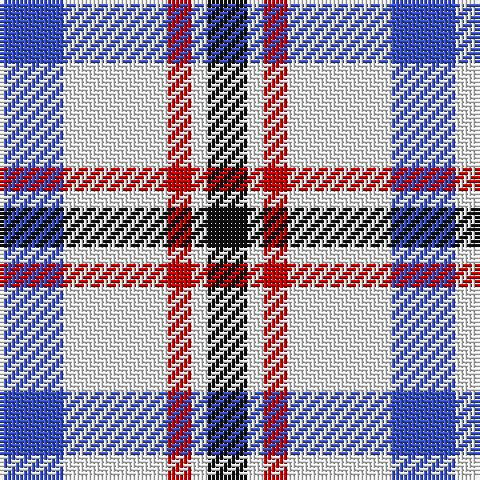

In pattern [BWRWK](/stripes/bwrwk/).

This was sourced from register-of-tartans.  It is a [5 stripe tartan](/stripes/stripes5/).

Original link https://www.tartanregister.gov.uk/tartanDetails.aspx?ref=318

## Also known as

This cloth is also recorded under:

- Boswell Dress Check

## Attestations

This cloth appears in 2 source records; the oldest owns this page.

- 01/08/2004 — Boswell Dress (Personal) (register-of-tartans, [record](https://www.tartanregister.gov.uk/tartanDetails.aspx?ref=318))
- Aug 2004 — Boswell Dress Check (Personal) (tartans-authority, [record](http://www.tartansauthority.com/tartan-ferret/display/6359/))

## Register references

External register numbers recorded for this tartan.

- Scottish Register of Tartans: [318](https://www.tartanregister.gov.uk/tartanDetails.aspx?ref=318)
- Scottish Tartans Authority (ITI): 6359

## Thread count
B/16 W26 R6 W4 K/10

## Palette
Each colour and the base-6 reference it is a variant of.

| Colour | Shade | Base |
|---|---|---|
| B | <code style="background-color:#3850C8;">#3850C8</code> `oklch(48.8% 0.188 269.4)` <small>#3850C8</small> | B <code style="background-color:#2A418A;">#2A418A</code> |
| Ba | <code style="background-color:#1474B4;">#1474B4</code> `oklch(54.0% 0.129 245.1)` <small>#1474B4</small> | B <code style="background-color:#2A418A;">#2A418A</code> |
| K | <code style="background-color:#101010;">#101010</code> `oklch(17.3% 0.000 89.9)` <small>#101010</small> | K <code style="background-color:#000000;">#000000</code> |
| R | <code style="background-color:#C80000;">#C80000</code> `oklch(52.3% 0.215 29.2)` <small>#C80000</small> | R <code style="background-color:#CC0000;">#CC0000</code> |
| W | <code style="background-color:#FFFFFF;">#FFFFFF</code> `oklch(100.0% 0.000 89.9)` <small>#FFFFFF</small> | W <code style="background-color:#F7F7F7;">#F7F7F7</code> |

# Sample pattern

## Nearest tartans

The nearest existing variants by ΔTartan distance, with this tartan at the top so the swatches line up against it.

ΔTartan

Tartan

Sett

—

<a href="/ttd/edit/#slug=b8w13r3w2k5~x2">Boswell Dress (Personal)</a> <a class="nn-out" href="/setts/s5/b8w13r3w2k5~x2/" title="open its dictionary page">↗</a>

0.95

<a href="/ttd/edit/#slug=r7w36db36ly7~x2">MacRae of Conchra #3</a> <a class="nn-out" href="/setts/s4/r7w36db36ly7~x2/" title="open its dictionary page">↗</a>

1.30

<a href="/ttd/edit/#slug=k5n24w24k5~x2">City of London</a> <a class="nn-out" href="/setts/s4/k5n24w24k5~x2/" title="open its dictionary page">↗</a>

1.33

<a href="/ttd/edit/#slug=r2w6db2w9db9w2db6ly2~x4">North Vancouver Island</a> <a class="nn-out" href="/setts/s8/r2w6db2w9db9w2db6ly2~x4/" title="open its dictionary page">↗</a>

1.34

<a href="/ttd/edit/#slug=k5n24w24r5~x2">City of London (Corporate)</a> <a class="nn-out" href="/setts/s4/k5n24w24r5~x2/" title="open its dictionary page">↗</a>

1.44

<a href="/ttd/edit/#slug=r2w6db2w9db9w2db6ly2~x2">North Vancouver, Island</a> <a class="nn-out" href="/setts/s8/r2w6db2w9db9w2db6ly2~x2/" title="open its dictionary page">↗</a>

1.45

<a href="/ttd/edit/#slug=r1w8dt8ly1~x4">MacRae of Conchra</a> <a class="nn-out" href="/setts/s4/r1w8dt8ly1~x4/" title="open its dictionary page">↗</a>

1.49

<a href="/ttd/edit/#slug=r21db61ly8w21~x2">Kellogg College University of Oxford</a> <a class="nn-out" href="/setts/s4/r21db61ly8w21~x2/" title="open its dictionary page">↗</a>

1.52

<a href="/ttd/edit/#slug=w1b3w3b1w5k1w2k3lo1~x4">Henderson Dress (Dance)</a> <a class="nn-out" href="/setts/s9/w1b3w3b1w5k1w2k3lo1~x4/" title="open its dictionary page">↗</a>

1.58

<a href="/ttd/edit/#slug=o22ly10w3db8~x2">Louisburg</a> <a class="nn-out" href="/setts/s4/o22ly10w3db8~x2/" title="open its dictionary page">↗</a>

1.59

<a href="/ttd/edit/#slug=k1w8db8r1~x8">MacRae Dress Purple</a> <a class="nn-out" href="/setts/s4/k1w8db8r1~x8/" title="open its dictionary page">↗</a>

## Neighbour map

Every grey dot is one of 14299 variants placed by the first two principal components of the ΔTartan feature space (44% of its variance). Red is this tartan; blue dots are its nearest — click one to open its page.

<svg viewBox="0 0 640 380" role="img" style="max-width:100%;height:auto;border:1px solid #e0e0e0;border-radius:4px;display:block" xmlns="http://www.w3.org/2000/svg"><image href="/nn/cloud.v1.png" width="640" height="380"/><a href="/setts/s4/r7w36db36ly7~x2/"><circle cx="161.7" cy="232.6" r="4" fill="#3465a4"><title>MacRae of Conchra #3</title></circle></a><a href="/setts/s4/k5n24w24k5~x2/"><circle cx="147.0" cy="236.5" r="4" fill="#3465a4"><title>City of London</title></circle></a><a href="/setts/s8/r2w6db2w9db9w2db6ly2~x4/"><circle cx="156.9" cy="213.4" r="4" fill="#3465a4"><title>North Vancouver Island</title></circle></a><a href="/setts/s4/k5n24w24r5~x2/"><circle cx="155.8" cy="236.0" r="4" fill="#3465a4"><title>City of London (Corporate)</title></circle></a><a href="/setts/s8/r2w6db2w9db9w2db6ly2~x2/"><circle cx="169.8" cy="221.2" r="4" fill="#3465a4"><title>North Vancouver, Island</title></circle></a><a href="/setts/s4/r1w8dt8ly1~x4/"><circle cx="208.1" cy="212.4" r="4" fill="#3465a4"><title>MacRae of Conchra</title></circle></a><a href="/setts/s4/r21db61ly8w21~x2/"><circle cx="242.3" cy="222.4" r="4" fill="#3465a4"><title>Kellogg College University of Oxford</title></circle></a><a href="/setts/s9/w1b3w3b1w5k1w2k3lo1~x4/"><circle cx="174.3" cy="204.9" r="4" fill="#3465a4"><title>Henderson Dress (Dance)</title></circle></a><a href="/setts/s4/o22ly10w3db8~x2/"><circle cx="219.6" cy="235.6" r="4" fill="#3465a4"><title>Louisburg</title></circle></a><a href="/setts/s4/k1w8db8r1~x8/"><circle cx="212.8" cy="211.7" r="4" fill="#3465a4"><title>MacRae Dress Purple</title></circle></a><circle cx="165.3" cy="213.2" r="5" fill="#c00000"/></svg>

ID: /setts/s5/b8w13r3w2k5~x2/
