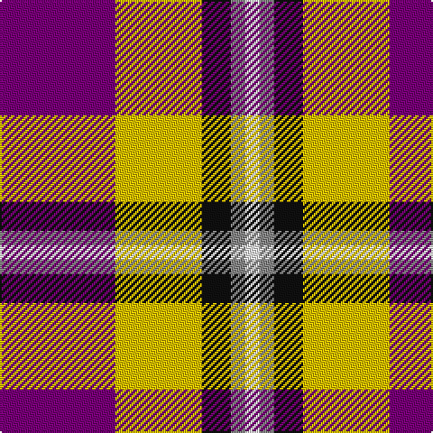

In pattern [BYKRW](/patterns/bykrw/).

This was sourced from tartans-authority.  It is a [5 stripes tartan](/stripes/stripes5/).

Original link http://www.tartansauthority.com/tartan-ferret/display/11064/

## Thread count
P/64 Y48 K16 N8 W/8

## Palette
Each colour and its ΔE from the base-6 reference it is a variant of.

| Colour | Shade | Base | ΔE (OKLab) |
|---|---|---|---|
| K | <code style="background-color:#101010;">#101010</code> `#101010` | K <code style="background-color:#000000;">#000000</code> | 0.17 |
| N | <code style="background-color:#888888;">#888888</code> `#888888` | R <code style="background-color:#CC0000;">#CC0000</code> | 0.24 |
| P | <code style="background-color:#780078;">#780078</code> `#780078` | B <code style="background-color:#2A418A;">#2A418A</code> | 0.17 |
| W | <code style="background-color:#FCFCFC;">#FCFCFC</code> `#FCFCFC` | W <code style="background-color:#F7F7F7;">#F7F7F7</code> | 0.01 |
| Y | <code style="background-color:#E8C000;">#E8C000</code> `#E8C000` | Y <code style="background-color:#F2BF00;">#F2BF00</code> | 0.02 |

# Sample pattern

## Nearest tartans

The nearest existing variants by ΔTartan distance.

1. [Siddle, New (Corporate)](/setts/s5/r30b20w15wa3y3~b202060-rc80000-we0e0e0-wa98c8e8-yfccc00/) — ΔT 0.62
1. [Ballater Victoria Week](/setts/s5/b8y6k2g1w1x8~b5a008c-g808080-k101010-wf9f5ef-ye8c000/) — ΔT 0.68
1. [McGill University](/setts/s5/w3r24b12g8y3x2~b23138d-g063928-rff0000-wffffff-ycea12c/) — ΔT 0.94
1. [Rose Dress White Dress Clan Tartan Tartan Number: 1227. Earliest known date: 1930-50 This sample comes from the MacGregor-Hastie collection which forms the basis of the cloth archive of the Scottish Tartans Society. Stocked by Dalgliesh See products available Copyright © Blair Urquhart, Comrie, 2015](/setts/s6/r32b6k6g6w18k3~b2c2c80-g006818-k101010-rc80000-we0e0e0/) — ΔT 0.95
1. [Rose, White dress](/setts/s6/r32b6k6g6w18k3~b304080-g008000-k000000-rc00000-we0e0e0/) — ΔT 0.99
1. [Wallace Dress, Red (Dance)](/setts/s5/b3w28k10r28k3x2~b2888c4-k101010-rc80000-we0e0e0/) — ΔT 1.18
1. [McGill University (Corporate)](/setts/s5/w3r24b12g8y3x2~b1c0070-g003820-rc80000-we0e0e0-ybc8c00/) — ΔT 1.20
1. [Rose White Dress](/setts/s6/r24b4k4g4w13k2x4~b447084-g006818-k101010-r880000-wf8f4d0/) — ΔT 1.25
1. [Baillie of Polkemmet Red](/setts/s5/w3b12k12r20g2x2~b1870a4-g006818-k101010-rc80000-we0e0e0/) — ΔT 1.29
1. [Pengelly, The Cornish (Name)](/setts/s7/w5k26y4w24b8k3r4x2~b780078-k101010-rc80000-wcccccc-ye8c000/) — ΔT 1.30

## Neighbour map

Every grey dot is one of 15726 variants placed by the first two principal components of the ΔTartan feature space (44% of its variance). Red is this tartan; blue dots are its nearest — click one to open its page.

<svg viewBox="0 0 640 380" role="img" style="max-width:100%;height:auto;border:1px solid #e0e0e0;border-radius:4px;display:block" xmlns="http://www.w3.org/2000/svg"><image href="/nn/cloud.v1.png" width="640" height="380"/><a href="/setts/s5/r30b20w15wa3y3~b202060-rc80000-we0e0e0-wa98c8e8-yfccc00/"><circle cx="170.6" cy="183.0" r="4" fill="#3465a4"><title>Siddle, New (Corporate)</title></circle></a><a href="/setts/s5/b8y6k2g1w1x8~b5a008c-g808080-k101010-wf9f5ef-ye8c000/"><circle cx="170.8" cy="188.3" r="4" fill="#3465a4"><title>Ballater Victoria Week</title></circle></a><a href="/setts/s5/w3r24b12g8y3x2~b23138d-g063928-rff0000-wffffff-ycea12c/"><circle cx="196.5" cy="187.1" r="4" fill="#3465a4"><title>McGill University</title></circle></a><a href="/setts/s6/r32b6k6g6w18k3~b2c2c80-g006818-k101010-rc80000-we0e0e0/"><circle cx="186.7" cy="161.2" r="4" fill="#3465a4"><title>Rose Dress White Dress Clan Tartan Tartan Number: 1227. Earliest known date: 1930-50 This sample comes from the MacGregor-Hastie collection which forms the basis of the cloth archive of the Scottish Tartans Society. Stocked by Dalgliesh See products available Copyright © Blair Urquhart, Comrie, 2015</title></circle></a><a href="/setts/s6/r32b6k6g6w18k3~b304080-g008000-k000000-rc00000-we0e0e0/"><circle cx="179.1" cy="160.0" r="4" fill="#3465a4"><title>Rose, White dress</title></circle></a><a href="/setts/s5/b3w28k10r28k3x2~b2888c4-k101010-rc80000-we0e0e0/"><circle cx="182.4" cy="192.2" r="4" fill="#3465a4"><title>Wallace Dress, Red (Dance)</title></circle></a><a href="/setts/s5/w3r24b12g8y3x2~b1c0070-g003820-rc80000-we0e0e0-ybc8c00/"><circle cx="209.0" cy="198.3" r="4" fill="#3465a4"><title>McGill University (Corporate)</title></circle></a><a href="/setts/s6/r24b4k4g4w13k2x4~b447084-g006818-k101010-r880000-wf8f4d0/"><circle cx="200.8" cy="156.1" r="4" fill="#3465a4"><title>Rose White Dress</title></circle></a><a href="/setts/s5/w3b12k12r20g2x2~b1870a4-g006818-k101010-rc80000-we0e0e0/"><circle cx="168.9" cy="200.4" r="4" fill="#3465a4"><title>Baillie of Polkemmet Red</title></circle></a><a href="/setts/s7/w5k26y4w24b8k3r4x2~b780078-k101010-rc80000-wcccccc-ye8c000/"><circle cx="150.0" cy="165.9" r="4" fill="#3465a4"><title>Pengelly, The Cornish (Name)</title></circle></a><circle cx="176.5" cy="185.7" r="5" fill="#c00000"/></svg>

ID: /setts/s5/b8y6k2r1w1x8~b780078-k101010-r888888-wfcfcfc-ye8c000/
