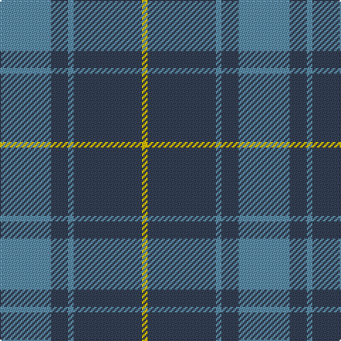

In pattern [BBBBY](/patterns/bbbby/).

This was sourced from register-of-tartans.  It is a [5 stripes tartan](/stripes/stripes5/).

Original link https://www.tartanregister.gov.uk/tartanDetails.aspx?ref=3154

## Attestations

This cloth appears in 2 source records; the oldest owns this page.

- 01/06/2006 — North Sea Commission (register-of-tartans, [record](https://www.tartanregister.gov.uk/tartanDetails.aspx?ref=3154))
- 2006 June — North Sea Commission (Corporate) (tartans-authority, [record](http://www.tartansauthority.com/tartan-ferret/display/6938/))

## Register references

External register numbers recorded for this tartan.

- Scottish Register of Tartans: [3154](https://www.tartanregister.gov.uk/tartanDetails.aspx?ref=3154)
- Scottish Tartans Authority (ITI): 6938

## Thread count
B/36 N12 B4 N48 Y/4

## Palette
Each colour and its ΔE from the base-6 reference it is a variant of.

| Colour | Shade | Base | ΔE (OKLab) |
|---|---|---|---|
| B | <code style="background-color:#5C8CA8;">#5C8CA8</code> `#5C8CA8` | B <code style="background-color:#2A418A;">#2A418A</code> | 0.23 |
| N | <code style="background-color:#344054;">#344054</code> `#344054` | B <code style="background-color:#2A418A;">#2A418A</code> | 0.09 |
| Y | <code style="background-color:#E8C000;">#E8C000</code> `#E8C000` | Y <code style="background-color:#F2BF00;">#F2BF00</code> | 0.02 |

# Sample pattern

## Nearest tartans

The nearest existing variants by ΔTartan distance.

1. [Hector James](/setts/s5/r2g11b27g5ra2~b304080-g008000-r806050-rac00000~x2/) — ΔT 1.18
1. [Hamilton Hunting](/setts/s5/b11g2b15g18w2~b2c4084-g005020-we0e0e0~x2/) — ΔT 1.26
1. [Barclay](/setts/s4/g1b16g16r1~b2c2c80-g006818-rc80000~x2/) — ΔT 1.27
1. [Barclay Htg (Clan)](/setts/s4/g1b16g16r1~b2c2c80-g006818-rc80000~x4/) — ΔT 1.27
1. [Cameron Hunting](/setts/s6/b15r5b30ba32b4y3~b4c3428-ba1474b4-rc80000-yd09800~x2/) — ΔT 1.32
1. [City of Kincardine](/setts/s6/g4b36y6g16b16g3~b202060-g006818-y48a4c0~x2/) — ΔT 1.34
1. [Gallaecia - Galicia National](/setts/s5/b24ba13b4ba4w2~b141e46-ba07648c-we0e0e0~x2/) — ΔT 1.39
1. [Thorburn (Lochcarron)](/setts/s6/b3ba14b3r16b34ra3~b003c64-ba5c8ca8-r888888-rac80000~x2/) — ΔT 1.39
1. [Perthshire (New) District Tartan Tartan Number: 2188. Earliest known date: 1992 The New Perthshire District tartan has established itself through use and wont since 1992. It provides a useful alternative to the Drummond pattern which was always closely associated with Perthshire. See products available Copyright © Blair Urquhart, Comrie, 2015](/setts/s6/b26r6g16b8g3r2~b202060-g006818-rc80000~x2/) — ΔT 1.43
1. [MacCallum High School Corporate Tartan Tartan Number: 1279. Earliest known date: 0 From the J. Rutledge Collection, Belfast. MacCallum High School, Philadelphia See products available Copyright © Blair Urquhart, Comrie, 2015](/setts/s5/r9b3r1b11r1~b2c2c80-r888888~x6/) — ΔT 1.46

## Neighbour map

Every grey dot is one of 15726 variants placed by the first two principal components of the ΔTartan feature space (44% of its variance). Red is this tartan; blue dots are its nearest — click one to open its page.

<svg viewBox="0 0 640 380" role="img" style="max-width:100%;height:auto;border:1px solid #e0e0e0;border-radius:4px;display:block" xmlns="http://www.w3.org/2000/svg"><image href="/nn/cloud.v1.png" width="640" height="380"/><a href="/setts/s5/r2g11b27g5ra2~b304080-g008000-r806050-rac00000~x2/"><circle cx="376.7" cy="220.3" r="4" fill="#3465a4"><title>Hector James</title></circle></a><a href="/setts/s5/b11g2b15g18w2~b2c4084-g005020-we0e0e0~x2/"><circle cx="363.5" cy="286.3" r="4" fill="#3465a4"><title>Hamilton Hunting</title></circle></a><a href="/setts/s4/g1b16g16r1~b2c2c80-g006818-rc80000~x2/"><circle cx="383.0" cy="252.8" r="4" fill="#3465a4"><title>Barclay</title></circle></a><a href="/setts/s4/g1b16g16r1~b2c2c80-g006818-rc80000~x4/"><circle cx="383.0" cy="252.8" r="4" fill="#3465a4"><title>Barclay Htg (Clan)</title></circle></a><a href="/setts/s6/b15r5b30ba32b4y3~b4c3428-ba1474b4-rc80000-yd09800~x2/"><circle cx="347.4" cy="231.0" r="4" fill="#3465a4"><title>Cameron Hunting</title></circle></a><a href="/setts/s6/g4b36y6g16b16g3~b202060-g006818-y48a4c0~x2/"><circle cx="408.1" cy="247.9" r="4" fill="#3465a4"><title>City of Kincardine</title></circle></a><a href="/setts/s5/b24ba13b4ba4w2~b141e46-ba07648c-we0e0e0~x2/"><circle cx="394.6" cy="252.1" r="4" fill="#3465a4"><title>Gallaecia - Galicia National</title></circle></a><a href="/setts/s6/b3ba14b3r16b34ra3~b003c64-ba5c8ca8-r888888-rac80000~x2/"><circle cx="330.6" cy="220.5" r="4" fill="#3465a4"><title>Thorburn (Lochcarron)</title></circle></a><a href="/setts/s6/b26r6g16b8g3r2~b202060-g006818-rc80000~x2/"><circle cx="350.8" cy="235.5" r="4" fill="#3465a4"><title>Perthshire (New) District Tartan Tartan Number: 2188. Earliest known date: 1992 The New Perthshire District tartan has established itself through use and wont since 1992. It provides a useful alternative to the Drummond pattern which was always closely associated with Perthshire. See products available Copyright © Blair Urquhart, Comrie, 2015</title></circle></a><a href="/setts/s5/r9b3r1b11r1~b2c2c80-r888888~x6/"><circle cx="402.2" cy="264.7" r="4" fill="#3465a4"><title>MacCallum High School Corporate Tartan Tartan Number: 1279. Earliest known date: 0 From the J. Rutledge Collection, Belfast. MacCallum High School, Philadelphia See products available Copyright © Blair Urquhart, Comrie, 2015</title></circle></a><circle cx="396.1" cy="249.5" r="5" fill="#c00000"/></svg>

ID: /setts/s5/b9ba3b1ba12y1~b5c8ca8-ba344054-ye8c000~x4/
