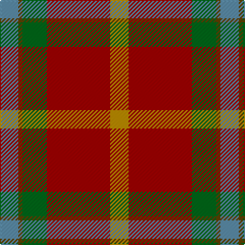

In pattern [BGGRY](/patterns/bggry/).

This was sourced from tartans-authority.  It is a [5 stripes tartan](/stripes/stripes5/).

Original link http://www.tartansauthority.com/tartan-ferret/display/10300/

## Thread count
B/18 T4 G24 DR62 DY/18

## Palette
Each colour and its ΔE from the base-6 reference it is a variant of.

| Colour | Shade | Base | ΔE (OKLab) |
|---|---|---|---|
| B | <code style="background-color:#5C8CA8;">#5C8CA8</code> `#5C8CA8` | B <code style="background-color:#2A418A;">#2A418A</code> | 0.23 |
| DR | <code style="background-color:#A00000;">#A00000</code> `#A00000` | R <code style="background-color:#CC0000;">#CC0000</code> | 0.09 |
| DY | <code style="background-color:#BC8C00;">#BC8C00</code> `#BC8C00` | Y <code style="background-color:#F2BF00;">#F2BF00</code> | 0.16 |
| G | <code style="background-color:#006818;">#006818</code> `#006818` | G <code style="background-color:#006100;">#006100</code> | 0.02 |
| T | <code style="background-color:#604000;">#604000</code> `#604000` | G <code style="background-color:#006100;">#006100</code> | 0.14 |

# Sample pattern

## Nearest tartans

The nearest existing variants by ΔTartan distance.

1. [Buncle (Duns)](/setts/s5/b9ba2g12r31y9~b486373-ba351e14-g203b27-ra32d18-ye0a126~x2/) — ΔT 0.32
1. [Jardine](/setts/s5/b18r9g9ra1ba1~b401000-ba5480b0-g808080-r906030-rac00000~x4/) — ΔT 1.08
1. [Bronte](/setts/s5/g24b2r25y2k3~b1870a4-g408060-k101010-rc80000-ye8c000~x2/) — ΔT 1.26
1. [Douglas Ancient Red](/setts/s5/k8y2b30r30w3~b5c5c5c-k101010-r880000-wc0c0c0-yd09800~x2/) — ΔT 1.26
1. [Dundhuin](/setts/s6/y6r5k2g18ra28w2~g6a8a67-k1c1714-r905966-ra9d2123-wf9f5ef-y99a3ba~x2/) — ΔT 1.37
1. [Duminiak (Trevose, Pennsylvania)](/setts/s6/g47w6r24w3b5y3~b433a5a-g6a5e47-rb62531-we5e0d2-ye0a126~x2/) — ΔT 1.43
1. [MacQuarrie 2](/setts/s7/r6g16r4b12r16ba1r2~b304080-ba5480b0-g008000-rc00000~x2/) — ΔT 1.43
1. [Leckie (Personal)](/setts/s7/r3b1r12ra3g12w1g2~b00008c-g004c00-rb00000-ra640000-wc8c8c8~x4/) — ΔT 1.44
1. [Hutcheson (Name)](/setts/s6/b8g4r30ga30y3ga4~b003c64-g789484-ga00643c-rcc4438-ydc943c~x2/) — ΔT 1.46
1. [Caithness (1848) (District?)](/setts/s6/r40b11w2k12g36r32~b5c8ca8-g408060-k101010-rc80000-wf8f8f8~x2/) — ΔT 1.47

## Neighbour map

Every grey dot is one of 15726 variants placed by the first two principal components of the ΔTartan feature space (44% of its variance). Red is this tartan; blue dots are its nearest — click one to open its page.

<svg viewBox="0 0 640 380" role="img" style="max-width:100%;height:auto;border:1px solid #e0e0e0;border-radius:4px;display:block" xmlns="http://www.w3.org/2000/svg"><image href="/nn/cloud.v1.png" width="640" height="380"/><a href="/setts/s5/b9ba2g12r31y9~b486373-ba351e14-g203b27-ra32d18-ye0a126~x2/"><circle cx="282.1" cy="195.4" r="4" fill="#3465a4"><title>Buncle (Duns)</title></circle></a><a href="/setts/s5/b18r9g9ra1ba1~b401000-ba5480b0-g808080-r906030-rac00000~x4/"><circle cx="286.2" cy="189.5" r="4" fill="#3465a4"><title>Jardine</title></circle></a><a href="/setts/s5/g24b2r25y2k3~b1870a4-g408060-k101010-rc80000-ye8c000~x2/"><circle cx="283.3" cy="182.5" r="4" fill="#3465a4"><title>Bronte</title></circle></a><a href="/setts/s5/k8y2b30r30w3~b5c5c5c-k101010-r880000-wc0c0c0-yd09800~x2/"><circle cx="283.1" cy="196.2" r="4" fill="#3465a4"><title>Douglas Ancient Red</title></circle></a><a href="/setts/s6/y6r5k2g18ra28w2~g6a8a67-k1c1714-r905966-ra9d2123-wf9f5ef-y99a3ba~x2/"><circle cx="257.5" cy="159.2" r="4" fill="#3465a4"><title>Dundhuin</title></circle></a><a href="/setts/s6/g47w6r24w3b5y3~b433a5a-g6a5e47-rb62531-we5e0d2-ye0a126~x2/"><circle cx="335.1" cy="164.4" r="4" fill="#3465a4"><title>Duminiak (Trevose, Pennsylvania)</title></circle></a><a href="/setts/s7/r6g16r4b12r16ba1r2~b304080-ba5480b0-g008000-rc00000~x2/"><circle cx="288.0" cy="195.2" r="4" fill="#3465a4"><title>MacQuarrie 2</title></circle></a><a href="/setts/s7/r3b1r12ra3g12w1g2~b00008c-g004c00-rb00000-ra640000-wc8c8c8~x4/"><circle cx="274.1" cy="179.0" r="4" fill="#3465a4"><title>Leckie (Personal)</title></circle></a><a href="/setts/s6/b8g4r30ga30y3ga4~b003c64-g789484-ga00643c-rcc4438-ydc943c~x2/"><circle cx="254.7" cy="196.1" r="4" fill="#3465a4"><title>Hutcheson (Name)</title></circle></a><a href="/setts/s6/r40b11w2k12g36r32~b5c8ca8-g408060-k101010-rc80000-wf8f8f8~x2/"><circle cx="294.6" cy="181.1" r="4" fill="#3465a4"><title>Caithness (1848) (District?)</title></circle></a><circle cx="283.6" cy="195.5" r="5" fill="#c00000"/></svg>

ID: /setts/s5/b9g2ga12r31y9~b5c8ca8-g604000-ga006818-ra00000-ybc8c00~x2/
