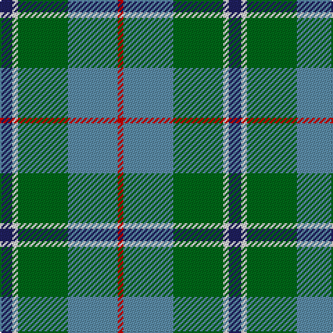

In pattern [BWGBR](/patterns/bwgbr/).

This was sourced from house-of-tartan.  It is a [5 stripes tartan](/stripes/stripes5/).

Original link http://www.house-of-tartan.scotland.net/house/TartanViewjs.asp?colr=Def&tnam=643

## Thread count
DB/9 LN4 G36 B36 R/4

## Palette
Each colour and its ΔE from the base-6 reference it is a variant of.

| Colour | Shade | Base | ΔE (OKLab) |
|---|---|---|---|
| B | <code style="background-color:#5C8CA8;">#5C8CA8</code> `#5C8CA8` | B <code style="background-color:#2C4084;">#2C4084</code> | 0.23 |
| DB | <code style="background-color:#202060;">#202060</code> `#202060` | B <code style="background-color:#2C4084;">#2C4084</code> | 0.11 |
| G | <code style="background-color:#006818;">#006818</code> `#006818` | G <code style="background-color:#006400;">#006400</code> | 0.02 |
| LN | <code style="background-color:#E0E0E0;">#E0E0E0</code> `#E0E0E0` | W <code style="background-color:#F4F4F0;">#F4F4F0</code> | 0.06 |
| R | <code style="background-color:#C80000;">#C80000</code> `#C80000` | R <code style="background-color:#C80000;">#C80000</code> | 0.00 |

# Sample pattern

## Nearest tartans

The nearest existing variants by ΔTartan distance.

1. [Alvis of Lee (Personal)](/setts/s5/b9w4g36ba36r4-b1c0070-ba5c8ca8-g228b22-rc80000-we0e0e0/) — ΔT 0.40
1. [Alvis of Lee (Personal)](/setts/s5/b18w8g72ba72r8-b1c0070-ba5c8ca8-g00643c-rc80000-we0e0e0/) — ΔT 0.50
1. [Alvis, of Lee](/setts/s5/b9w4g36ba36r4-b000050-ba5480b0-g008000-rc00000-we0e0e0/) — ΔT 0.55
1. [Turnbull, hunting](/setts/s5/r14y6g56b56w6-b304080-g008000-r800000-we0e0e0-yf0c000/) — ΔT 0.79
1. [Balfour Hunting](/setts/s6/b60y6g22y6ga66r12-b1870a4-g604000-ga006818-rc80000-ye8c000/) — ΔT 1.01
1. [Wellington (Lochcarron)](/setts/s5/k18y12b44g56ya4-b0c585c-g408060-k101010-y9ca8b0-yae8c000/) — ΔT 1.04
1. [Turnbull Hunting](/setts/s5/r14y6g56b56w6-b2c4084-g005020-r960000-we0e0e0-ye8c000/) — ΔT 1.08
1. [Douglas](/setts/s5/k4b4g32ba32w4-b5480b0-ba304080-g008000-k000000-we0e0e0/) — ΔT 1.09
1. [Sterling, Rob (Florida) (Personal)](/setts/s5/g22y20b22ba66w6-b433a5a-ba1870a4-g649848-wf9f5ef-ye0a126/) — ΔT 1.13
1. [Gamba (Commemorative)](/setts/s5/g10r6ga60b60w6-b2c2c80-g003820-ga006818-rc80000-wfcfcfc/) — ΔT 1.17

## Neighbour map

Every grey dot is one of 15726 variants placed by the first two principal components of the ΔTartan feature space (44% of its variance). Red is this tartan; blue dots are its nearest — click one to open its page.

<svg viewBox="0 0 640 380" role="img" style="max-width:100%;height:auto;border:1px solid #e0e0e0;border-radius:4px;display:block" xmlns="http://www.w3.org/2000/svg"><image href="/nn/cloud.v1.png" width="640" height="380"/><a href="/setts/s5/b9w4g36ba36r4-b1c0070-ba5c8ca8-g228b22-rc80000-we0e0e0/"><circle cx="210.3" cy="212.6" r="4" fill="#3465a4"><title>Alvis of Lee (Personal)</title></circle></a><a href="/setts/s5/b18w8g72ba72r8-b1c0070-ba5c8ca8-g00643c-rc80000-we0e0e0/"><circle cx="217.8" cy="216.2" r="4" fill="#3465a4"><title>Alvis of Lee (Personal)</title></circle></a><a href="/setts/s5/b9w4g36ba36r4-b000050-ba5480b0-g008000-rc00000-we0e0e0/"><circle cx="199.9" cy="209.7" r="4" fill="#3465a4"><title>Alvis, of Lee</title></circle></a><a href="/setts/s5/r14y6g56b56w6-b304080-g008000-r800000-we0e0e0-yf0c000/"><circle cx="204.0" cy="206.6" r="4" fill="#3465a4"><title>Turnbull, hunting</title></circle></a><a href="/setts/s6/b60y6g22y6ga66r12-b1870a4-g604000-ga006818-rc80000-ye8c000/"><circle cx="213.0" cy="203.8" r="4" fill="#3465a4"><title>Balfour Hunting</title></circle></a><a href="/setts/s5/k18y12b44g56ya4-b0c585c-g408060-k101010-y9ca8b0-yae8c000/"><circle cx="226.8" cy="215.9" r="4" fill="#3465a4"><title>Wellington (Lochcarron)</title></circle></a><a href="/setts/s5/r14y6g56b56w6-b2c4084-g005020-r960000-we0e0e0-ye8c000/"><circle cx="221.3" cy="214.7" r="4" fill="#3465a4"><title>Turnbull Hunting</title></circle></a><a href="/setts/s5/k4b4g32ba32w4-b5480b0-ba304080-g008000-k000000-we0e0e0/"><circle cx="206.8" cy="209.4" r="4" fill="#3465a4"><title>Douglas</title></circle></a><a href="/setts/s5/g22y20b22ba66w6-b433a5a-ba1870a4-g649848-wf9f5ef-ye0a126/"><circle cx="226.7" cy="210.5" r="4" fill="#3465a4"><title>Sterling, Rob (Florida) (Personal)</title></circle></a><a href="/setts/s5/g10r6ga60b60w6-b2c2c80-g003820-ga006818-rc80000-wfcfcfc/"><circle cx="232.6" cy="206.7" r="4" fill="#3465a4"><title>Gamba (Commemorative)</title></circle></a><circle cx="216.2" cy="215.6" r="5" fill="#c00000"/></svg>

ID: /setts/s5/b9w4g36ba36r4-b202060-ba5c8ca8-g006818-rc80000-we0e0e0/
