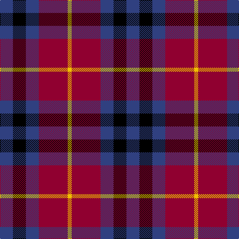

This page is one **sett** — a single exact thread-count. It belongs to the [tartan](/tartans/b13k13b13dr29y4/)
(the same proportion at any scale), whose colour order is pattern [BKBRY](/stripes/bkbry/).

Sourced from weddslist.  It is a [5 stripe tartan](/stripes/stripes5/).

Original link http://www.weddslist.com/cgi-bin/tartans/pg.pl?source=sts

## Thread count
B/26 K26 B26 DR58 Y/8

## Palette
Each colour and the base-6 reference it is a variant of.

| Colour | Shade | Base |
|---|---|---|
| B | <code style="background-color:#304080;">#304080</code> `oklch(39.4% 0.109 270.2)` <small>#304080</small> | B <code style="background-color:#2A418A;">#2A418A</code> |
| DR | <code style="background-color:#900030;">#900030</code> `oklch(41.6% 0.166 13.6)` <small>#900030</small> | R <code style="background-color:#CC0000;">#CC0000</code> |
| K | <code style="background-color:#000000;">#000000</code> `oklch(0.0% 0.000 0.0)` <small>#000000</small> | K <code style="background-color:#000000;">#000000</code> |
| Y | <code style="background-color:#F0C000;">#F0C000</code> `oklch(82.7% 0.169 90.5)` <small>#F0C000</small> | Y <code style="background-color:#F2BF00;">#F2BF00</code> |

# Sample pattern

## Nearest tartans

The nearest existing variants by ΔTartan distance, with this tartan at the top so the swatches line up against it.

ΔTartan

Tartan

Sett

—

<a href="/ttd/edit/#slug=db13k13db13r29ly4~x2">Highland Pub Company</a> <a class="nn-out" href="/setts/s5/db13k13db13r29ly4~x2/" title="open its dictionary page">↗</a>

1.04

<a href="/ttd/edit/#slug=r2dp8k8w1r2~x2">Inder (Corporate)</a> <a class="nn-out" href="/setts/s5/r2dp8k8w1r2~x2/" title="open its dictionary page">↗</a>

1.09

<a href="/ttd/edit/#slug=db14dg21db4r21db14ly2~x2">Kilgour</a> <a class="nn-out" href="/setts/s6/db14dg21db4r21db14ly2~x2/" title="open its dictionary page">↗</a>

1.18

<a href="/ttd/edit/#slug=db9r12dg9db5w2~x4">Battle of Prestonpans (1745) Herit</a> <a class="nn-out" href="/setts/s5/db9r12dg9db5w2~x4/" title="open its dictionary page">↗</a>

1.20

<a href="/ttd/edit/#slug=db8k3r4ly1~x2">Unidentified #17</a> <a class="nn-out" href="/setts/s4/db8k3r4ly1~x2/" title="open its dictionary page">↗</a>

1.20

<a href="/ttd/edit/#slug=db3r2g5r8db12w3~x2">Edinburgh Bus Company (Corporate)</a> <a class="nn-out" href="/setts/s6/db3r2g5r8db12w3~x2/" title="open its dictionary page">↗</a>

1.21

<a href="/ttd/edit/#slug=t1r6db1t3k3t1~x8">MacTavish #2</a> <a class="nn-out" href="/setts/s6/t1r6db1t3k3t1~x8/" title="open its dictionary page">↗</a>

1.24

<a href="/ttd/edit/#slug=r26t3r4k16db16k4~x2">Graham of Menteith, (Red)</a> <a class="nn-out" href="/setts/s6/r26t3r4k16db16k4~x2/" title="open its dictionary page">↗</a>

1.24

<a href="/ttd/edit/#slug=k60w8lo15dp74k14">Gingles (Personal)</a> <a class="nn-out" href="/setts/s5/k60w8lo15dp74k14/" title="open its dictionary page">↗</a>

1.27

<a href="/ttd/edit/#slug=dg3k20k20r20k3r3~x2">Unidentified #65</a> <a class="nn-out" href="/setts/s6/dg3k20k20r20k3r3~x2/" title="open its dictionary page">↗</a>

1.28

<a href="/ttd/edit/#slug=b2r12db2b6k6b1~x2">MacTavish</a> <a class="nn-out" href="/setts/s6/b2r12db2b6k6b1~x2/" title="open its dictionary page">↗</a>

## Neighbour map

Every grey dot is one of 14299 variants placed by the first two principal components of the ΔTartan feature space (44% of its variance). Red is this tartan; blue dots are its nearest — click one to open its page.

<svg viewBox="0 0 640 380" role="img" style="max-width:100%;height:auto;border:1px solid #e0e0e0;border-radius:4px;display:block" xmlns="http://www.w3.org/2000/svg"><image href="/nn/cloud.v1.png" width="640" height="380"/><a href="/setts/s5/r2dp8k8w1r2~x2/"><circle cx="203.7" cy="221.9" r="4" fill="#3465a4"><title>Inder (Corporate)</title></circle></a><a href="/setts/s6/db14dg21db4r21db14ly2~x2/"><circle cx="197.8" cy="227.0" r="4" fill="#3465a4"><title>Kilgour</title></circle></a><a href="/setts/s5/db9r12dg9db5w2~x4/"><circle cx="150.6" cy="262.8" r="4" fill="#3465a4"><title>Battle of Prestonpans (1745) Herit</title></circle></a><a href="/setts/s4/db8k3r4ly1~x2/"><circle cx="237.9" cy="245.7" r="4" fill="#3465a4"><title>Unidentified #17</title></circle></a><a href="/setts/s6/db3r2g5r8db12w3~x2/"><circle cx="182.2" cy="229.9" r="4" fill="#3465a4"><title>Edinburgh Bus Company (Corporate)</title></circle></a><a href="/setts/s6/t1r6db1t3k3t1~x8/"><circle cx="192.7" cy="234.6" r="4" fill="#3465a4"><title>MacTavish #2</title></circle></a><a href="/setts/s6/r26t3r4k16db16k4~x2/"><circle cx="205.9" cy="207.4" r="4" fill="#3465a4"><title>Graham of Menteith, (Red)</title></circle></a><a href="/setts/s5/k60w8lo15dp74k14/"><circle cx="248.1" cy="217.5" r="4" fill="#3465a4"><title>Gingles (Personal)</title></circle></a><a href="/setts/s6/dg3k20k20r20k3r3~x2/"><circle cx="165.0" cy="226.5" r="4" fill="#3465a4"><title>Unidentified #65</title></circle></a><a href="/setts/s6/b2r12db2b6k6b1~x2/"><circle cx="210.5" cy="195.6" r="4" fill="#3465a4"><title>MacTavish</title></circle></a><circle cx="184.5" cy="248.2" r="5" fill="#c00000"/></svg>

ID: /setts/s5/db13k13db13r29ly4~x2/
