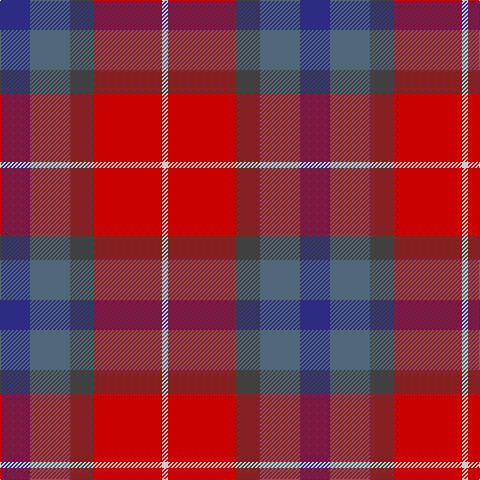

In pattern [BBBRW](/stripes/bbbrw/).

This was sourced from tartans-authority.  It is a [5 stripe tartan](/stripes/stripes5/).

Original link http://www.tartansauthority.com/tartan-ferret/display/10284/

## Thread count
DB/30 Nb40 N24 R68 Na/6

## Palette
Each colour and its ΔE from the base-6 reference it is a variant of.

| Colour | Shade | Base | ΔE (OKLab) |
|---|---|---|---|
| DB | <code style="background-color:#2C2C80;">#2C2C80</code> `#2C2C80` | B <code style="background-color:#2A418A;">#2A418A</code> | 0.06 |
| N | <code style="background-color:#404040;">#404040</code> `#404040` | B <code style="background-color:#2A418A;">#2A418A</code> | 0.13 |
| Na | <code style="background-color:#CCCCCC;">#CCCCCC</code> `#CCCCCC` | W <code style="background-color:#F7F7F7;">#F7F7F7</code> | 0.13 |
| Nb | <code style="background-color:#506878;">#506878</code> `#506878` | B <code style="background-color:#2A418A;">#2A418A</code> | 0.14 |
| R | <code style="background-color:#C80000;">#C80000</code> `#C80000` | R <code style="background-color:#CC0000;">#CC0000</code> | 0.01 |

# Sample pattern

## Nearest tartans

The nearest existing variants by ΔTartan distance.

1. [Pople (Name)](/setts/s5/k1r9n8y8w1~x2/) — ΔT 1.20
1. [Stevens #3](/setts/s6/dp2t9dp3r7r19ly2~x2/) — ΔT 1.30
1. [Moray of Abercairney #2](/setts/s5/r8r1dg4r1db4~x2/) — ΔT 1.46
1. [Dunfermline](/setts/s6/r11n3r12k11b11w1~x2/) — ΔT 1.47
1. [Moray of Abercairney](/setts/s5/r8r1g4r1db4~x2/) — ΔT 1.51
1. [Douglas Ancient Red](/setts/s5/k8lo2n30r30lb3~x2/) — ΔT 1.55
1. [McCurdy-Stribbling (Personal)](/setts/s5/db15t20k12o34y3~x2/) — ΔT 1.56
1. [Thompson's Fancy Personal Tartan Tartan Number: 286. Earliest known date: pre 2003 Designed for his own use. See products available Copyright © Blair Urquhart, Comrie, 2015](/setts/s6/r2dy8db2t4k4t1~x6/) — ΔT 1.58
1. [Afternoon Tea / Assam](/setts/s6/r15r98dp72t25dp8w15/) — ΔT 1.59
1. [Wyeth (Personal)](/setts/s5/db18r18dp2g12db1~x4/) — ΔT 1.60

## Neighbour map

Every grey dot is one of 14299 variants placed by the first two principal components of the ΔTartan feature space (44% of its variance). Red is this tartan; blue dots are its nearest — click one to open its page.

<svg viewBox="0 0 640 380" role="img" style="max-width:100%;height:auto;border:1px solid #e0e0e0;border-radius:4px;display:block" xmlns="http://www.w3.org/2000/svg"><image href="/nn/cloud.v1.png" width="640" height="380"/><a href="/setts/s5/k1r9n8y8w1~x2/"><circle cx="201.0" cy="236.6" r="4" fill="#3465a4"><title>Pople (Name)</title></circle></a><a href="/setts/s6/dp2t9dp3r7r19ly2~x2/"><circle cx="245.6" cy="194.2" r="4" fill="#3465a4"><title>Stevens #3</title></circle></a><a href="/setts/s5/r8r1dg4r1db4~x2/"><circle cx="239.8" cy="231.3" r="4" fill="#3465a4"><title>Moray of Abercairney #2</title></circle></a><a href="/setts/s6/r11n3r12k11b11w1~x2/"><circle cx="215.4" cy="217.5" r="4" fill="#3465a4"><title>Dunfermline</title></circle></a><a href="/setts/s5/r8r1g4r1db4~x2/"><circle cx="242.3" cy="235.1" r="4" fill="#3465a4"><title>Moray of Abercairney</title></circle></a><a href="/setts/s5/k8lo2n30r30lb3~x2/"><circle cx="283.9" cy="200.2" r="4" fill="#3465a4"><title>Douglas Ancient Red</title></circle></a><a href="/setts/s5/db15t20k12o34y3~x2/"><circle cx="231.5" cy="248.0" r="4" fill="#3465a4"><title>McCurdy-Stribbling (Personal)</title></circle></a><a href="/setts/s6/r2dy8db2t4k4t1~x6/"><circle cx="163.3" cy="225.3" r="4" fill="#3465a4"><title>Thompson's Fancy Personal Tartan Tartan Number: 286. Earliest known date: pre 2003 Designed for his own use. See products available Copyright © Blair Urquhart, Comrie, 2015</title></circle></a><a href="/setts/s6/r15r98dp72t25dp8w15/"><circle cx="237.2" cy="178.4" r="4" fill="#3465a4"><title>Afternoon Tea / Assam</title></circle></a><a href="/setts/s5/db18r18dp2g12db1~x4/"><circle cx="242.0" cy="207.1" r="4" fill="#3465a4"><title>Wyeth (Personal)</title></circle></a><circle cx="206.5" cy="222.2" r="5" fill="#c00000"/></svg>

ID: /setts/s5/db15n20do12r34lb3~x2/
