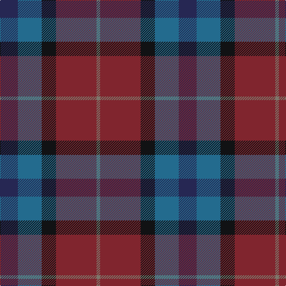

This page is one **sett** — a single exact thread-count. It belongs to the [tartan](/tartans/db15t20k12o34y3/)
(the same proportion at any scale), whose colour order is pattern [BBKRG](/stripes/bbkrg/).

Sourced from register-of-tartans.  It is a [5 stripe tartan](/stripes/stripes5/).

Original link https://www.tartanregister.gov.uk/tartanDetails.aspx?ref=10284

## Register references

External register numbers recorded for this tartan.

- Scottish Register of Tartans: [10284](https://www.tartanregister.gov.uk/tartanDetails.aspx?ref=10284)

## Thread count
DB/30 B40 K24 DR68 N/6

## Palette

Palette: <strong>custom</strong>
<table><thead><tr><th>Colour</th><th>Threads</th><th>Shade</th><th>Base</th><th>OKLCh</th></tr></thead><tbody><tr><td>DB/</td><td style="text-align:right;font-variant-numeric:tabular-nums">30</td><td><code style="background-color:#262753;">#262753</code> <small style="color:#888">#262753</small></td><td>B <code style="background-color:#2A418A;">#2A418A</code></td><td><small style="color:#888">oklch(29.7% 0.078 279.5)</small></td></tr><tr><td>B</td><td style="text-align:right;font-variant-numeric:tabular-nums">40</td><td><code style="background-color:#236B8E;">#236B8E</code> <small style="color:#888">#236B8E</small></td><td>B <code style="background-color:#2A418A;">#2A418A</code></td><td><small style="color:#888">oklch(50.0% 0.089 234.0)</small></td></tr><tr><td>K</td><td style="text-align:right;font-variant-numeric:tabular-nums">24</td><td><code style="background-color:#111214;">#111214</code> <small style="color:#888">#111214</small></td><td>K <code style="background-color:#000000;">#000000</code></td><td><small style="color:#888">oklch(18.2% 0.004 264.5)</small></td></tr><tr><td>DR</td><td style="text-align:right;font-variant-numeric:tabular-nums">68</td><td><code style="background-color:#80252E;">#80252E</code> <small style="color:#888">#80252E</small></td><td>R <code style="background-color:#CC0000;">#CC0000</code></td><td><small style="color:#888">oklch(40.9% 0.124 19.1)</small></td></tr><tr><td>N/</td><td style="text-align:right;font-variant-numeric:tabular-nums">6</td><td><code style="background-color:#7D776B;">#7D776B</code> <small style="color:#888">#7D776B</small></td><td>G <code style="background-color:#006100;">#006100</code></td><td><small style="color:#888">oklch(57.1% 0.019 84.6)</small></td></tr></tbody></table>

# Sample pattern

## Nearest tartans

The nearest existing variants by ΔTartan distance, with this tartan at the top so the swatches line up against it.

ΔTartan

Tartan

Sett

—

<a href="/ttd/edit/#slug=db15t20k12o34y3~x2">McCurdy-Stribbling (Personal)</a> <a class="nn-out" href="/setts/s5/db15t20k12o34y3~x2/" title="open its dictionary page">↗</a>

1.35

<a href="/ttd/edit/#slug=r1n12k6k1do10r1~x4">Andover</a> <a class="nn-out" href="/setts/s6/r1n12k6k1do10r1~x4/" title="open its dictionary page">↗</a>

1.41

<a href="/ttd/edit/#slug=db6w1dy6dy12r2~x4">Vass (Personal)</a> <a class="nn-out" href="/setts/s5/db6w1dy6dy12r2~x4/" title="open its dictionary page">↗</a>

1.45

<a href="/ttd/edit/#slug=k6y1r18b6dg18k2~x2">Eachaidh</a> <a class="nn-out" href="/setts/s6/k6y1r18b6dg18k2~x2/" title="open its dictionary page">↗</a>

1.47

<a href="/ttd/edit/#slug=k1r9n8y8w1~x2">Pople (Name)</a> <a class="nn-out" href="/setts/s5/k1r9n8y8w1~x2/" title="open its dictionary page">↗</a>

1.47

<a href="/ttd/edit/#slug=r1n12k6ly1do10r1~x4">Andover (Fashion)</a> <a class="nn-out" href="/setts/s6/r1n12k6ly1do10r1~x4/" title="open its dictionary page">↗</a>

1.50

<a href="/ttd/edit/#slug=dp2dg6k2db6k1r2~x4">MacCaughan or MacEachain (Personal)</a> <a class="nn-out" href="/setts/s6/dp2dg6k2db6k1r2~x4/" title="open its dictionary page">↗</a>

1.51

<a href="/ttd/edit/#slug=k26n10dt19r6ly2db9~x2">Meeson Hunting</a> <a class="nn-out" href="/setts/s6/k26n10dt19r6ly2db9~x2/" title="open its dictionary page">↗</a>

1.51

<a href="/ttd/edit/#slug=db4dg2r17r9dg10db30n2~x2">Dempster, Ross (Personal)</a> <a class="nn-out" href="/setts/s7/db4dg2r17r9dg10db30n2~x2/" title="open its dictionary page">↗</a>

1.52

<a href="/ttd/edit/#slug=db7r26db7dg24ly2~x2">McCarthy, Old</a> <a class="nn-out" href="/setts/s5/db7r26db7dg24ly2~x2/" title="open its dictionary page">↗</a>

1.52

<a href="/ttd/edit/#slug=r4n3n12db8n2r4">Bristol Gramar School Check (School)</a> <a class="nn-out" href="/setts/s6/r4n3n12db8n2r4/" title="open its dictionary page">↗</a>

## Neighbour map

Every grey dot is one of 14299 variants placed by the first two principal components of the ΔTartan feature space (44% of its variance). Red is this tartan; blue dots are its nearest — click one to open its page.

<svg viewBox="0 0 640 380" role="img" style="max-width:100%;height:auto;border:1px solid #e0e0e0;border-radius:4px;display:block" xmlns="http://www.w3.org/2000/svg"><image href="/nn/cloud.v1.png" width="640" height="380"/><a href="/setts/s6/r1n12k6k1do10r1~x4/"><circle cx="255.5" cy="216.6" r="4" fill="#3465a4"><title>Andover</title></circle></a><a href="/setts/s5/db6w1dy6dy12r2~x4/"><circle cx="252.9" cy="234.6" r="4" fill="#3465a4"><title>Vass (Personal)</title></circle></a><a href="/setts/s6/k6y1r18b6dg18k2~x2/"><circle cx="251.3" cy="204.1" r="4" fill="#3465a4"><title>Eachaidh</title></circle></a><a href="/setts/s5/k1r9n8y8w1~x2/"><circle cx="201.0" cy="236.6" r="4" fill="#3465a4"><title>Pople (Name)</title></circle></a><a href="/setts/s6/r1n12k6ly1do10r1~x4/"><circle cx="241.7" cy="208.0" r="4" fill="#3465a4"><title>Andover (Fashion)</title></circle></a><a href="/setts/s6/dp2dg6k2db6k1r2~x4/"><circle cx="165.4" cy="263.8" r="4" fill="#3465a4"><title>MacCaughan or MacEachain (Personal)</title></circle></a><a href="/setts/s6/k26n10dt19r6ly2db9~x2/"><circle cx="181.2" cy="214.4" r="4" fill="#3465a4"><title>Meeson Hunting</title></circle></a><a href="/setts/s7/db4dg2r17r9dg10db30n2~x2/"><circle cx="281.3" cy="195.0" r="4" fill="#3465a4"><title>Dempster, Ross (Personal)</title></circle></a><a href="/setts/s5/db7r26db7dg24ly2~x2/"><circle cx="274.2" cy="240.7" r="4" fill="#3465a4"><title>McCarthy, Old</title></circle></a><a href="/setts/s6/r4n3n12db8n2r4/"><circle cx="197.5" cy="265.4" r="4" fill="#3465a4"><title>Bristol Gramar School Check (School)</title></circle></a><circle cx="231.5" cy="248.0" r="5" fill="#c00000"/></svg>

ID: /setts/s5/db15t20k12o34y3~x2/
