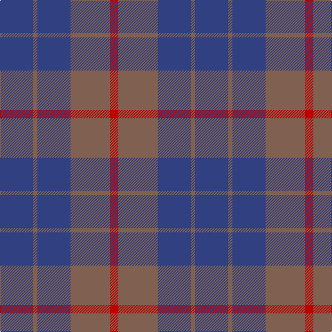

This page is one **sett** — a single exact thread-count. It belongs to the [tartan](/tartans/db16o2db16o19r4/)
(the same proportion at any scale), whose colour order is pattern [BRBRR](/stripes/brbrr/).

Sourced from weddslist.  It is a [5 stripe tartan](/stripes/stripes5/).

Original link http://www.weddslist.com/cgi-bin/tartans/pg.pl?source=sts

## Thread count
B/48 LT6 B48 LT57 R/12

## Palette

Palette: <strong>custom</strong>
<table><thead><tr><th>Colour</th><th>Threads</th><th>Shade</th><th>Base</th><th>OKLCh</th></tr></thead><tbody><tr><td>B/</td><td style="text-align:right;font-variant-numeric:tabular-nums">48</td><td><code style="background-color:#304080;">#304080</code> <small style="color:#888">#304080</small></td><td>B <code style="background-color:#2A418A;">#2A418A</code></td><td><small style="color:#888">oklch(39.4% 0.109 270.2)</small></td></tr><tr><td>LT</td><td style="text-align:right;font-variant-numeric:tabular-nums">6</td><td><code style="background-color:#806050;">#806050</code> <small style="color:#888">#806050</small></td><td>R <code style="background-color:#CC0000;">#CC0000</code></td><td><small style="color:#888">oklch(51.7% 0.049 47.8)</small></td></tr><tr><td>B</td><td style="text-align:right;font-variant-numeric:tabular-nums">48</td><td><code style="background-color:#304080;">#304080</code> <small style="color:#888">#304080</small></td><td>B <code style="background-color:#2A418A;">#2A418A</code></td><td><small style="color:#888">oklch(39.4% 0.109 270.2)</small></td></tr><tr><td>LT</td><td style="text-align:right;font-variant-numeric:tabular-nums">57</td><td><code style="background-color:#806050;">#806050</code> <small style="color:#888">#806050</small></td><td>R <code style="background-color:#CC0000;">#CC0000</code></td><td><small style="color:#888">oklch(51.7% 0.049 47.8)</small></td></tr><tr><td>R/</td><td style="text-align:right;font-variant-numeric:tabular-nums">12</td><td><code style="background-color:#C00000;">#C00000</code> <small style="color:#888">#C00000</small></td><td>R <code style="background-color:#CC0000;">#CC0000</code></td><td><small style="color:#888">oklch(50.7% 0.208 29.2)</small></td></tr></tbody></table>

# Sample pattern

## Nearest tartans

The nearest existing variants by ΔTartan distance, with this tartan at the top so the swatches line up against it.

ΔTartan

Tartan

Sett

—

<a href="/ttd/edit/#slug=db16o2db16o19r4~x3">Unidentified 17</a> <a class="nn-out" href="/setts/s5/db16o2db16o19r4~x3/" title="open its dictionary page">↗</a>

0.60

<a href="/ttd/edit/#slug=db16dy2db16dy19r4~x3">Unidentified #24</a> <a class="nn-out" href="/setts/s5/db16dy2db16dy19r4~x3/" title="open its dictionary page">↗</a>

1.47

<a href="/ttd/edit/#slug=n16r2n10r14t5~x2">Mowbray (Personal)</a> <a class="nn-out" href="/setts/s5/n16r2n10r14t5~x2/" title="open its dictionary page">↗</a>

1.58

<a href="/ttd/edit/#slug=db1r3db1r3db6g1~x4">Robbins</a> <a class="nn-out" href="/setts/s6/db1r3db1r3db6g1~x4/" title="open its dictionary page">↗</a>

1.63

<a href="/ttd/edit/#slug=o15r5o30db32o4ly3~x2">Cameron, hunting</a> <a class="nn-out" href="/setts/s6/o15r5o30db32o4ly3~x2/" title="open its dictionary page">↗</a>

1.69

<a href="/ttd/edit/#slug=y9db3y1db11y1~x6">MacCallum, High School</a> <a class="nn-out" href="/setts/s5/y9db3y1db11y1~x6/" title="open its dictionary page">↗</a>

1.76

<a href="/ttd/edit/#slug=dr30db10dr3db30m3~x2">Feniston (Personal)</a> <a class="nn-out" href="/setts/s5/dr30db10dr3db30m3~x2/" title="open its dictionary page">↗</a>

1.97

<a href="/ttd/edit/#slug=y16r2y10r15t5~x2">Mowbray, (Moubray)</a> <a class="nn-out" href="/setts/s5/y16r2y10r15t5~x2/" title="open its dictionary page">↗</a>

1.97

<a href="/ttd/edit/#slug=dg17r2db15~x2">Ferguson (Old)</a> <a class="nn-out" href="/setts/s3/dg17r2db15~x2/" title="open its dictionary page">↗</a>

1.97

<a href="/ttd/edit/#slug=dbi7db2dbi25db10g21db2~x2">Sugiyama</a> <a class="nn-out" href="/setts/s6/dbi7db2dbi25db10g21db2~x2/" title="open its dictionary page">↗</a>

2.00

<a href="/ttd/edit/#slug=dy11db1dy3dbi1db9r1~x4">Dege of Saville Row</a> <a class="nn-out" href="/setts/s6/dy11db1dy3dbi1db9r1~x4/" title="open its dictionary page">↗</a>

## Neighbour map

Every grey dot is one of 14359 variants placed by the first two principal components of the ΔTartan feature space (44% of its variance). Red is this tartan; blue dots are its nearest — click one to open its page.

<svg viewBox="0 0 640 380" role="img" style="max-width:100%;height:auto;border:1px solid #e0e0e0;border-radius:4px;display:block" xmlns="http://www.w3.org/2000/svg"><image href="/nn/cloud.v1.png" width="640" height="380"/><a href="/setts/s5/db16dy2db16dy19r4~x3/"><circle cx="399.3" cy="307.1" r="4" fill="#3465a4"><title>Unidentified #24</title></circle></a><a href="/setts/s5/n16r2n10r14t5~x2/"><circle cx="397.6" cy="318.8" r="4" fill="#3465a4"><title>Mowbray (Personal)</title></circle></a><a href="/setts/s6/db1r3db1r3db6g1~x4/"><circle cx="364.5" cy="288.1" r="4" fill="#3465a4"><title>Robbins</title></circle></a><a href="/setts/s6/o15r5o30db32o4ly3~x2/"><circle cx="378.5" cy="245.6" r="4" fill="#3465a4"><title>Cameron, hunting</title></circle></a><a href="/setts/s5/y9db3y1db11y1~x6/"><circle cx="449.5" cy="290.1" r="4" fill="#3465a4"><title>MacCallum, High School</title></circle></a><a href="/setts/s5/dr30db10dr3db30m3~x2/"><circle cx="424.9" cy="285.6" r="4" fill="#3465a4"><title>Feniston (Personal)</title></circle></a><a href="/setts/s5/y16r2y10r15t5~x2/"><circle cx="373.9" cy="299.2" r="4" fill="#3465a4"><title>Mowbray, (Moubray)</title></circle></a><a href="/setts/s3/dg17r2db15~x2/"><circle cx="365.7" cy="335.8" r="4" fill="#3465a4"><title>Ferguson (Old)</title></circle></a><a href="/setts/s6/dbi7db2dbi25db10g21db2~x2/"><circle cx="345.7" cy="268.0" r="4" fill="#3465a4"><title>Sugiyama</title></circle></a><a href="/setts/s6/dy11db1dy3dbi1db9r1~x4/"><circle cx="399.4" cy="245.6" r="4" fill="#3465a4"><title>Dege of Saville Row</title></circle></a><circle cx="408.0" cy="308.0" r="5" fill="#c00000"/></svg>

ID: /setts/s5/db16o2db16o19r4~x3/
