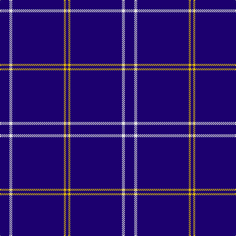

This page is one **sett** — a single exact thread-count. It belongs to the [tartan](/tartans/db19w6db105ly4db5/)
(the same proportion at any scale), whose colour order is pattern [BWBYB](/stripes/bwbyb/).

Sourced from tartans-authority.  It is a [5 stripe tartan](/stripes/stripes5/).

Original link http://www.tartansauthority.com/tartan-ferret/display/7467/

## Also known as

This cloth is also recorded under:

- Greenock Morton F. C.

2 attestations — the source records this cloth was collapsed from (oldest owns this page)

<ul>
<li>pre 2008 — Greenock Morton F. C. (Corporate) (tartans-authority, <a href="http://www.tartansauthority.com/tartan-ferret/display/7467/">record</a>)</li>
<li>undated — Greenock Morton Football Club (register-of-tartans, <a href="https://www.tartanregister.gov.uk/tartanDetails.aspx?ref=5512">record</a>)</li>
</ul>

## Register references

External register numbers recorded for this tartan.

- Scottish Register of Tartans: [5512](https://www.tartanregister.gov.uk/tartanDetails.aspx?ref=5512)
- Scottish Tartans Authority (ITI): 7467

## Thread count
DB/19 LN6 DB105 Y4 DB/5

## Palette

Palette: <strong>Tartan Register</strong>
<table><thead><tr><th>Colour</th><th>Threads</th><th>Shade</th><th>Base</th><th>OKLCh</th></tr></thead><tbody><tr><td>DB/</td><td style="text-align:right;font-variant-numeric:tabular-nums">19</td><td><code style="background-color:#1C0070;">#1C0070</code> <small style="color:#888">#1C0070</small></td><td>B <code style="background-color:#2A418A;">#2A418A</code></td><td><small style="color:#888">oklch(26.3% 0.162 277.1)</small></td></tr><tr><td>LN</td><td style="text-align:right;font-variant-numeric:tabular-nums">6</td><td><code style="background-color:#E0E0E0;">#E0E0E0</code> <small style="color:#888">#E0E0E0</small></td><td>W <code style="background-color:#F7F7F7;">#F7F7F7</code></td><td><small style="color:#888">oklch(90.7% 0.000 89.9)</small></td></tr><tr><td>DB</td><td style="text-align:right;font-variant-numeric:tabular-nums">105</td><td><code style="background-color:#1C0070;">#1C0070</code> <small style="color:#888">#1C0070</small></td><td>B <code style="background-color:#2A418A;">#2A418A</code></td><td><small style="color:#888">oklch(26.3% 0.162 277.1)</small></td></tr><tr><td>Y</td><td style="text-align:right;font-variant-numeric:tabular-nums">4</td><td><code style="background-color:#E8C000;">#E8C000</code> <small style="color:#888">#E8C000</small></td><td>Y <code style="background-color:#F2BF00;">#F2BF00</code></td><td><small style="color:#888">oklch(81.9% 0.168 93.7)</small></td></tr><tr><td>DB/</td><td style="text-align:right;font-variant-numeric:tabular-nums">5</td><td><code style="background-color:#1C0070;">#1C0070</code> <small style="color:#888">#1C0070</small></td><td>B <code style="background-color:#2A418A;">#2A418A</code></td><td><small style="color:#888">oklch(26.3% 0.162 277.1)</small></td></tr></tbody></table>

# Sample pattern

## Nearest tartans

The nearest existing variants by ΔTartan distance, with this tartan at the top so the swatches line up against it.

ΔTartan

Tartan

Sett

—

<a href="/ttd/edit/#slug=db19w6db105ly4db5">Greenock Morton F. C. (Corporate)</a> <a class="nn-out" href="/setts/s5/db19w6db105ly4db5/" title="open its dictionary page">↗</a>

1.59

<a href="/ttd/edit/#slug=db80w1lo8w3~x2">Weir Minerals (Corporate)</a> <a class="nn-out" href="/setts/s4/db80w1lo8w3~x2/" title="open its dictionary page">↗</a>

1.72

<a href="/ttd/edit/#slug=w2db4r2db90w2db4r1~x2">Spirit of Ulster</a> <a class="nn-out" href="/setts/s7/w2db4r2db90w2db4r1~x2/" title="open its dictionary page">↗</a>

2.07

<a href="/ttd/edit/#slug=db32r3db4k1ly3">MacLaine of Lochbuie Hunting</a> <a class="nn-out" href="/setts/s5/db32r3db4k1ly3/" title="open its dictionary page">↗</a>

2.07

<a href="/ttd/edit/#slug=db140r11db14ly11">Gem</a> <a class="nn-out" href="/setts/s4/db140r11db14ly11/" title="open its dictionary page">↗</a>

2.23

<a href="/ttd/edit/#slug=b10db6b3db62w4db5~x2">Auchairne</a> <a class="nn-out" href="/setts/s6/b10db6b3db62w4db5~x2/" title="open its dictionary page">↗</a>

2.37

<a href="/ttd/edit/#slug=b11db7b3db70lb4db6~x2">Auchairne (Corporate)</a> <a class="nn-out" href="/setts/s6/b11db7b3db70lb4db6~x2/" title="open its dictionary page">↗</a>

2.46

<a href="/ttd/edit/#slug=ly6db28do2db28y1~x2">Pearson</a> <a class="nn-out" href="/setts/s5/ly6db28do2db28y1~x2/" title="open its dictionary page">↗</a>

2.47

<a href="/ttd/edit/#slug=db80r1db2r1db6r10db1r7~x2">Mack of Stoneywood Dress (Personal)</a> <a class="nn-out" href="/setts/s8/db80r1db2r1db6r10db1r7~x2/" title="open its dictionary page">↗</a>

2.53

<a href="/ttd/edit/#slug=r5w4k4db80w4~x2">Volunteer Lifesaving Corps (Corp.)</a> <a class="nn-out" href="/setts/s5/r5w4k4db80w4~x2/" title="open its dictionary page">↗</a>

2.58

<a href="/ttd/edit/#slug=db32r3db4k1ly3~x2">MacLaine of Lochbuie, hunting</a> <a class="nn-out" href="/setts/s5/db32r3db4k1ly3~x2/" title="open its dictionary page">↗</a>

## Neighbour map

Every grey dot is one of 14359 variants placed by the first two principal components of the ΔTartan feature space (44% of its variance). Red is this tartan; blue dots are its nearest — click one to open its page.

<svg viewBox="0 0 640 380" role="img" style="max-width:100%;height:auto;border:1px solid #e0e0e0;border-radius:4px;display:block" xmlns="http://www.w3.org/2000/svg"><image href="/nn/cloud.v1.png" width="640" height="380"/><a href="/setts/s4/db80w1lo8w3~x2/"><circle cx="626.0" cy="169.8" r="4" fill="#3465a4"><title>Weir Minerals (Corporate)</title></circle></a><a href="/setts/s7/w2db4r2db90w2db4r1~x2/"><circle cx="626.0" cy="142.7" r="4" fill="#3465a4"><title>Spirit of Ulster</title></circle></a><a href="/setts/s5/db32r3db4k1ly3/"><circle cx="574.8" cy="166.1" r="4" fill="#3465a4"><title>MacLaine of Lochbuie Hunting</title></circle></a><a href="/setts/s4/db140r11db14ly11/"><circle cx="614.9" cy="231.7" r="4" fill="#3465a4"><title>Gem</title></circle></a><a href="/setts/s6/b10db6b3db62w4db5~x2/"><circle cx="552.3" cy="185.9" r="4" fill="#3465a4"><title>Auchairne</title></circle></a><a href="/setts/s6/b11db7b3db70lb4db6~x2/"><circle cx="612.6" cy="198.8" r="4" fill="#3465a4"><title>Auchairne (Corporate)</title></circle></a><a href="/setts/s5/ly6db28do2db28y1~x2/"><circle cx="589.8" cy="197.0" r="4" fill="#3465a4"><title>Pearson</title></circle></a><a href="/setts/s8/db80r1db2r1db6r10db1r7~x2/"><circle cx="626.0" cy="139.1" r="4" fill="#3465a4"><title>Mack of Stoneywood Dress (Personal)</title></circle></a><a href="/setts/s5/r5w4k4db80w4~x2/"><circle cx="560.8" cy="163.3" r="4" fill="#3465a4"><title>Volunteer Lifesaving Corps (Corp.)</title></circle></a><a href="/setts/s5/db32r3db4k1ly3~x2/"><circle cx="596.1" cy="164.5" r="4" fill="#3465a4"><title>MacLaine of Lochbuie, hunting</title></circle></a><circle cx="626.0" cy="195.4" r="5" fill="#c00000"/></svg>

ID: /setts/s5/db19w6db105ly4db5/
