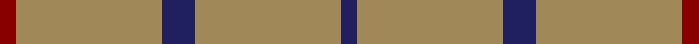
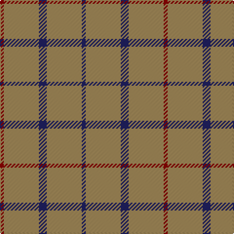

In pattern [BYBYR](/stripes/bybyr/).

This was sourced from register-of-tartans.  It is a [5 stripe tartan](/stripes/stripes5/).

Original link https://www.tartanregister.gov.uk/tartanDetails.aspx?ref=383

## Also known as

This cloth is also recorded under:

- Brooks Brothers Tattersall Camel

## Attestations

This cloth appears in 2 source records; the oldest owns this page.

- 01/01/2005 — Brooks Brothers Tattersall Camel (register-of-tartans, [record](https://www.tartanregister.gov.uk/tartanDetails.aspx?ref=383))
- pre 2005 — Brooks Bros Tattersall Camel (Fashio (tartans-authority, [record](http://www.tartansauthority.com/tartan-ferret/display/6571/))

## Register references

External register numbers recorded for this tartan.

- Scottish Register of Tartans: [383](https://www.tartanregister.gov.uk/tartanDetails.aspx?ref=383)
- Scottish Tartans Authority (ITI): 6571

## Thread count
DR/4 LT36 DB8 LT36 DB/4

## Palette
Each colour and the base-6 reference it is a variant of.

| Colour | Shade | Base |
|---|---|---|
| DB | <code style="background-color:#202060;">#202060</code> `oklch(28.9% 0.111 276.9)` <small>#202060</small> | B <code style="background-color:#2A418A;">#2A418A</code> |
| DR | <code style="background-color:#880000;">#880000</code> `oklch(39.4% 0.162 29.2)` <small>#880000</small> | R <code style="background-color:#CC0000;">#CC0000</code> |
| LT | <code style="background-color:#A08858;">#A08858</code> `oklch(63.7% 0.071 84.0)` <small>#A08858</small> | Y <code style="background-color:#F2BF00;">#F2BF00</code> |

# Sample pattern

## Nearest tartans

The nearest existing variants by ΔTartan distance.

1. [Oman RAF, Sultanate of (Military)](/setts/s6/dy9t3dy6t3dy20ly2~x2/) — ΔT 1.46
1. [Lochnagar](/setts/s6/w1y1y4y7p1w1~x4/) — ΔT 1.51
1. [S3](/setts/s3/y30w2r5~x4/) — ΔT 1.76
1. [Graham Grey - 1820 (Fashion?)](/setts/s4/n25k9n10w2~x4/) — ΔT 2.03
1. [Welsh National District Tartan Tartan Number: 1523. Earliest known date: 1968 The Welsh Tartan owes its origin to a Society formed in Cardiff in 1967. Its aims were cultural and political - to strengthen Celtic ties and give visible signs of being an individual nation in culture, language and dress. The colours are those of the Welsh flag. It is said that the design was based on the Lord of the Isles tartan because the present Lord is also Prince of Wales. However comparison reveals similarity only to MacDonald, MacDonald of the Isles, or perhaps Applecross district. See products available Copyright © Blair Urquhart, Comrie, 2015](/setts/s5/m2g1m1g10w1~x4/) — ΔT 2.11
1. [Oman, Sultanate of / Oliver dress](/setts/s10/dy9t3dy6t3dy20ly2~x2/) — ΔT 2.16
1. [Welsh National (District)](/setts/s5/r8g3r4g44w4~x2/) — ΔT 2.18
1. [Lochcarron, Camel (Fashion)](/setts/s5/o12k1o2o1k1~x8/) — ΔT 2.26
1. [Coca Cola](/setts/s5/w7dy7w7dy40r3~x2/) — ΔT 2.27
1. [Highland Spring (1997)](/setts/s6/g23r3g7r3g23dp7~x2/) — ΔT 2.28

## Neighbour map

Every grey dot is one of 14299 variants placed by the first two principal components of the ΔTartan feature space (44% of its variance). Red is this tartan; blue dots are its nearest — click one to open its page.

<svg viewBox="0 0 640 380" role="img" style="max-width:100%;height:auto;border:1px solid #e0e0e0;border-radius:4px;display:block" xmlns="http://www.w3.org/2000/svg"><image href="/nn/cloud.v1.png" width="640" height="380"/><a href="/setts/s6/dy9t3dy6t3dy20ly2~x2/"><circle cx="559.0" cy="256.1" r="4" fill="#3465a4"><title>Oman RAF, Sultanate of (Military)</title></circle></a><a href="/setts/s6/w1y1y4y7p1w1~x4/"><circle cx="525.1" cy="253.5" r="4" fill="#3465a4"><title>Lochnagar</title></circle></a><a href="/setts/s3/y30w2r5~x4/"><circle cx="582.7" cy="254.9" r="4" fill="#3465a4"><title>S3</title></circle></a><a href="/setts/s4/n25k9n10w2~x4/"><circle cx="481.1" cy="260.5" r="4" fill="#3465a4"><title>Graham Grey - 1820 (Fashion?)</title></circle></a><a href="/setts/s5/m2g1m1g10w1~x4/"><circle cx="479.5" cy="228.3" r="4" fill="#3465a4"><title>Welsh National District Tartan Tartan Number: 1523. Earliest known date: 1968 The Welsh Tartan owes its origin to a Society formed in Cardiff in 1967. Its aims were cultural and political - to strengthen Celtic ties and give visible signs of being an individual nation in culture, language and dress. The colours are those of the Welsh flag. It is said that the design was based on the Lord of the Isles tartan because the present Lord is also Prince of Wales. However comparison reveals similarity only to MacDonald, MacDonald of the Isles, or perhaps Applecross district. See products available Copyright © Blair Urquhart, Comrie, 2015</title></circle></a><a href="/setts/s10/dy9t3dy6t3dy20ly2~x2/"><circle cx="561.4" cy="240.3" r="4" fill="#3465a4"><title>Oman, Sultanate of / Oliver dress</title></circle></a><a href="/setts/s5/r8g3r4g44w4~x2/"><circle cx="504.5" cy="208.0" r="4" fill="#3465a4"><title>Welsh National (District)</title></circle></a><a href="/setts/s5/o12k1o2o1k1~x8/"><circle cx="482.8" cy="183.9" r="4" fill="#3465a4"><title>Lochcarron, Camel (Fashion)</title></circle></a><a href="/setts/s5/w7dy7w7dy40r3~x2/"><circle cx="455.5" cy="196.4" r="4" fill="#3465a4"><title>Coca Cola</title></circle></a><a href="/setts/s6/g23r3g7r3g23dp7~x2/"><circle cx="515.8" cy="278.0" r="4" fill="#3465a4"><title>Highland Spring (1997)</title></circle></a><circle cx="534.7" cy="248.8" r="5" fill="#c00000"/></svg>

ID: /setts/s5/db1lo9db2lo9r1~x4/
