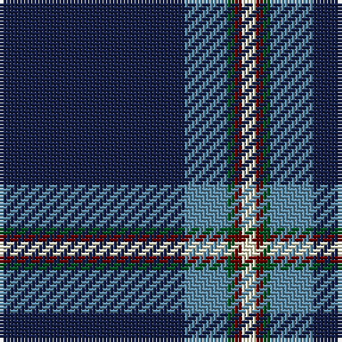

**Bands:** [BBGRW](/stripes/bbgrw/) · **Stripes:** [DB T DG O W](/stripes/stripes5/) DB T DG O W

This was sourced from register-of-tartans.  It is a [5 band tartan](/bands/bands5/).

Original link https://www.tartanregister.gov.uk/tartanDetails.aspx?ref=10886

## Register references

External register numbers recorded for this tartan.

- Scottish Register of Tartans: [10886](https://www.tartanregister.gov.uk/tartanDetails.aspx?ref=10886)

## Thread count
DB/52 B12 G2 DR2 LY/4

## Palette
Each colour and its ΔE from the base-6 reference it is a variant of.

| Colour | Shade | Base | ΔE (OKLab) |
|---|---|---|---|
| B | <code style="background-color:#5C8CA8;">#5C8CA8</code> `#5C8CA8` | B <code style="background-color:#2A418A;">#2A418A</code> | 0.23 |
| DB | <code style="background-color:#141E46;">#141E46</code> `#141E46` | B <code style="background-color:#2A418A;">#2A418A</code> | 0.16 |
| DR | <code style="background-color:#660000;">#660000</code> `#660000` | R <code style="background-color:#CC0000;">#CC0000</code> | 0.23 |
| G | <code style="background-color:#005020;">#005020</code> `#005020` | G <code style="background-color:#006100;">#006100</code> | 0.07 |
| LY | <code style="background-color:#F8F4D0;">#F8F4D0</code> `#F8F4D0` | W <code style="background-color:#F7F7F7;">#F7F7F7</code> | 0.05 |

# Sample pattern

## Nearest tartans

The nearest existing variants by ΔTartan distance.

1. [Special Air Service](/setts/s5/db26lb6g1r1w2~x2/) — ΔT 1.02
1. [Indiana #2](/setts/s8/db50ly4db3ly4db8k2db12w5~x2/) — ΔT 1.11
1. [Parkin](/setts/s8/w3dt9ly1lb3dp9lb1dt40dp2~x2/) — ΔT 1.30
1. [Laidlaw's Highland Drovers (Corp)](/setts/s7/db35k10db4w2db3r2ly2~x2/) — ΔT 1.34
1. [Ailsa, Navy (Fashion)](/setts/s6/k60r3k5r3lr18o3~x2/) — ΔT 1.36
1. [MaleHsuHK (Hong Kong) (Personal)](/setts/s4/db60dg16w8lo3~x2/) — ΔT 1.37
1. [Cleland](/setts/s5/k2db36g12w3r2~x2/) — ΔT 1.41
1. [Bro-sant-Brieg](/setts/s7/dt3g6dt2ly3dt42k6w3~x2/) — ΔT 1.48
1. [Norwich University](/setts/s4/db39lo8r3w1~x4/) — ΔT 1.51
1. [World Youth Congress (Corporate)](/setts/s10/r2db8ly1db16w1g12db27w1db1w1~x2/) — ΔT 1.55

## Neighbour map

Every grey dot is one of 14313 variants placed by the first two principal components of the ΔTartan feature space (44% of its variance). Red is this tartan; blue dots are its nearest — click one to open its page.

<svg viewBox="0 0 640 380" role="img" style="max-width:100%;height:auto;border:1px solid #e0e0e0;border-radius:4px;display:block" xmlns="http://www.w3.org/2000/svg"><image href="/nn/cloud.v1.png" width="640" height="380"/><a href="/setts/s5/db26lb6g1r1w2~x2/"><circle cx="440.1" cy="137.4" r="4" fill="#3465a4"><title>Special Air Service</title></circle></a><a href="/setts/s8/db50ly4db3ly4db8k2db12w5~x2/"><circle cx="412.7" cy="123.9" r="4" fill="#3465a4"><title>Indiana #2</title></circle></a><a href="/setts/s8/w3dt9ly1lb3dp9lb1dt40dp2~x2/"><circle cx="474.5" cy="109.7" r="4" fill="#3465a4"><title>Parkin</title></circle></a><a href="/setts/s7/db35k10db4w2db3r2ly2~x2/"><circle cx="453.1" cy="153.7" r="4" fill="#3465a4"><title>Laidlaw's Highland Drovers (Corp)</title></circle></a><a href="/setts/s6/k60r3k5r3lr18o3~x2/"><circle cx="436.6" cy="160.5" r="4" fill="#3465a4"><title>Ailsa, Navy (Fashion)</title></circle></a><a href="/setts/s4/db60dg16w8lo3~x2/"><circle cx="421.6" cy="198.7" r="4" fill="#3465a4"><title>MaleHsuHK (Hong Kong) (Personal)</title></circle></a><a href="/setts/s5/k2db36g12w3r2~x2/"><circle cx="388.1" cy="168.8" r="4" fill="#3465a4"><title>Cleland</title></circle></a><a href="/setts/s7/dt3g6dt2ly3dt42k6w3~x2/"><circle cx="456.0" cy="146.9" r="4" fill="#3465a4"><title>Bro-sant-Brieg</title></circle></a><a href="/setts/s4/db39lo8r3w1~x4/"><circle cx="520.3" cy="164.6" r="4" fill="#3465a4"><title>Norwich University</title></circle></a><a href="/setts/s10/r2db8ly1db16w1g12db27w1db1w1~x2/"><circle cx="466.8" cy="133.9" r="4" fill="#3465a4"><title>World Youth Congress (Corporate)</title></circle></a><circle cx="453.7" cy="149.3" r="5" fill="#c00000"/></svg>

ID: /setts/s5/db26t6dg1o1w2~x2/
