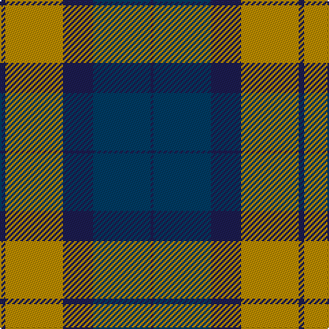

This page is one **sett** — a single exact thread-count. It belongs to the [tartan](/tartans/db2lo21db11dt21db1/)
(the same proportion at any scale), whose colour order is pattern [BBBYB](/stripes/bbbyb/).

Sourced from tartans-authority.  It is a [5 stripe tartan](/stripes/stripes5/).

Original link http://www.tartansauthority.com/tartan-ferret/display/8147/

## Thread count
DBa/4 DY42 DBa22 DB42 DBa/2

## Palette

Palette: <strong>Tartan Register</strong>
<table><thead><tr><th>Colour</th><th>Threads</th><th>Shade</th><th>Base</th><th>OKLCh</th></tr></thead><tbody><tr><td>DBa/</td><td style="text-align:right;font-variant-numeric:tabular-nums">4</td><td><code style="background-color:#1C1C50;">#1C1C50</code> <small style="color:#888">#1C1C50</small></td><td>B <code style="background-color:#2A418A;">#2A418A</code></td><td><small style="color:#888">oklch(26.2% 0.093 277.9)</small></td></tr><tr><td>DY</td><td style="text-align:right;font-variant-numeric:tabular-nums">42</td><td><code style="background-color:#BC8C00;">#BC8C00</code> <small style="color:#888">#BC8C00</small></td><td>Y <code style="background-color:#F2BF00;">#F2BF00</code></td><td><small style="color:#888">oklch(66.8% 0.137 84.1)</small></td></tr><tr><td>DBa</td><td style="text-align:right;font-variant-numeric:tabular-nums">22</td><td><code style="background-color:#1C1C50;">#1C1C50</code> <small style="color:#888">#1C1C50</small></td><td>B <code style="background-color:#2A418A;">#2A418A</code></td><td><small style="color:#888">oklch(26.2% 0.093 277.9)</small></td></tr><tr><td>DB</td><td style="text-align:right;font-variant-numeric:tabular-nums">42</td><td><code style="background-color:#003C64;">#003C64</code> <small style="color:#888">#003C64</small></td><td>B <code style="background-color:#2A418A;">#2A418A</code></td><td><small style="color:#888">oklch(34.5% 0.089 246.0)</small></td></tr><tr><td>DBa/</td><td style="text-align:right;font-variant-numeric:tabular-nums">2</td><td><code style="background-color:#1C1C50;">#1C1C50</code> <small style="color:#888">#1C1C50</small></td><td>B <code style="background-color:#2A418A;">#2A418A</code></td><td><small style="color:#888">oklch(26.2% 0.093 277.9)</small></td></tr></tbody></table>

# Sample pattern

## Nearest tartans

The nearest existing variants by ΔTartan distance, with this tartan at the top so the swatches line up against it.

ΔTartan

Tartan

Sett

—

<a href="/ttd/edit/#slug=db2lo21db11dt21db1~x2">St. Matthews Check (School)</a> <a class="nn-out" href="/setts/s5/db2lo21db11dt21db1~x2/" title="open its dictionary page">↗</a>

0.98

<a href="/ttd/edit/#slug=db2r24g24r1db24r2~x2">Mar, Red</a> <a class="nn-out" href="/setts/s6/db2r24g24r1db24r2~x2/" title="open its dictionary page">↗</a>

1.35

<a href="/ttd/edit/#slug=t3o26g4t13k13t2~x2">MacTavish / Thom(p)son, hunting</a> <a class="nn-out" href="/setts/s6/t3o26g4t13k13t2~x2/" title="open its dictionary page">↗</a>

1.40

<a href="/ttd/edit/#slug=w3g15db18r15g1r2~x2">Nibley</a> <a class="nn-out" href="/setts/s6/w3g15db18r15g1r2~x2/" title="open its dictionary page">↗</a>

1.48

<a href="/ttd/edit/#slug=w4db30g10r25w2~x2">Highland Spring Dress (2004) (Corp)</a> <a class="nn-out" href="/setts/s5/w4db30g10r25w2~x2/" title="open its dictionary page">↗</a>

1.49

<a href="/ttd/edit/#slug=lo7db4lo2db4lo23n19db19n4~x2">Chindecella Gorse (Personal)</a> <a class="nn-out" href="/setts/s8/lo7db4lo2db4lo23n19db19n4~x2/" title="open its dictionary page">↗</a>

1.51

<a href="/ttd/edit/#slug=db8r3db1r3dg14r3db1~x4">Logan</a> <a class="nn-out" href="/setts/s7/db8r3db1r3dg14r3db1~x4/" title="open its dictionary page">↗</a>

1.51

<a href="/ttd/edit/#slug=db4r11g11db22ly1g4~x2">Harvey</a> <a class="nn-out" href="/setts/s6/db4r11g11db22ly1g4~x2/" title="open its dictionary page">↗</a>

1.53

<a href="/ttd/edit/#slug=ly5g22dp15dp11dp5g2~x2">Scottish Ballet</a> <a class="nn-out" href="/setts/s6/ly5g22dp15dp11dp5g2~x2/" title="open its dictionary page">↗</a>

1.54

<a href="/ttd/edit/#slug=r12b18k1r4k1g6k2~x2">Confederate (Military)</a> <a class="nn-out" href="/setts/s7/r12b18k1r4k1g6k2~x2/" title="open its dictionary page">↗</a>

1.54

<a href="/ttd/edit/#slug=ly2db8r8g17r1~x4">British Hills</a> <a class="nn-out" href="/setts/s5/ly2db8r8g17r1~x4/" title="open its dictionary page">↗</a>

## Neighbour map

Every grey dot is one of 14299 variants placed by the first two principal components of the ΔTartan feature space (44% of its variance). Red is this tartan; blue dots are its nearest — click one to open its page.

<svg viewBox="0 0 640 380" role="img" style="max-width:100%;height:auto;border:1px solid #e0e0e0;border-radius:4px;display:block" xmlns="http://www.w3.org/2000/svg"><image href="/nn/cloud.v1.png" width="640" height="380"/><a href="/setts/s6/db2r24g24r1db24r2~x2/"><circle cx="269.7" cy="193.7" r="4" fill="#3465a4"><title>Mar, Red</title></circle></a><a href="/setts/s6/t3o26g4t13k13t2~x2/"><circle cx="215.2" cy="195.4" r="4" fill="#3465a4"><title>MacTavish / Thom(p)son, hunting</title></circle></a><a href="/setts/s6/w3g15db18r15g1r2~x2/"><circle cx="205.7" cy="187.2" r="4" fill="#3465a4"><title>Nibley</title></circle></a><a href="/setts/s5/w4db30g10r25w2~x2/"><circle cx="227.8" cy="194.2" r="4" fill="#3465a4"><title>Highland Spring Dress (2004) (Corp)</title></circle></a><a href="/setts/s8/lo7db4lo2db4lo23n19db19n4~x2/"><circle cx="232.2" cy="210.3" r="4" fill="#3465a4"><title>Chindecella Gorse (Personal)</title></circle></a><a href="/setts/s7/db8r3db1r3dg14r3db1~x4/"><circle cx="289.0" cy="209.7" r="4" fill="#3465a4"><title>Logan</title></circle></a><a href="/setts/s6/db4r11g11db22ly1g4~x2/"><circle cx="298.7" cy="194.0" r="4" fill="#3465a4"><title>Harvey</title></circle></a><a href="/setts/s6/ly5g22dp15dp11dp5g2~x2/"><circle cx="194.9" cy="212.8" r="4" fill="#3465a4"><title>Scottish Ballet</title></circle></a><a href="/setts/s7/r12b18k1r4k1g6k2~x2/"><circle cx="238.1" cy="162.6" r="4" fill="#3465a4"><title>Confederate (Military)</title></circle></a><a href="/setts/s5/ly2db8r8g17r1~x4/"><circle cx="265.8" cy="201.8" r="4" fill="#3465a4"><title>British Hills</title></circle></a><circle cx="254.9" cy="212.1" r="5" fill="#c00000"/></svg>

ID: /setts/s5/db2lo21db11dt21db1~x2/
