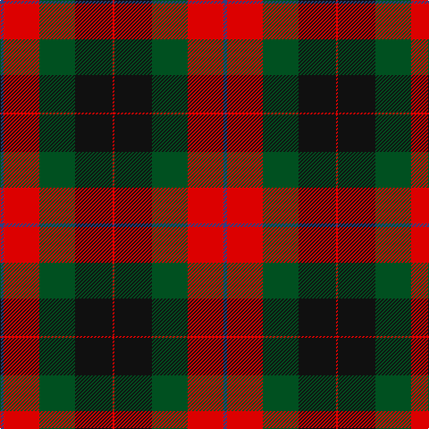

**Bands:** [BRGKR](/stripes/brgkr/) · **Stripes:** [DB R DG K R](/stripes/stripes5/) DB R DG K R

This was sourced from register-of-tartans.  It is a [5 band tartan](/bands/bands5/).

Original link https://www.tartanregister.gov.uk/tartanDetails.aspx?ref=3806

## Register references

External register numbers recorded for this tartan.

- Scottish Register of Tartans: [3806](https://www.tartanregister.gov.uk/tartanDetails.aspx?ref=3806)
- Scottish Tartans World Register: 535

## Thread count
B/4 R40 G40 K42 R/2

## Palette
Each colour and its ΔE from the base-6 reference it is a variant of.

| Colour | Shade | Base | ΔE (OKLab) |
|---|---|---|---|
| B | <code style="background-color:#2C4084;">#2C4084</code> `#2C4084` | B <code style="background-color:#2A418A;">#2A418A</code> | 0.01 |
| G | <code style="background-color:#005020;">#005020</code> `#005020` | G <code style="background-color:#006100;">#006100</code> | 0.07 |
| K | <code style="background-color:#101010;">#101010</code> `#101010` | K <code style="background-color:#000000;">#000000</code> | 0.17 |
| R | <code style="background-color:#DC0000;">#DC0000</code> `#DC0000` | R <code style="background-color:#CC0000;">#CC0000</code> | 0.03 |

# Sample pattern

## Nearest tartans

The nearest existing variants by ΔTartan distance.

1. [United Distillers](/setts/s6/ly2o14k14o1dr14o2~x2/) — ΔT 0.96
1. [Nibley (Personal)](/setts/s6/w3dg18db22r19dg1r2~x2/) — ΔT 1.13
1. [Skene of Cromar](/setts/s5/db2r20g20k21r1~x2/) — ΔT 1.16
1. [Unidentified #15](/setts/s6/k6r2dg17r16k1t2~x2/) — ΔT 1.22
1. [Skene of Cromar (Cant version)](/setts/s6/g21k21r1db20r20k2~x2/) — ΔT 1.25
1. [Logan - 1797 (Dark)](/setts/s7/k9lr4k1lr4dg15r4k1~x4/) — ΔT 1.26
1. [Cook (Name)](/setts/s7/dg12g6dg6r15k1r1k2~x2/) — ΔT 1.31
1. [Prince Edward Island #2](/setts/s7/w2k1dg16k12r12k1w2~x2/) — ΔT 1.32
1. [MacKintosh Geddes](/setts/s7/db1r5dg18r4db9r10w1~x4/) — ΔT 1.33
1. [Nibley](/setts/s6/w3g15db18r15g1r2~x2/) — ΔT 1.35

## Neighbour map

Every grey dot is one of 14313 variants placed by the first two principal components of the ΔTartan feature space (44% of its variance). Red is this tartan; blue dots are its nearest — click one to open its page.

<svg viewBox="0 0 640 380" role="img" style="max-width:100%;height:auto;border:1px solid #e0e0e0;border-radius:4px;display:block" xmlns="http://www.w3.org/2000/svg"><image href="/nn/cloud.v1.png" width="640" height="380"/><a href="/setts/s6/ly2o14k14o1dr14o2~x2/"><circle cx="204.6" cy="193.3" r="4" fill="#3465a4"><title>United Distillers</title></circle></a><a href="/setts/s6/w3dg18db22r19dg1r2~x2/"><circle cx="224.7" cy="179.7" r="4" fill="#3465a4"><title>Nibley (Personal)</title></circle></a><a href="/setts/s5/db2r20g20k21r1~x2/"><circle cx="187.0" cy="187.9" r="4" fill="#3465a4"><title>Skene of Cromar</title></circle></a><a href="/setts/s6/k6r2dg17r16k1t2~x2/"><circle cx="258.9" cy="178.4" r="4" fill="#3465a4"><title>Unidentified #15</title></circle></a><a href="/setts/s6/g21k21r1db20r20k2~x2/"><circle cx="166.0" cy="204.4" r="4" fill="#3465a4"><title>Skene of Cromar (Cant version)</title></circle></a><a href="/setts/s7/k9lr4k1lr4dg15r4k1~x4/"><circle cx="215.3" cy="185.3" r="4" fill="#3465a4"><title>Logan - 1797 (Dark)</title></circle></a><a href="/setts/s7/dg12g6dg6r15k1r1k2~x2/"><circle cx="253.3" cy="191.0" r="4" fill="#3465a4"><title>Cook (Name)</title></circle></a><a href="/setts/s7/w2k1dg16k12r12k1w2~x2/"><circle cx="191.6" cy="167.4" r="4" fill="#3465a4"><title>Prince Edward Island #2</title></circle></a><a href="/setts/s7/db1r5dg18r4db9r10w1~x4/"><circle cx="250.0" cy="180.0" r="4" fill="#3465a4"><title>MacKintosh Geddes</title></circle></a><a href="/setts/s6/w3g15db18r15g1r2~x2/"><circle cx="205.8" cy="187.2" r="4" fill="#3465a4"><title>Nibley</title></circle></a><circle cx="216.7" cy="198.2" r="5" fill="#c00000"/></svg>

ID: /setts/s5/db2r20dg20k21r1~x2/
