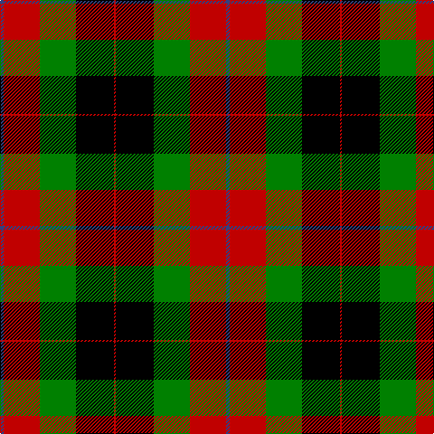

In pattern [BRGKR](/stripes/brgkr/).

This was sourced from weddslist.  It is a [5 stripe tartan](/stripes/stripes5/).

Original link http://www.weddslist.com/cgi-bin/tartans/pg.pl?source=sts

## Attestations

This cloth appears in 2 source records; the oldest owns this page.

- undated — Skene of Cromar (weddslist, [record](http://www.weddslist.com/cgi-bin/tartans/pg.pl?source=sts))
- undated — Skene of Cromar Clan Tartan Tartan Number: 535. Earliest known date: pre 2003 Count divided by 2 for display purposes. See products available Copyright © Blair Urquhart, Comrie, 2015 (house-of-tartan, [record](http://www.house-of-tartan.scotland.net/house/TartanViewjs.asp?colr=Def&tnam=535))

## Thread count
B/4 R40 G40 K42 R/2

## Palette
Each colour and the base-6 reference it is a variant of.

| Colour | Shade | Base |
|---|---|---|
| B | <code style="background-color:#304080;">#304080</code> `oklch(39.4% 0.109 270.2)` <small>#304080</small> | B <code style="background-color:#2A418A;">#2A418A</code> |
| G | <code style="background-color:#008000;">#008000</code> `oklch(52.0% 0.177 142.5)` <small>#008000</small> | G <code style="background-color:#006100;">#006100</code> |
| K | <code style="background-color:#000000;">#000000</code> `oklch(0.0% 0.000 0.0)` <small>#000000</small> | K <code style="background-color:#000000;">#000000</code> |
| R | <code style="background-color:#C00000;">#C00000</code> `oklch(50.7% 0.208 29.2)` <small>#C00000</small> | R <code style="background-color:#CC0000;">#CC0000</code> |

# Sample pattern

## Nearest tartans

The nearest existing variants by ΔTartan distance, with this tartan at the top so the swatches line up against it.

ΔTartan

Tartan

Sett

—

<a href="/ttd/edit/#slug=db2r20g20k21r1~x2">Skene of Cromar</a> <a class="nn-out" href="/setts/s5/db2r20g20k21r1~x2/" title="open its dictionary page">↗</a>

1.16

<a href="/ttd/edit/#slug=db2r20dg20k21r1~x2">Skene of Cromar (1885)</a> <a class="nn-out" href="/setts/s5/db2r20dg20k21r1~x2/" title="open its dictionary page">↗</a>

1.18

<a href="/ttd/edit/#slug=o2k14o1k14o14ly2~x2">United Distillers (Corporate)</a> <a class="nn-out" href="/setts/s6/o2k14o1k14o14ly2~x2/" title="open its dictionary page">↗</a>

1.21

<a href="/ttd/edit/#slug=k9r4k1r4g15r4k1~x2">Logan, Dark</a> <a class="nn-out" href="/setts/s7/k9r4k1r4g15r4k1~x2/" title="open its dictionary page">↗</a>

1.23

<a href="/ttd/edit/#slug=w2k1g16k12r12k1w2~x2">Prince Edward Island</a> <a class="nn-out" href="/setts/s7/w2k1g16k12r12k1w2~x2/" title="open its dictionary page">↗</a>

1.33

<a href="/ttd/edit/#slug=w2k1dg16k12r12k1w2~x2">Prince Edward Island #2</a> <a class="nn-out" href="/setts/s7/w2k1dg16k12r12k1w2~x2/" title="open its dictionary page">↗</a>

1.42

<a href="/ttd/edit/#slug=k6r2g17r16k1t2~x2">Unidentified 12</a> <a class="nn-out" href="/setts/s6/k6r2g17r16k1t2~x2/" title="open its dictionary page">↗</a>

1.48

<a href="/ttd/edit/#slug=o2dr14o1k14o14ly2~x2">United Distillers</a> <a class="nn-out" href="/setts/s6/o2dr14o1k14o14ly2~x2/" title="open its dictionary page">↗</a>

1.50

<a href="/ttd/edit/#slug=dg17k1r16k2y14k19y14k2r6">Borthwick</a> <a class="nn-out" href="/setts/s9/dg17k1r16k2y14k19y14k2r6/" title="open its dictionary page">↗</a>

1.52

<a href="/ttd/edit/#slug=k3ly18g6r17k31g3~x2">MacMillan Variant (Unidentified)</a> <a class="nn-out" href="/setts/s6/k3ly18g6r17k31g3~x2/" title="open its dictionary page">↗</a>

1.54

<a href="/ttd/edit/#slug=g3r20g16k22lo6k3g2~x2">Wcwm 1062</a> <a class="nn-out" href="/setts/s7/g3r20g16k22lo6k3g2~x2/" title="open its dictionary page">↗</a>

## Neighbour map

Every grey dot is one of 14299 variants placed by the first two principal components of the ΔTartan feature space (44% of its variance). Red is this tartan; blue dots are its nearest — click one to open its page.

<svg viewBox="0 0 640 380" role="img" style="max-width:100%;height:auto;border:1px solid #e0e0e0;border-radius:4px;display:block" xmlns="http://www.w3.org/2000/svg"><image href="/nn/cloud.v1.png" width="640" height="380"/><a href="/setts/s5/db2r20dg20k21r1~x2/"><circle cx="216.8" cy="198.2" r="4" fill="#3465a4"><title>Skene of Cromar (1885)</title></circle></a><a href="/setts/s6/o2k14o1k14o14ly2~x2/"><circle cx="179.9" cy="192.8" r="4" fill="#3465a4"><title>United Distillers (Corporate)</title></circle></a><a href="/setts/s7/k9r4k1r4g15r4k1~x2/"><circle cx="189.7" cy="172.6" r="4" fill="#3465a4"><title>Logan, Dark</title></circle></a><a href="/setts/s7/w2k1g16k12r12k1w2~x2/"><circle cx="171.8" cy="161.6" r="4" fill="#3465a4"><title>Prince Edward Island</title></circle></a><a href="/setts/s7/w2k1dg16k12r12k1w2~x2/"><circle cx="191.5" cy="167.4" r="4" fill="#3465a4"><title>Prince Edward Island #2</title></circle></a><a href="/setts/s6/k6r2g17r16k1t2~x2/"><circle cx="235.4" cy="170.5" r="4" fill="#3465a4"><title>Unidentified 12</title></circle></a><a href="/setts/s6/o2dr14o1k14o14ly2~x2/"><circle cx="204.5" cy="193.2" r="4" fill="#3465a4"><title>United Distillers</title></circle></a><a href="/setts/s9/dg17k1r16k2y14k19y14k2r6/"><circle cx="148.9" cy="172.3" r="4" fill="#3465a4"><title>Borthwick</title></circle></a><a href="/setts/s6/k3ly18g6r17k31g3~x2/"><circle cx="180.0" cy="190.4" r="4" fill="#3465a4"><title>MacMillan Variant (Unidentified)</title></circle></a><a href="/setts/s7/g3r20g16k22lo6k3g2~x2/"><circle cx="179.7" cy="196.8" r="4" fill="#3465a4"><title>Wcwm 1062</title></circle></a><circle cx="187.1" cy="187.8" r="5" fill="#c00000"/></svg>

ID: /setts/s5/db2r20g20k21r1~x2/
