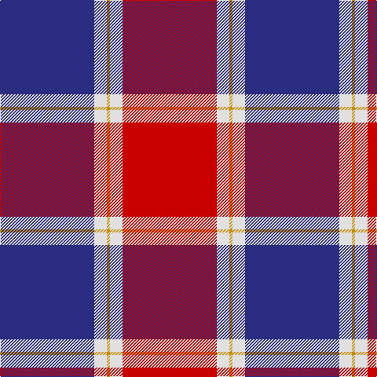

**Bands:** [BWYWR](/stripes/bwywr/) · **Stripes:** [DB W LO W R](/stripes/stripes5/) DB W LO W R

This was sourced from register-of-tartans.  It is a [5 band tartan](/bands/bands5/).

Original link https://www.tartanregister.gov.uk/tartanDetails.aspx?ref=10660

## Register references

External register numbers recorded for this tartan.

- Scottish Register of Tartans: [10660](https://www.tartanregister.gov.uk/tartanDetails.aspx?ref=10660)

## Thread count
DB/120 LN16 DY4 LN16 R/120

## Palette
Each colour and its ΔE from the base-6 reference it is a variant of.

| Colour | Shade | Base | ΔE (OKLab) |
|---|---|---|---|
| DB | <code style="background-color:#2C2C80;">#2C2C80</code> `#2C2C80` | B <code style="background-color:#2A418A;">#2A418A</code> | 0.06 |
| DY | <code style="background-color:#C88C00;">#C88C00</code> `#C88C00` | Y <code style="background-color:#F2BF00;">#F2BF00</code> | 0.15 |
| LN | <code style="background-color:#E0E0E0;">#E0E0E0</code> `#E0E0E0` | W <code style="background-color:#F7F7F7;">#F7F7F7</code> | 0.07 |
| R | <code style="background-color:#C80000;">#C80000</code> `#C80000` | R <code style="background-color:#CC0000;">#CC0000</code> | 0.01 |

# Sample pattern

## Nearest tartans

The nearest existing variants by ΔTartan distance.

1. [Philippine Heritage (Corporate)](/setts/s5/db30w4ly1w4r30~x4/) — ΔT 0.31
1. [Superfast Ferries (Corporate)](/setts/s6/db1r16db6ly4db6w1~x4/) — ΔT 1.23
1. [Masai Shuka 17 (Artefact)](/setts/s6/k4b32r30b2w5k2~x2/) — ΔT 1.24
1. [Galloway Dress (Yellow Line)](/setts/s6/dg2r1db16r16db1ly2~x2/) — ΔT 1.26
1. [Nisbet Dress Rose (Dance)](/setts/s6/m3w1m20k8w8g2~x4/) — ΔT 1.33
1. [Double Elvis Gallery (Corporate)](/setts/s6/r40db15k2dp1db15k6~x2/) — ΔT 1.34
1. [Boring and Dull](/setts/s9/db5w4r1db26r26w1r8w5k1~x2/) — ΔT 1.35
1. [Boring and Dull](/setts/s9/db5w4r1db26r25w1r8w5dt1~x2/) — ΔT 1.38
1. [Ruthven](/setts/s6/lb3dg15db18r30db1r2~x2/) — ΔT 1.42
1. [Galloway dress](/setts/s6/g2r1db16r16db1ly2~x2/) — ΔT 1.50

## Neighbour map

Every grey dot is one of 14313 variants placed by the first two principal components of the ΔTartan feature space (44% of its variance). Red is this tartan; blue dots are its nearest — click one to open its page.

<svg viewBox="0 0 640 380" role="img" style="max-width:100%;height:auto;border:1px solid #e0e0e0;border-radius:4px;display:block" xmlns="http://www.w3.org/2000/svg"><image href="/nn/cloud.v1.png" width="640" height="380"/><a href="/setts/s5/db30w4ly1w4r30~x4/"><circle cx="292.9" cy="145.8" r="4" fill="#3465a4"><title>Philippine Heritage (Corporate)</title></circle></a><a href="/setts/s6/db1r16db6ly4db6w1~x4/"><circle cx="279.9" cy="168.4" r="4" fill="#3465a4"><title>Superfast Ferries (Corporate)</title></circle></a><a href="/setts/s6/k4b32r30b2w5k2~x2/"><circle cx="285.1" cy="162.4" r="4" fill="#3465a4"><title>Masai Shuka 17 (Artefact)</title></circle></a><a href="/setts/s6/dg2r1db16r16db1ly2~x2/"><circle cx="308.6" cy="167.0" r="4" fill="#3465a4"><title>Galloway Dress (Yellow Line)</title></circle></a><a href="/setts/s6/m3w1m20k8w8g2~x4/"><circle cx="301.6" cy="152.2" r="4" fill="#3465a4"><title>Nisbet Dress Rose (Dance)</title></circle></a><a href="/setts/s6/r40db15k2dp1db15k6~x2/"><circle cx="368.6" cy="144.1" r="4" fill="#3465a4"><title>Double Elvis Gallery (Corporate)</title></circle></a><a href="/setts/s9/db5w4r1db26r26w1r8w5k1~x2/"><circle cx="289.8" cy="114.2" r="4" fill="#3465a4"><title>Boring and Dull</title></circle></a><a href="/setts/s9/db5w4r1db26r25w1r8w5dt1~x2/"><circle cx="285.0" cy="112.2" r="4" fill="#3465a4"><title>Boring and Dull</title></circle></a><a href="/setts/s6/lb3dg15db18r30db1r2~x2/"><circle cx="283.2" cy="150.5" r="4" fill="#3465a4"><title>Ruthven</title></circle></a><a href="/setts/s6/g2r1db16r16db1ly2~x2/"><circle cx="316.9" cy="172.1" r="4" fill="#3465a4"><title>Galloway dress</title></circle></a><circle cx="301.8" cy="150.6" r="5" fill="#c00000"/></svg>

ID: /setts/s5/db30w4lo1w4r30~x4/
