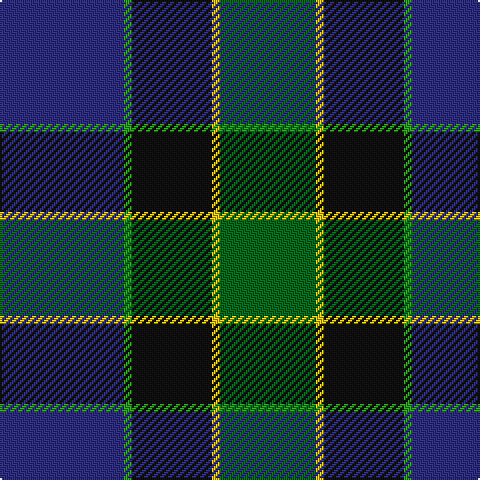

**Bands:** [BGKYG](/stripes/bgkyg/) · **Stripes:** [DB G K LY G](/stripes/stripes5/) DB G K LY G

This was sourced from tartans-authority.  It is a [5 band tartan](/bands/bands5/).

Original link http://www.tartansauthority.com/tartan-ferret/display/7370/

## Attestations

This cloth appears in 2 source records; the oldest owns this page.

- pre 2007 — Landels (Personal) (tartans-authority, [record](http://www.tartansauthority.com/tartan-ferret/display/7370/))
- undated — Landels (Personal) (register-of-tartans, [record](https://www.tartanregister.gov.uk/tartanDetails.aspx?ref=5476))

## Register references

External register numbers recorded for this tartan.

- Scottish Register of Tartans: [5476](https://www.tartanregister.gov.uk/tartanDetails.aspx?ref=5476)
- Scottish Tartans Authority (ITI): 7370

## Thread count
DB/62 G4 K40 Y4 Ga/48

## Palette
Each colour and its ΔE from the base-6 reference it is a variant of.

| Colour | Shade | Base | ΔE (OKLab) |
|---|---|---|---|
| DB | <code style="background-color:#2C2C80;">#2C2C80</code> `#2C2C80` | B <code style="background-color:#2A418A;">#2A418A</code> | 0.06 |
| G | <code style="background-color:#289C18;">#289C18</code> `#289C18` | G <code style="background-color:#006100;">#006100</code> | 0.19 |
| Ga | <code style="background-color:#006818;">#006818</code> `#006818` | G <code style="background-color:#006100;">#006100</code> | 0.02 |
| K | <code style="background-color:#101010;">#101010</code> `#101010` | K <code style="background-color:#000000;">#000000</code> | 0.17 |
| Y | <code style="background-color:#E8C000;">#E8C000</code> `#E8C000` | Y <code style="background-color:#F2BF00;">#F2BF00</code> | 0.02 |

# Sample pattern

## Nearest tartans

The nearest existing variants by ΔTartan distance.

1. [Corey in Balachuirn](/setts/s5/b32do16dg3o4k28~x2/) — ΔT 0.61
1. [Russell or Mitchell or Hunter or Galbraith](/setts/s6/k2dg12k12r1db12w2~x2/) — ΔT 0.77
1. [MacWilliam Clan Tartan Tartan Number: 1417. Earliest known date: pre 1880 Mentioned in the pattern book 'Clans Originaux' produced in Paris in 1880 by J. Claude Fres Et Cie. It is similar in style and colour to the MacKay tartan both from Sutherland in the North of Scotland See products available Copyright © Blair Urquhart, Comrie, 2015](/setts/s6/dy2g12k10r1db16r2~x2/) — ΔT 0.80
1. [MacPhail Hunting](/setts/s6/r2db23k14dg16k2w2~x2/) — ΔT 0.81
1. [MacWilliam (Clan)](/setts/s6/dy2g12k10r1b16r2~x4/) — ΔT 0.86
1. [Paterson Blue (Personal)](/setts/s6/db22w2k10g11r3g4~x2/) — ΔT 0.90
1. [Paterson (Personal)](/setts/s7/g3db12w1k12g13r2g2~x2/) — ΔT 0.95
1. [Loudoun's Highlanders - 1747 #1 (Mil](/setts/s6/r4k2db24k20g20lo3~x2/) — ΔT 0.95
1. [MacPhedran/MacFadzean](/setts/s7/dg3db12lb1k12dg13r2dg2~x2/) — ΔT 0.98
1. [Highlander Highland Laddie](/setts/s5/k7r3g30db28lb3~x2/) — ΔT 0.99

## Neighbour map

Every grey dot is one of 14313 variants placed by the first two principal components of the ΔTartan feature space (44% of its variance). Red is this tartan; blue dots are its nearest — click one to open its page.

<svg viewBox="0 0 640 380" role="img" style="max-width:100%;height:auto;border:1px solid #e0e0e0;border-radius:4px;display:block" xmlns="http://www.w3.org/2000/svg"><image href="/nn/cloud.v1.png" width="640" height="380"/><a href="/setts/s5/b32do16dg3o4k28~x2/"><circle cx="199.2" cy="229.4" r="4" fill="#3465a4"><title>Corey in Balachuirn</title></circle></a><a href="/setts/s6/k2dg12k12r1db12w2~x2/"><circle cx="180.3" cy="211.0" r="4" fill="#3465a4"><title>Russell or Mitchell or Hunter or Galbraith</title></circle></a><a href="/setts/s6/dy2g12k10r1db16r2~x2/"><circle cx="214.1" cy="200.6" r="4" fill="#3465a4"><title>MacWilliam Clan Tartan Tartan Number: 1417. Earliest known date: pre 1880 Mentioned in the pattern book 'Clans Originaux' produced in Paris in 1880 by J. Claude Fres Et Cie. It is similar in style and colour to the MacKay tartan both from Sutherland in the North of Scotland See products available Copyright © Blair Urquhart, Comrie, 2015</title></circle></a><a href="/setts/s6/r2db23k14dg16k2w2~x2/"><circle cx="214.8" cy="209.7" r="4" fill="#3465a4"><title>MacPhail Hunting</title></circle></a><a href="/setts/s6/dy2g12k10r1b16r2~x4/"><circle cx="193.4" cy="191.4" r="4" fill="#3465a4"><title>MacWilliam (Clan)</title></circle></a><a href="/setts/s6/db22w2k10g11r3g4~x2/"><circle cx="203.9" cy="204.8" r="4" fill="#3465a4"><title>Paterson Blue (Personal)</title></circle></a><a href="/setts/s7/g3db12w1k12g13r2g2~x2/"><circle cx="200.7" cy="194.5" r="4" fill="#3465a4"><title>Paterson (Personal)</title></circle></a><a href="/setts/s6/r4k2db24k20g20lo3~x2/"><circle cx="173.2" cy="210.5" r="4" fill="#3465a4"><title>Loudoun's Highlanders - 1747 #1 (Mil</title></circle></a><a href="/setts/s7/dg3db12lb1k12dg13r2dg2~x2/"><circle cx="220.4" cy="203.3" r="4" fill="#3465a4"><title>MacPhedran/MacFadzean</title></circle></a><a href="/setts/s5/k7r3g30db28lb3~x2/"><circle cx="222.2" cy="213.8" r="4" fill="#3465a4"><title>Highlander Highland Laddie</title></circle></a><circle cx="218.5" cy="213.6" r="5" fill="#c00000"/></svg>

ID: /setts/s5/db31g2k20ly2g24~x2/
