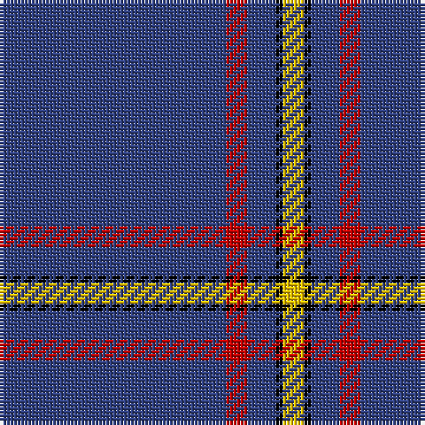

In pattern [BRBKY](/stripes/brbky/).

This was sourced from weddslist.  It is a [5 stripe tartan](/stripes/stripes5/).

Original link http://www.weddslist.com/cgi-bin/tartans/pg.pl?source=sts

## Also known as

This cloth is also recorded under:

- MacLaine of Lochbuie, hunting

## Attestations

This cloth appears in 3 source records; the oldest owns this page.

- undated — MacLaine of Lochbuie, hunting (weddslist, [record](http://www.weddslist.com/cgi-bin/tartans/pg.pl?source=sts))
- undated — MacLaine of Lochbuie Hunting (weddslist, [record](http://www.weddslist.com/cgi-bin/tartans/pg.pl?source=tinsel))
- undated — MacLaine of Lochbuie Hunting Clan Tartan Tartan Number: 491. Earliest known date: 1906 The Sett is also recorded by Adam in 1908. The hunting version first appeared in this century, in the work of H. Whyte published by W. and A.K. Johnston. His book introduced many new hunting and dress forms of both clan and family tartans. D.W. Stewart (1893) pointed out that the use of so much blue, was unique among old tartan setts. See products available Copyright © Blair Urquhart, Comrie, 2015 (house-of-tartan, [record](http://www.house-of-tartan.scotland.net/house/TartanViewjs.asp?colr=Def&tnam=491))

## Thread count
B/64 R6 B8 K2 Y/6

## Palette
Each colour and the base-6 reference it is a variant of.

| Colour | Shade | Base |
|---|---|---|
| B | <code style="background-color:#304080;">#304080</code> `oklch(39.4% 0.109 270.2)` <small>#304080</small> | B <code style="background-color:#2A418A;">#2A418A</code> |
| K | <code style="background-color:#000000;">#000000</code> `oklch(0.0% 0.000 0.0)` <small>#000000</small> | K <code style="background-color:#000000;">#000000</code> |
| R | <code style="background-color:#C00000;">#C00000</code> `oklch(50.7% 0.208 29.2)` <small>#C00000</small> | R <code style="background-color:#CC0000;">#CC0000</code> |
| Y | <code style="background-color:#F0C000;">#F0C000</code> `oklch(82.7% 0.169 90.5)` <small>#F0C000</small> | Y <code style="background-color:#F2BF00;">#F2BF00</code> |

# Sample pattern

## Nearest tartans

The nearest existing variants by ΔTartan distance.

1. [Wylie](/setts/s6/db45ly3db10o4k1w2~x2/) — ΔT 1.10
1. [Pearson](/setts/s5/ly6db28do2db28y1~x2/) — ΔT 1.16
1. [Inverness, Duke of York](/setts/s8/db122r11w4r15ly4db6ly4db30/) — ΔT 1.18
1. [Volunteer Lifesaving Corps (Corp.)](/setts/s5/r5w4k4db80w4~x2/) — ΔT 1.36
1. [Auchairne (Corporate)](/setts/s6/b11db7b3db70lb4db6~x2/) — ΔT 1.61
1. [RAAF #4](/setts/s9/db48w2db7w2db7w2db20t11r2~x2/) — ΔT 1.61
1. [Alpha Chi Sigma Fraternity](/setts/s10/dt35ly1dt3ly1dt3ly1dt20r6w1r5~x2/) — ΔT 1.67
1. [Balmer (Personal)](/setts/s6/w2db49r5ly2r5ly2~x2/) — ΔT 1.68
1. [MacLaine of Lochbuie Hunting](/setts/s5/db32r3db4k1ly3/) — ΔT 1.72
1. [Lynch](/setts/s6/r3db2r1db18g1db2~x4/) — ΔT 1.73

## Neighbour map

Every grey dot is one of 14299 variants placed by the first two principal components of the ΔTartan feature space (44% of its variance). Red is this tartan; blue dots are its nearest — click one to open its page.

<svg viewBox="0 0 640 380" role="img" style="max-width:100%;height:auto;border:1px solid #e0e0e0;border-radius:4px;display:block" xmlns="http://www.w3.org/2000/svg"><image href="/nn/cloud.v1.png" width="640" height="380"/><a href="/setts/s6/db45ly3db10o4k1w2~x2/"><circle cx="593.6" cy="123.9" r="4" fill="#3465a4"><title>Wylie</title></circle></a><a href="/setts/s5/ly6db28do2db28y1~x2/"><circle cx="591.0" cy="196.5" r="4" fill="#3465a4"><title>Pearson</title></circle></a><a href="/setts/s8/db122r11w4r15ly4db6ly4db30/"><circle cx="576.2" cy="137.7" r="4" fill="#3465a4"><title>Inverness, Duke of York</title></circle></a><a href="/setts/s5/r5w4k4db80w4~x2/"><circle cx="562.0" cy="162.9" r="4" fill="#3465a4"><title>Volunteer Lifesaving Corps (Corp.)</title></circle></a><a href="/setts/s6/b11db7b3db70lb4db6~x2/"><circle cx="613.4" cy="198.4" r="4" fill="#3465a4"><title>Auchairne (Corporate)</title></circle></a><a href="/setts/s9/db48w2db7w2db7w2db20t11r2~x2/"><circle cx="549.6" cy="157.8" r="4" fill="#3465a4"><title>RAAF #4</title></circle></a><a href="/setts/s10/dt35ly1dt3ly1dt3ly1dt20r6w1r5~x2/"><circle cx="559.6" cy="131.5" r="4" fill="#3465a4"><title>Alpha Chi Sigma Fraternity</title></circle></a><a href="/setts/s6/w2db49r5ly2r5ly2~x2/"><circle cx="508.7" cy="140.4" r="4" fill="#3465a4"><title>Balmer (Personal)</title></circle></a><a href="/setts/s5/db32r3db4k1ly3/"><circle cx="575.7" cy="165.6" r="4" fill="#3465a4"><title>MacLaine of Lochbuie Hunting</title></circle></a><a href="/setts/s6/r3db2r1db18g1db2~x4/"><circle cx="602.2" cy="204.9" r="4" fill="#3465a4"><title>Lynch</title></circle></a><circle cx="597.3" cy="164.2" r="5" fill="#c00000"/></svg>

ID: /setts/s5/db32r3db4k1ly3~x2/
