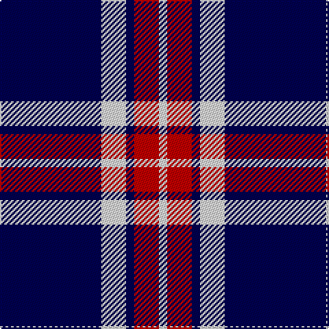

In pattern [BWBRW](/stripes/bwbrw/).

This was sourced from weddslist.  It is a [5 stripe tartan](/stripes/stripes5/).

Original link http://www.weddslist.com/cgi-bin/tartans/pg.pl?source=sts

## Attestations

This cloth appears in 2 source records; the oldest owns this page.

- undated — Glen Moy (weddslist, [record](http://www.weddslist.com/cgi-bin/tartans/pg.pl?source=sts))
- undated — Glen Moy Trade Tartan Tartan Number: 635. Earliest known date: pre 1992 Its mainly Sheep farming in Glen Moy. Off the beaten track, its a very quiet area of the Angus glens close to Cortachy castle and great for walking if you like it to yourself! Its also close to Glen Clova which is the busiest glen around here with some fantastic mountains for walking and taking photos. See products available Copyright © Blair Urquhart, Comrie, 2015 (house-of-tartan, [record](http://www.house-of-tartan.scotland.net/house/TartanViewjs.asp?colr=Def&tnam=635))

## Thread count
DB/74 LN18 DB6 R18 LN/6

## Palette
Each colour and the base-6 reference it is a variant of.

| Colour | Shade | Base |
|---|---|---|
| DB | <code style="background-color:#000050;">#000050</code> `oklch(19.5% 0.135 264.1)` <small>#000050</small> | B <code style="background-color:#2A418A;">#2A418A</code> |
| LN | <code style="background-color:#E0E0E0;">#E0E0E0</code> `oklch(90.7% 0.000 89.9)` <small>#E0E0E0</small> | W <code style="background-color:#F7F7F7;">#F7F7F7</code> |
| R | <code style="background-color:#C00000;">#C00000</code> `oklch(50.7% 0.208 29.2)` <small>#C00000</small> | R <code style="background-color:#CC0000;">#CC0000</code> |

# Sample pattern

## Nearest tartans

The nearest existing variants by ΔTartan distance, with this tartan at the top so the swatches line up against it.

ΔTartan

Tartan

Sett

—

<a href="/ttd/edit/#slug=db37w9db3r9w3~x2">Glen Moy</a> <a class="nn-out" href="/setts/s5/db37w9db3r9w3~x2/" title="open its dictionary page">↗</a>

0.83

<a href="/ttd/edit/#slug=db13lb3db1r3lb1~x6">Glen Moy</a> <a class="nn-out" href="/setts/s5/db13lb3db1r3lb1~x6/" title="open its dictionary page">↗</a>

1.08

<a href="/ttd/edit/#slug=lr3k3lr3k10r1~x6">Burberry Blue</a> <a class="nn-out" href="/setts/s5/lr3k3lr3k10r1~x6/" title="open its dictionary page">↗</a>

1.22

<a href="/ttd/edit/#slug=w8k16w2db2w1k1~x4">Ikelman No 1</a> <a class="nn-out" href="/setts/s6/w8k16w2db2w1k1~x4/" title="open its dictionary page">↗</a>

1.30

<a href="/ttd/edit/#slug=t50k4t12k23lo4k4~x2">Sligo Irish County Tartan Tartan Number: 2256. Earliest known date: 1995 One of a series of Irish District tartans designed by Polly Wittering of the House of Edgar, with colours reminiscent of the Country with soft warm colours dominating. See products available Copyright © Blair Urquhart, Comrie, 2015</a> <a class="nn-out" href="/setts/s6/t50k4t12k23lo4k4~x2/" title="open its dictionary page">↗</a>

1.39

<a href="/ttd/edit/#slug=db12w1r3w1r3w1db6~x4">BC Corps of Commissionaires</a> <a class="nn-out" href="/setts/s7/db12w1r3w1r3w1db6~x4/" title="open its dictionary page">↗</a>

1.49

<a href="/ttd/edit/#slug=db8r1w1r1k1~x8">Laing of Archiestown</a> <a class="nn-out" href="/setts/s5/db8r1w1r1k1~x8/" title="open its dictionary page">↗</a>

1.54

<a href="/ttd/edit/#slug=db33w7db5r2db5w2r13db3~x2">Americana - 1978 (Fashion)</a> <a class="nn-out" href="/setts/s8/db33w7db5r2db5w2r13db3~x2/" title="open its dictionary page">↗</a>

1.55

<a href="/ttd/edit/#slug=r4db32k15w2~x2">Scottish Nuclear</a> <a class="nn-out" href="/setts/s4/r4db32k15w2~x2/" title="open its dictionary page">↗</a>

1.55

<a href="/setts/s6/db60ly6db11r25~x2/">South Australian Pipes &amp; Drums (Corp</a>

1.58

<a href="/ttd/edit/#slug=lo8w3db40k12w3lo3~x2">Wolverines (Corporate)</a> <a class="nn-out" href="/setts/s6/lo8w3db40k12w3lo3~x2/" title="open its dictionary page">↗</a>

## Neighbour map

Every grey dot is one of 14299 variants placed by the first two principal components of the ΔTartan feature space (44% of its variance). Red is this tartan; blue dots are its nearest — click one to open its page.

<svg viewBox="0 0 640 380" role="img" style="max-width:100%;height:auto;border:1px solid #e0e0e0;border-radius:4px;display:block" xmlns="http://www.w3.org/2000/svg"><image href="/nn/cloud.v1.png" width="640" height="380"/><a href="/setts/s5/db13lb3db1r3lb1~x6/"><circle cx="395.4" cy="200.9" r="4" fill="#3465a4"><title>Glen Moy</title></circle></a><a href="/setts/s5/lr3k3lr3k10r1~x6/"><circle cx="351.7" cy="236.2" r="4" fill="#3465a4"><title>Burberry Blue</title></circle></a><a href="/setts/s6/w8k16w2db2w1k1~x4/"><circle cx="325.8" cy="175.5" r="4" fill="#3465a4"><title>Ikelman No 1</title></circle></a><a href="/setts/s6/t50k4t12k23lo4k4~x2/"><circle cx="370.0" cy="197.4" r="4" fill="#3465a4"><title>Sligo Irish County Tartan Tartan Number: 2256. Earliest known date: 1995 One of a series of Irish District tartans designed by Polly Wittering of the House of Edgar, with colours reminiscent of the Country with soft warm colours dominating. See products available Copyright © Blair Urquhart, Comrie, 2015</title></circle></a><a href="/setts/s7/db12w1r3w1r3w1db6~x4/"><circle cx="395.7" cy="206.2" r="4" fill="#3465a4"><title>BC Corps of Commissionaires</title></circle></a><a href="/setts/s5/db8r1w1r1k1~x8/"><circle cx="370.1" cy="198.8" r="4" fill="#3465a4"><title>Laing of Archiestown</title></circle></a><a href="/setts/s8/db33w7db5r2db5w2r13db3~x2/"><circle cx="394.9" cy="167.2" r="4" fill="#3465a4"><title>Americana - 1978 (Fashion)</title></circle></a><a href="/setts/s4/r4db32k15w2~x2/"><circle cx="346.4" cy="208.8" r="4" fill="#3465a4"><title>Scottish Nuclear</title></circle></a><a href="/setts/s6/db60ly6db11r25~x2/"><circle cx="410.4" cy="214.8" r="4" fill="#3465a4"><title>South Australian Pipes &amp; Drums (Corp</title></circle></a><a href="/setts/s6/lo8w3db40k12w3lo3~x2/"><circle cx="306.9" cy="166.6" r="4" fill="#3465a4"><title>Wolverines (Corporate)</title></circle></a><circle cx="369.0" cy="201.6" r="5" fill="#c00000"/></svg>

ID: /setts/s5/db37w9db3r9w3~x2/
