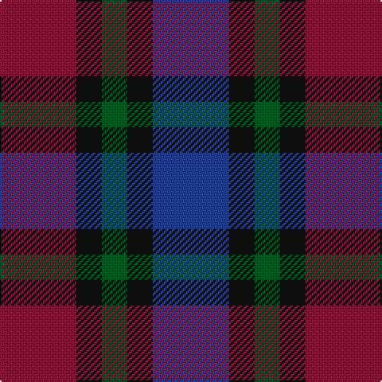

In pattern [BKGKR](/stripes/bkgkr/).

This was sourced from register-of-tartans.  It is a [5 stripe tartan](/stripes/stripes5/).

Original link https://www.tartanregister.gov.uk/tartanDetails.aspx?ref=667

## Register references

External register numbers recorded for this tartan.

- Scottish Register of Tartans: [667](https://www.tartanregister.gov.uk/tartanDetails.aspx?ref=667)
- Scottish Tartans World Register: 329

## Thread count
DR/48 K16 G16 K16 B/48

## Palette
Each colour and the base-6 reference it is a variant of.

| Colour | Shade | Base |
|---|---|---|
| B | <code style="background-color:#2C4084;">#2C4084</code> `oklch(39.4% 0.117 268.3)` <small>#2C4084</small> | B <code style="background-color:#2A418A;">#2A418A</code> |
| DR | <code style="background-color:#781C38;">#781C38</code> `oklch(38.7% 0.127 7.4)` <small>#781C38</small> | R <code style="background-color:#CC0000;">#CC0000</code> |
| G | <code style="background-color:#005020;">#005020</code> `oklch(37.7% 0.105 149.6)` <small>#005020</small> | G <code style="background-color:#006100;">#006100</code> |
| K | <code style="background-color:#101010;">#101010</code> `oklch(17.3% 0.000 89.9)` <small>#101010</small> | K <code style="background-color:#000000;">#000000</code> |

# Sample pattern

## Nearest tartans

The nearest existing variants by ΔTartan distance.

1. [Breon (Jersey Shore, Pennsylvania) (Personal)](/setts/s5/t25dg25k6dp10r6~x2/) — ΔT 1.46
1. [Lennie](/setts/s6/k2dg10y2k9dp8dg2~x2/) — ΔT 1.49
1. [Glen Shee #3 (Fashion)](/setts/s5/m4k29dr30dt29m4~x2/) — ΔT 1.57
1. [Campbell, Sir Walter Scott](/setts/s6/k2dg8db2k9dp7k2~x2/) — ΔT 1.59
1. [MacCaughan or MacEachain (Personal)](/setts/s6/dp2dg6k2db6k1r2~x4/) — ΔT 1.61
1. [Bristol Gramar School Check (School)](/setts/s6/r4n3n12db8n2r4/) — ΔT 1.71
1. [Sutherland 42nd](/setts/s6/k1dg3k3db3k1db1~x4/) — ΔT 1.80
1. [Crinnion (Personal)](/setts/s5/db3k1n3dp4g3~x4/) — ΔT 1.83
1. [Unidentified pattern #3](/setts/s4/db4k5dg4r1~x4/) — ΔT 1.85
1. [I Y](/setts/s6/k4dg16k13db16t3db3~x2/) — ΔT 1.87

## Neighbour map

Every grey dot is one of 14299 variants placed by the first two principal components of the ΔTartan feature space (44% of its variance). Red is this tartan; blue dots are its nearest — click one to open its page.

<svg viewBox="0 0 640 380" role="img" style="max-width:100%;height:auto;border:1px solid #e0e0e0;border-radius:4px;display:block" xmlns="http://www.w3.org/2000/svg"><image href="/nn/cloud.v1.png" width="640" height="380"/><a href="/setts/s5/t25dg25k6dp10r6~x2/"><circle cx="163.8" cy="281.7" r="4" fill="#3465a4"><title>Breon (Jersey Shore, Pennsylvania) (Personal)</title></circle></a><a href="/setts/s6/k2dg10y2k9dp8dg2~x2/"><circle cx="200.9" cy="281.0" r="4" fill="#3465a4"><title>Lennie</title></circle></a><a href="/setts/s5/m4k29dr30dt29m4~x2/"><circle cx="222.5" cy="287.0" r="4" fill="#3465a4"><title>Glen Shee #3 (Fashion)</title></circle></a><a href="/setts/s6/k2dg8db2k9dp7k2~x2/"><circle cx="223.9" cy="293.2" r="4" fill="#3465a4"><title>Campbell, Sir Walter Scott</title></circle></a><a href="/setts/s6/dp2dg6k2db6k1r2~x4/"><circle cx="165.4" cy="263.8" r="4" fill="#3465a4"><title>MacCaughan or MacEachain (Personal)</title></circle></a><a href="/setts/s6/r4n3n12db8n2r4/"><circle cx="197.5" cy="265.4" r="4" fill="#3465a4"><title>Bristol Gramar School Check (School)</title></circle></a><a href="/setts/s6/k1dg3k3db3k1db1~x4/"><circle cx="233.7" cy="348.8" r="4" fill="#3465a4"><title>Sutherland 42nd</title></circle></a><a href="/setts/s5/db3k1n3dp4g3~x4/"><circle cx="86.7" cy="315.6" r="4" fill="#3465a4"><title>Crinnion (Personal)</title></circle></a><a href="/setts/s4/db4k5dg4r1~x4/"><circle cx="169.3" cy="322.2" r="4" fill="#3465a4"><title>Unidentified pattern #3</title></circle></a><a href="/setts/s6/k4dg16k13db16t3db3~x2/"><circle cx="238.7" cy="310.4" r="4" fill="#3465a4"><title>I Y</title></circle></a><circle cx="182.6" cy="325.7" r="5" fill="#c00000"/></svg>

ID: /setts/s5/db3k1dg1k1m3~x16/
