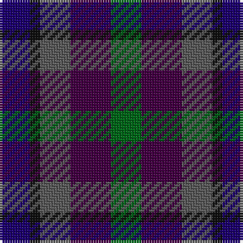

This page is one **sett** — a single exact thread-count. It belongs to the [tartan](/tartans/db3k1n3dp4g3/)
(the same proportion at any scale), whose colour order is pattern [BKBBG](/stripes/bkbbg/).

Sourced from tartans-authority.  It is a [5 stripe tartan](/stripes/stripes5/).

Original link http://www.tartansauthority.com/tartan-ferret/display/10789/

## Thread count
DB/12 K4 N12 DP16 G/12

## Palette
Each colour and the base-6 reference it is a variant of.

| Colour | Shade | Base |
|---|---|---|
| DB | <code style="background-color:#1C0070;">#1C0070</code> `oklch(26.3% 0.162 277.1)` <small>#1C0070</small> | B <code style="background-color:#2A418A;">#2A418A</code> |
| DP | <code style="background-color:#440044;">#440044</code> `oklch(27.1% 0.125 328.4)` <small>#440044</small> | B <code style="background-color:#2A418A;">#2A418A</code> |
| G | <code style="background-color:#006818;">#006818</code> `oklch(45.0% 0.142 145.0)` <small>#006818</small> | G <code style="background-color:#006100;">#006100</code> |
| K | <code style="background-color:#101010;">#101010</code> `oklch(17.3% 0.000 89.9)` <small>#101010</small> | K <code style="background-color:#000000;">#000000</code> |
| N | <code style="background-color:#5C5C5C;">#5C5C5C</code> `oklch(47.5% 0.000 89.9)` <small>#5C5C5C</small> | B <code style="background-color:#2A418A;">#2A418A</code> |

# Sample pattern

## Nearest tartans

The nearest existing variants by ΔTartan distance, with this tartan at the top so the swatches line up against it.

ΔTartan

Tartan

Sett

—

<a href="/ttd/edit/#slug=db3k1n3dp4g3~x4">Crinnion (Personal)</a> <a class="nn-out" href="/setts/s5/db3k1n3dp4g3~x4/" title="open its dictionary page">↗</a>

0.69

<a href="/ttd/edit/#slug=dg27n20r9db16b20~x2">Currens (2016)</a> <a class="nn-out" href="/setts/s5/dg27n20r9db16b20~x2/" title="open its dictionary page">↗</a>

1.20

<a href="/ttd/edit/#slug=dt4db4dp4k4w1~x10">Weston (Personal)</a> <a class="nn-out" href="/setts/s5/dt4db4dp4k4w1~x10/" title="open its dictionary page">↗</a>

1.40

<a href="/ttd/edit/#slug=r4dg15k15db15lb4~x2">Dalmeny #1</a> <a class="nn-out" href="/setts/s5/r4dg15k15db15lb4~x2/" title="open its dictionary page">↗</a>

1.59

<a href="/ttd/edit/#slug=k4dt4dy1dt4r4db4w1~x8">Blackdown Hills</a> <a class="nn-out" href="/setts/s7/k4dt4dy1dt4r4db4w1~x8/" title="open its dictionary page">↗</a>

1.61

<a href="/ttd/edit/#slug=k4dt4dy1dt4r4db4lr1~x8">Blackdown Hills (Corporate)</a> <a class="nn-out" href="/setts/s7/k4dt4dy1dt4r4db4lr1~x8/" title="open its dictionary page">↗</a>

1.64

<a href="/ttd/edit/#slug=r4db14k15dg14ly4~x2">Scots Heritage</a> <a class="nn-out" href="/setts/s5/r4db14k15dg14ly4~x2/" title="open its dictionary page">↗</a>

1.64

<a href="/ttd/edit/#slug=db4k5dg4r1~x4">Unidentified pattern #3</a> <a class="nn-out" href="/setts/s4/db4k5dg4r1~x4/" title="open its dictionary page">↗</a>

1.71

<a href="/ttd/edit/#slug=t25dg25k6dp10r6~x2">Breon (Jersey Shore, Pennsylvania) (Personal)</a> <a class="nn-out" href="/setts/s5/t25dg25k6dp10r6~x2/" title="open its dictionary page">↗</a>

1.75

<a href="/ttd/edit/#slug=b2db3k1db3o3g4r1~x8">New York City</a> <a class="nn-out" href="/setts/s7/b2db3k1db3o3g4r1~x8/" title="open its dictionary page">↗</a>

1.79

<a href="/ttd/edit/#slug=dp2dg6k2db6k1r2~x4">MacCaughan or MacEachain (Personal)</a> <a class="nn-out" href="/setts/s6/dp2dg6k2db6k1r2~x4/" title="open its dictionary page">↗</a>

## Neighbour map

Every grey dot is one of 14299 variants placed by the first two principal components of the ΔTartan feature space (44% of its variance). Red is this tartan; blue dots are its nearest — click one to open its page.

<svg viewBox="0 0 640 380" role="img" style="max-width:100%;height:auto;border:1px solid #e0e0e0;border-radius:4px;display:block" xmlns="http://www.w3.org/2000/svg"><image href="/nn/cloud.v1.png" width="640" height="380"/><a href="/setts/s5/dg27n20r9db16b20~x2/"><circle cx="66.2" cy="326.7" r="4" fill="#3465a4"><title>Currens (2016)</title></circle></a><a href="/setts/s5/dt4db4dp4k4w1~x10/"><circle cx="52.8" cy="303.1" r="4" fill="#3465a4"><title>Weston (Personal)</title></circle></a><a href="/setts/s5/r4dg15k15db15lb4~x2/"><circle cx="89.8" cy="286.1" r="4" fill="#3465a4"><title>Dalmeny #1</title></circle></a><a href="/setts/s7/k4dt4dy1dt4r4db4w1~x8/"><circle cx="90.1" cy="267.6" r="4" fill="#3465a4"><title>Blackdown Hills</title></circle></a><a href="/setts/s7/k4dt4dy1dt4r4db4lr1~x8/"><circle cx="118.6" cy="282.9" r="4" fill="#3465a4"><title>Blackdown Hills (Corporate)</title></circle></a><a href="/setts/s5/r4db14k15dg14ly4~x2/"><circle cx="93.4" cy="290.2" r="4" fill="#3465a4"><title>Scots Heritage</title></circle></a><a href="/setts/s4/db4k5dg4r1~x4/"><circle cx="169.3" cy="322.2" r="4" fill="#3465a4"><title>Unidentified pattern #3</title></circle></a><a href="/setts/s5/t25dg25k6dp10r6~x2/"><circle cx="163.8" cy="281.7" r="4" fill="#3465a4"><title>Breon (Jersey Shore, Pennsylvania) (Personal)</title></circle></a><a href="/setts/s7/b2db3k1db3o3g4r1~x8/"><circle cx="76.4" cy="263.7" r="4" fill="#3465a4"><title>New York City</title></circle></a><a href="/setts/s6/dp2dg6k2db6k1r2~x4/"><circle cx="165.4" cy="263.8" r="4" fill="#3465a4"><title>MacCaughan or MacEachain (Personal)</title></circle></a><circle cx="86.7" cy="315.6" r="5" fill="#c00000"/></svg>

ID: /setts/s5/db3k1n3dp4g3~x4/
